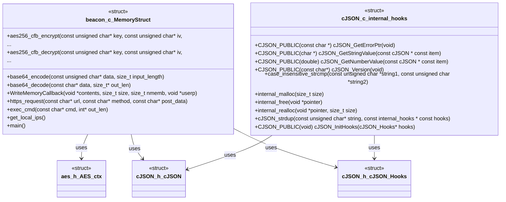

# Polyglot Codebase Knowledge Graph

> Generated offline by **readmenator**. Supports C, C++, Python, Go, Rust, JS/TS, Java, C#, Shell, PHP, Dart, GDScript, Nim, ASM, Ruby, Swift, Kotlin, Scala, Lua, Elixir.
> No LLMs. No tokens. Pure static analysis. See more [here](https://github.com/grisuno/ReadMenator)

**Total Files Parsed:** 9 | **Total Symbols Extracted:** 227 | **Total Imports:** 38

<!-- ranking_model: v1.0 | weights: {ppr:0.45,auth:0.2,test:0.15,doc:0.1,fresh:0.1} | alpha:0.85 | commit:f0ae16d | date:2026-07-18 -->


## Table of Contents

1. [Statistics Dashboard](#statistics-dashboard)
2. [Architectural Layers](#architectural-layers)
3. [Ranked Context](#ranked-context)
4. [God Nodes](#god-nodes)
5. [Community Analysis](#community-analysis)
6. [Surprising Connections](#surprising-connections)
7. [Suggested Questions](#suggested-questions)
8. [Hotspot Analysis](#hotspot-analysis)
9. [Change Impact Analysis](#change-impact-analysis)
10. [Suggested Linting Rules](#suggested-linting-rules)
11. [Orphans](#orphans)
12. [Query Recipes](#query-recipes)
13. [Structural Knowledge Map](#structural-knowledge-map)
14. [UML Class Diagram](#uml-class-diagram)
15. [Code Property Graph](#code-property-graph)
16. [Architecture Reference](#architecture-reference)
    - [C (3 files)](#c-3-files)
    - [H (2 files)](#h-2-files)
    - [PY (1 files)](#py-1-files)
    - [SH (3 files)](#sh-3-files)

---

## Statistics Dashboard

| Metric | Value |
|--------|-------|
| Total Files | 9 |
| Total Symbols | 227 |
| Total Imports | 38 |
| Call Edges | 0 |
| Inheritance Edges | 0 |
| Languages | 4 |
| Avg Symbols/File | 25.2 |
| Avg Imports/File | 4.2 |

### Top Files by Import Count (Fan-Out)

| File | Imports | Symbols | Language |
|------|---------|---------|----------|
| `beacon.c` | 24 | 15 | c |
| `cJSON.c` | 9 | 122 | c |
| `aes.c` | 2 | 43 | c |
| `aes.h` | 2 | 13 | h |
| `cJSON.h` | 1 | 34 | h |

### Top Files by Imported-By Count (Fan-In)

| File | Imported By | Symbols | Language |
|------|-------------|---------|----------|
| `aes.h` | 2 | 13 | h |
| `cJSON.h` | 2 | 34 | h |

---

## Architectural Layers

Auto-detected from path patterns, naming conventions, and imported frameworks.

| Layer | Files |
|-------|-------|
| utility | 7 |
| presentation | 2 |

### utility

- `aes.c` (c, 43 symbols)
- `aes.h` (h, 13 symbols)
- `app.py` (py, 0 symbols)
- `beacon.c` (c, 15 symbols)
- `cJSON.c` (c, 122 symbols)
- `cJSON.h` (h, 34 symbols)
- `install.sh` (sh, 0 symbols)

### presentation

- `andoid_build.sh` (sh, 0 symbols)
- `armbian_build.sh` (sh, 0 symbols)

---

## Ranked Context

Files ranked by composite score for the current query context. The ranking combines Personalized PageRank (query relevance), global authority, test coverage, documentation coverage, and code freshness. Model: v1.0.

| Rank | File | Composite | PPR | Authority | Test | Doc |
|------|------|-----------|-----|-----------|------|-----|
| 1 | `aes.h` | 0.2036 | 0.3013 | 0.3013 | 0.00 | 0.08 |
| 2 | `cJSON.h` | 0.1988 | 0.3013 | 0.3013 | 0.00 | 0.03 |
| 3 | `beacon.c` | 0.1261 | 0.1325 | 0.1325 | 0.00 | 0.40 |
| 4 | `aes.c` | 0.1233 | 0.1325 | 0.1325 | 0.00 | 0.37 |
| 5 | `cJSON.c` | 0.1099 | 0.1325 | 0.1325 | 0.00 | 0.24 |
| 6 | `app.py` | 0.1000 | 0.0000 | 0.0000 | 0.00 | 1.00 |
| 7 | `armbian_build.sh` | 0.1000 | 0.0000 | 0.0000 | 0.00 | 1.00 |
| 8 | `andoid_build.sh` | 0.0000 | 0.0000 | 0.0000 | 0.00 | 0.00 |
| 9 | `install.sh` | 0.0000 | 0.0000 | 0.0000 | 0.00 | 0.00 |

---

## God Nodes

Most architecturally central files ranked by combined import/export degree and symbol richness.

| File | Score | Connections | PageRank |
|------|-------|-------------|----------|
| `cJSON.c` | 14.2 | | 0.1325 |
| `cJSON.h` | 7.4 | | 0.3013 |
| `aes.c` | 6.3 | | 0.1325 |
| `beacon.c` | 5.5 | | 0.1325 |
| `aes.h` | 5.3 | | 0.3013 |
| `andoid_build.sh` | 0.0 | | 0.0000 |
| `app.py` | 0.0 | | 0.0000 |
| `armbian_build.sh` | 0.0 | | 0.0000 |
| `install.sh` | 0.0 | | 0.0000 |

---

## Community Analysis

Files grouped by import-based community detection. Cohesion measures how tightly connected each community is internally.

### root (Cohesion: 0.67)

**3 files** in this community:

- `aes.c` (c, 43 symbols)
- `aes.h` (h, 13 symbols)
- `beacon.c` (c, 15 symbols)

### root (Cohesion: 0.50)

**2 files** in this community:

- `cJSON.c` (c, 122 symbols)
- `cJSON.h` (h, 34 symbols)

---

## Surprising Connections

Files in different communities connected through 3+ indirect hops.

- `aes.c` <-> `cJSON.c` (4 hops, across 2 communities)
- `aes.c` <-> `cJSON.h` (3 hops, across 2 communities)
- `aes.h` <-> `cJSON.c` (3 hops, across 2 communities)

---

## Suggested Questions

Auto-generated exploration prompts based on graph structure:

- What does cJSON.c depend on, and what depends on it? (1 connections)
- What does cJSON.h depend on, and what depends on it? (2 connections)
- What does aes.c depend on, and what depends on it? (1 connections)
- How are the 3 files in 'root' related to each other?
- Why are aes.c and cJSON.c connected through 4 hops across 2 communities?

---

## Hotspot Analysis

Files ranked by combined complexity (symbol count) and centrality (connection count). High-scoring files are architecturally critical and may need refactoring attention.

| File | Complexity | Centrality | Combined | Symbols | Connections |
|------|-----------|------------|----------|---------|-------------|
| `aes.h` | 0.107 | 0.167 | 0.143 | 13 | 4 |
| `cJSON.h` | 0.279 | 0.125 | 0.186 | 34 | 3 |
| `beacon.c` | 0.123 | 1.000 | 0.649 | 15 | 24 |
| `aes.c` | 0.352 | 0.083 | 0.191 | 43 | 2 |
| `cJSON.c` | 1.000 | 0.375 | 0.625 | 122 | 9 |
| `app.py` | 0.000 | 0.000 | 0.000 | 0 | 0 |
| `armbian_build.sh` | 0.000 | 0.000 | 0.000 | 0 | 0 |
| `andoid_build.sh` | 0.000 | 0.000 | 0.000 | 0 | 0 |
| `install.sh` | 0.000 | 0.000 | 0.000 | 0 | 0 |

---

## Change Impact Analysis

Files sorted by how many other files would be affected if they changed. High-impact files should be changed with caution.

| File | Direct Dependents | Transitive Dependents | Total Impact |
|------|------------------|----------------------|--------------|
| `aes.c` | 0 | 0 | 0 |
| `aes.h` | 0 | 0 | 0 |
| `andoid_build.sh` | 0 | 0 | 0 |
| `app.py` | 0 | 0 | 0 |
| `armbian_build.sh` | 0 | 0 | 0 |
| `beacon.c` | 0 | 0 | 0 |
| `cJSON.c` | 0 | 0 | 0 |
| `cJSON.h` | 0 | 0 | 0 |
| `install.sh` | 0 | 0 | 0 |

---

## Suggested Linting Rules

Automatically suggested linting and security rules based on patterns detected in the codebase. These can be exported as Semgrep rules using the `--export-rules` flag.

| Rule ID | Severity | Description | Language | Matches |
|---------|----------|-------------|----------|---------|
| `RM001` | info | Large number of functions in c: 142 total | c | 142 |

---

## Orphans

Files with no documentation or low connectivity. These are candidates for documentation investment or cleanup.

- `andoid_build.sh` (0 symbols, no doc)
- `install.sh` (0 symbols, no doc)

---

## Query Recipes

Example queries you can run against this knowledge base using the ranking engine:

```
# Find files most relevant to a concept
readmenator query "Where is the import resolver implemented?"

# Rank files by relevance to a topic
readmenator query "How does documentation generation work?"

# Explain why a file ranks highly
readmenator query "explain readmenator/_documentation.py"

# Trace dependency paths with ranked context
readmenator query "path from CLI to exporter"
```

The ranking model uses the following signals:

- **Personalized PageRank** (45% weight): query-specific relevance via seed propagation
- **Global Authority** (20% weight): structural importance via standard PageRank
- **Test Coverage** (15% weight): fraction of symbols referenced in test files
- **Doc Coverage** (10% weight): presence of docstrings and file-level docs
- **Freshness** (10% weight): recent modification activity

Results include score decomposition and justification paths for each ranked item.

---

## Structural Knowledge Map

```mermaid
graph TD
    classDef mod fill:#1e1e1e,stroke:#ff6666,stroke-width:2px,color:#fff;
    classDef cls fill:#2d2d2d,stroke:#4ec9b0,stroke-width:2px,color:#fff;
    classDef fn fill:#333,stroke:#dcdcaa,stroke-width:1px,color:#dcdcaa;
    classDef ext fill:#111,stroke:#666,stroke-dasharray:5 5,color:#aaa;
    subgraph community_0 ["root"]
    beacon_c["beacon.c (c)"]
    class beacon_c mod;
    beacon_c_MemoryStruct["MemoryStruct"]
    class beacon_c_MemoryStruct cls;
    beacon_c --> beacon_c_MemoryStruct
    beacon_c_base64_encode["base64_encode"]
    class beacon_c_base64_encode fn;
    beacon_c --> beacon_c_base64_encode
    beacon_c_base64_decode["base64_decode"]
    class beacon_c_base64_decode fn;
    beacon_c --> beacon_c_base64_decode
    beacon_c_aes256_cfb_encrypt["aes256_cfb_encrypt"]
    class beacon_c_aes256_cfb_encrypt fn;
    beacon_c --> beacon_c_aes256_cfb_encrypt
    beacon_c_aes256_cfb_decrypt["aes256_cfb_decrypt"]
    class beacon_c_aes256_cfb_decrypt fn;
    beacon_c --> beacon_c_aes256_cfb_decrypt
    end
    subgraph community_1 ["root"]
    cJSON_c["cJSON.c (c)"]
    class cJSON_c mod;
    aes_c["aes.c (c)"]
    class aes_c mod;
    aes_h["aes.h (h)"]
    class aes_h mod;
    cJSON_h["cJSON.h (h)"]
    class cJSON_h mod;
    andoid_build_sh["andoid_build.sh (sh)"]
    class andoid_build_sh mod;
    app_py["app.py (py)"]
    class app_py mod;
    armbian_build_sh["armbian_build.sh (sh)"]
    class armbian_build_sh mod;
    install_sh["install.sh (sh)"]
    class install_sh mod;
    end
    ext_aes_h["aes.h"]
    class ext_aes_h ext;
    aes_c -.->|imports| ext_aes_h
    ext_string_h["string.h"]
    class ext_string_h ext;
    aes_c -.->|imports| ext_string_h
    ext_stdint_h["stdint.h"]
    class ext_stdint_h ext;
    aes_h -.->|imports| ext_stdint_h
    ext_stddef_h["stddef.h"]
    class ext_stddef_h ext;
    aes_h -.->|imports| ext_stddef_h
    ext_stdio_h["stdio.h"]
    class ext_stdio_h ext;
    beacon_c -.->|imports| ext_stdio_h
    ext_stdlib_h["stdlib.h"]
    class ext_stdlib_h ext;
    beacon_c -.->|imports| ext_stdlib_h
    beacon_c -.->|imports| ext_string_h
    ext_unistd_h["unistd.h"]
    class ext_unistd_h ext;
    beacon_c -.->|imports| ext_unistd_h
    ext_time_h["time.h"]
    class ext_time_h ext;
    beacon_c -.->|imports| ext_time_h
    ext_sys_types_h["types.h"]
    class ext_sys_types_h ext;
    beacon_c -.->|imports| ext_sys_types_h
    ext_sys_socket_h["socket.h"]
    class ext_sys_socket_h ext;
    beacon_c -.->|imports| ext_sys_socket_h
    ext_netinet_in_h["in.h"]
    class ext_netinet_in_h ext;
    beacon_c -.->|imports| ext_netinet_in_h
    ext_arpa_inet_h["inet.h"]
    class ext_arpa_inet_h ext;
    beacon_c -.->|imports| ext_arpa_inet_h
    ext_net_if_h["if.h"]
    class ext_net_if_h ext;
    beacon_c -.->|imports| ext_net_if_h
    ext_sys_ioctl_h["ioctl.h"]
    class ext_sys_ioctl_h ext;
    beacon_c -.->|imports| ext_sys_ioctl_h
    ext_pwd_h["pwd.h"]
    class ext_pwd_h ext;
    beacon_c -.->|imports| ext_pwd_h
    ext_errno_h["errno.h"]
    class ext_errno_h ext;
    beacon_c -.->|imports| ext_errno_h
    ext_curl_curl_h["curl.h"]
    class ext_curl_curl_h ext;
    beacon_c -.->|imports| ext_curl_curl_h
    ext_sys_mman_h["mman.h"]
    class ext_sys_mman_h ext;
    beacon_c -.->|imports| ext_sys_mman_h
    ext_fcntl_h["fcntl.h"]
    class ext_fcntl_h ext;
    beacon_c -.->|imports| ext_fcntl_h
    beacon_c -.->|imports| ext_stdint_h
    ext_sys_wait_h["wait.h"]
    class ext_sys_wait_h ext;
    beacon_c -.->|imports| ext_sys_wait_h
    ext_stdarg_h["stdarg.h"]
    class ext_stdarg_h ext;
    beacon_c -.->|imports| ext_stdarg_h
    ext_netdb_h["netdb.h"]
    class ext_netdb_h ext;
    beacon_c -.->|imports| ext_netdb_h
    ext_sys_utsname_h["utsname.h"]
    class ext_sys_utsname_h ext;
    beacon_c -.->|imports| ext_sys_utsname_h
    ext_openssl_rand_h["rand.h"]
    class ext_openssl_rand_h ext;
    beacon_c -.->|imports| ext_openssl_rand_h
    beacon_c -.->|imports| ext_aes_h
    ext_cJSON_h["cJSON.h"]
    class ext_cJSON_h ext;
    beacon_c -.->|imports| ext_cJSON_h
    cJSON_c -.->|imports| ext_string_h
    cJSON_c -.->|imports| ext_stdio_h
    ext_math_h["math.h"]
    class ext_math_h ext;
    cJSON_c -.->|imports| ext_math_h
    cJSON_c -.->|imports| ext_stdlib_h
    ext_limits_h["limits.h"]
    class ext_limits_h ext;
    cJSON_c -.->|imports| ext_limits_h
    ext_ctype_h["ctype.h"]
    class ext_ctype_h ext;
    cJSON_c -.->|imports| ext_ctype_h
    ext_float_h["float.h"]
    class ext_float_h ext;
    cJSON_c -.->|imports| ext_float_h
    ext_locale_h["locale.h"]
    class ext_locale_h ext;
    cJSON_c -.->|imports| ext_locale_h
    cJSON_c -.->|imports| ext_cJSON_h
    cJSON_h -.->|imports| ext_stddef_h
```



---

## UML Class Diagram

Auto-generated Mermaid class diagram from parsed class-level symbols. Shows classes, structs, interfaces, traits, and their methods with inheritance and dependency relationships.



---

## Code Property Graph

Machine-readable Code Property Graph (CPG) in JSON-LD format. This block allows AI agents to parse the full structural graph without additional file reads. Compatible with GraphRAG pipelines.

```json
{"@context": "https://schema.org", "analysis": {"communities": [{"cohesion": 0.667, "id": 0, "label": "root", "size": 3}, {"cohesion": 0.5, "id": 1, "label": "root", "size": 2}], "god_nodes": [{"node_id": "cJSON.c", "score": 14.2}, {"node_id": "cJSON.h", "score": 7.4}, {"node_id": "aes.c", "score": 6.3}, {"node_id": "beacon.c", "score": 5.5}, {"node_id": "aes.h", "score": 5.3}, {"node_id": "andoid_build.sh", "score": 0.0}, {"node_id": "app.py", "score": 0.0}, {"node_id": "armbian_build.sh", "score": 0.0}, {"node_id": "install.sh", "score": 0.0}], "surprising_connections": [{"hops": 4, "source": "aes.c", "target": "cJSON.c"}, {"hops": 3, "source": "aes.c", "target": "cJSON.h"}, {"hops": 3, "source": "aes.h", "target": "cJSON.c"}]}, "edges": [{"confidence": "EXTRACTED", "relation": "imports", "source": "aes.c", "target": "aes.h"}, {"confidence": "EXTRACTED", "relation": "imports", "source": "aes.c", "target": "string.h"}, {"confidence": "EXTRACTED", "relation": "imports", "source": "aes.h", "target": "stdint.h"}, {"confidence": "EXTRACTED", "relation": "imports", "source": "aes.h", "target": "stddef.h"}, {"confidence": "EXTRACTED", "relation": "imports", "source": "beacon.c", "target": "stdio.h"}, {"confidence": "EXTRACTED", "relation": "imports", "source": "beacon.c", "target": "stdlib.h"}, {"confidence": "EXTRACTED", "relation": "imports", "source": "beacon.c", "target": "string.h"}, {"confidence": "EXTRACTED", "relation": "imports", "source": "beacon.c", "target": "unistd.h"}, {"confidence": "EXTRACTED", "relation": "imports", "source": "beacon.c", "target": "time.h"}, {"confidence": "EXTRACTED", "relation": "imports", "source": "beacon.c", "target": "sys/types.h"}, {"confidence": "EXTRACTED", "relation": "imports", "source": "beacon.c", "target": "sys/socket.h"}, {"confidence": "EXTRACTED", "relation": "imports", "source": "beacon.c", "target": "netinet/in.h"}, {"confidence": "EXTRACTED", "relation": "imports", "source": "beacon.c", "target": "arpa/inet.h"}, {"confidence": "EXTRACTED", "relation": "imports", "source": "beacon.c", "target": "net/if.h"}, {"confidence": "EXTRACTED", "relation": "imports", "source": "beacon.c", "target": "sys/ioctl.h"}, {"confidence": "EXTRACTED", "relation": "imports", "source": "beacon.c", "target": "pwd.h"}, {"confidence": "EXTRACTED", "relation": "imports", "source": "beacon.c", "target": "errno.h"}, {"confidence": "EXTRACTED", "relation": "imports", "source": "beacon.c", "target": "curl/curl.h"}, {"confidence": "EXTRACTED", "relation": "imports", "source": "beacon.c", "target": "sys/mman.h"}, {"confidence": "EXTRACTED", "relation": "imports", "source": "beacon.c", "target": "fcntl.h"}, {"confidence": "EXTRACTED", "relation": "imports", "source": "beacon.c", "target": "stdint.h"}, {"confidence": "EXTRACTED", "relation": "imports", "source": "beacon.c", "target": "sys/wait.h"}, {"confidence": "EXTRACTED", "relation": "imports", "source": "beacon.c", "target": "stdarg.h"}, {"confidence": "EXTRACTED", "relation": "imports", "source": "beacon.c", "target": "netdb.h"}, {"confidence": "EXTRACTED", "relation": "imports", "source": "beacon.c", "target": "sys/utsname.h"}, {"confidence": "EXTRACTED", "relation": "imports", "source": "beacon.c", "target": "openssl/rand.h"}, {"confidence": "EXTRACTED", "relation": "imports", "source": "beacon.c", "target": "aes.h"}, {"confidence": "EXTRACTED", "relation": "imports", "source": "beacon.c", "target": "cJSON.h"}, {"confidence": "EXTRACTED", "relation": "imports", "source": "cJSON.c", "target": "string.h"}, {"confidence": "EXTRACTED", "relation": "imports", "source": "cJSON.c", "target": "stdio.h"}, {"confidence": "EXTRACTED", "relation": "imports", "source": "cJSON.c", "target": "math.h"}, {"confidence": "EXTRACTED", "relation": "imports", "source": "cJSON.c", "target": "stdlib.h"}, {"confidence": "EXTRACTED", "relation": "imports", "source": "cJSON.c", "target": "limits.h"}, {"confidence": "EXTRACTED", "relation": "imports", "source": "cJSON.c", "target": "ctype.h"}, {"confidence": "EXTRACTED", "relation": "imports", "source": "cJSON.c", "target": "float.h"}, {"confidence": "EXTRACTED", "relation": "imports", "source": "cJSON.c", "target": "locale.h"}, {"confidence": "EXTRACTED", "relation": "imports", "source": "cJSON.c", "target": "cJSON.h"}, {"confidence": "EXTRACTED", "relation": "imports", "source": "cJSON.h", "target": "stddef.h"}], "generator": "readmenator", "metadata": {"edge_count": 38, "file_count": 9, "language_count": 4, "symbol_count": 227}, "nodes": [{"doc": "aes.c - tiny-AES-c (https://github.com/kokke/tiny-AES-c) include \"aes.h\" include <string.h>  define Nb 4    define KEYLEN_256 32 define RKLENGTH (4 * (Nr + 1)) define BLOCKLEN 16", "id": "aes.c", "kind": "module", "label": "aes.c", "language": "c", "sha256": "90bb0430dbddaeb8", "symbol_count": 43, "symbols": [{"doc": "define KEYLEN_256 32 define RKLENGTH (4 * (Nr + 1)) define BLOCKLEN 16", "kind": "function", "line": 12, "name": "getSBoxValue", "signature": "static uint8_t getSBoxValue(uint8_t num)"}, {"kind": "function", "line": 34, "name": "getSBoxInvert", "signature": "static uint8_t getSBoxInvert(uint8_t num)"}, {"kind": "function", "line": 56, "name": "Td0", "signature": "static uint8_t Td0(int x)"}, {"kind": "function", "line": 58, "name": "Td1", "signature": "static uint8_t Td1(int x)"}, {"kind": "function", "line": 59, "name": "Td2", "signature": "static uint8_t Td2(int x)"}, {"kind": "function", "line": 60, "name": "Td3", "signature": "static uint8_t Td3(int x)"}, {"kind": "function", "line": 61, "name": "Td4", "signature": "static uint8_t Td4(int x)"}, {"doc": "This function produces Nb(Nr+1) round keys. The round keys are used in each round to decrypt the states.", "kind": "function", "line": 166, "name": "KeyExpansion", "signature": "static void KeyExpansion(uint8_t* RoundKey, const uint8_t* Key)"}, {"kind": "function", "line": 238, "name": "AES_init_ctx", "signature": "void AES_init_ctx(struct AES_ctx* ctx, const uint8_t* key)"}, {"doc": "if (defined(CBC) && (CBC == 1)) || (defined(CTR) && (CTR == 1))", "kind": "function", "line": 244, "name": "AES_init_ctx_iv", "signature": "void AES_init_ctx_iv(struct AES_ctx* ctx, const uint8_t* key, const uint8_t* iv)"}, {"kind": "function", "line": 249, "name": "AES_ctx_set_iv", "signature": "void AES_ctx_set_iv(struct AES_ctx* ctx, const uint8_t* iv)"}, {"doc": "This function adds the round key to state. The round key is added to the state by an XOR function.", "kind": "function", "line": 257, "name": "AddRoundKey", "signature": "static void AddRoundKey(uint8_t round, state_t* state, const uint8_t* RoundKey)"}, {"doc": "The SubBytes Function Substitutes the values in the state matrix with values in an S-box.", "kind": "function", "line": 271, "name": "SubBytes", "signature": "static void SubBytes(state_t* state)"}, {"doc": "The ShiftRows() function shifts the rows in the state to the left. Each row is shifted with different offset. Offset = Row number. So the first row is not shifted.", "kind": "function", "line": 286, "name": "ShiftRows", "signature": "static void ShiftRows(state_t* state)"}, {"kind": "function", "line": 313, "name": "xtime", "signature": "static uint8_t xtime(uint8_t x)"}, {"doc": "MixColumns function mixes the columns of the state matrix", "kind": "function", "line": 320, "name": "MixColumns", "signature": "static void MixColumns(state_t* state)"}, {"doc": "Multiply is used to multiply numbers in the field GF(2^8) Note: The last call to xtime() is unneeded, but often ends up generating a smaller binary The compiler seems to be able to vectorize the operation better this way. See https://github.com/kokke/tiny-AES-c/pull/34 if MULTIPLY_AS_A_FUNCTION", "kind": "function", "line": 340, "name": "Multiply", "signature": "static uint8_t Multiply(uint8_t x, uint8_t y)"}, {"doc": "MixColumns function mixes the columns of the state matrix. The method used to multiply may be difficult to understand for the inexperienced. Please use the references to gain more information.", "kind": "function", "line": 370, "name": "InvMixColumns", "signature": "static void InvMixColumns(state_t* state)"}, {"doc": "The SubBytes Function Substitutes the values in the state matrix with values in an S-box.", "kind": "function", "line": 391, "name": "InvSubBytes", "signature": "static void InvSubBytes(state_t* state)"}, {"kind": "function", "line": 402, "name": "InvShiftRows", "signature": "static void InvShiftRows(state_t* state)"}, {"doc": "Cipher is the main function that encrypts the PlainText.", "kind": "function", "line": 433, "name": "Cipher", "signature": "static void Cipher(state_t* state, const uint8_t* RoundKey)"}, {"doc": "if (defined(CBC) && CBC == 1) || (defined(ECB) && ECB == 1)", "kind": "function", "line": 459, "name": "InvCipher", "signature": "static void InvCipher(state_t* state, const uint8_t* RoundKey)"}, {"doc": "AddRoundKey(round, state, RoundKey); if (round == 0) { break; } InvMixColumns(state); } } #endif // #if (defined(CBC) && CBC == 1) || (defined(ECB) && ECB == 1)  /* Public functions:  if defined(ECB) && (ECB == 1)", "kind": "function", "line": 488, "name": "AES_ECB_encrypt", "signature": "void AES_ECB_encrypt(const struct AES_ctx* ctx, uint8_t* buf)"}, {"kind": "function", "line": 495, "name": "AES_ECB_decrypt", "signature": "void AES_ECB_decrypt(const struct AES_ctx* ctx, uint8_t* buf)"}, {"doc": "if defined(CBC) && (CBC == 1)", "kind": "function", "line": 510, "name": "XorWithIv", "signature": "static void XorWithIv(uint8_t* buf, const uint8_t* Iv)"}, {"kind": "function", "line": 520, "name": "AES_CBC_encrypt_buffer", "signature": "void AES_CBC_encrypt_buffer(struct AES_ctx *ctx, uint8_t* buf, size_t length)"}, {"kind": "function", "line": 535, "name": "AES_CBC_decrypt_buffer", "signature": "void AES_CBC_decrypt_buffer(struct AES_ctx* ctx, uint8_t* buf, size_t length)"}, {"doc": "XorWithIv(buf, ctx->Iv); memcpy(ctx->Iv, storeNextIv, AES_BLOCKLEN); buf += AES_BLOCKLEN; } } #endif // #if defined(CBC) && (CBC == 1) #if defined(CTR) && (CTR == 1) /* Symmetrical operation: same function for encrypting as for decrypting. Note any IV/nonce should never be reused with the same key", "kind": "function", "line": 558, "name": "AES_CTR_xcrypt_buffer", "signature": "void AES_CTR_xcrypt_buffer(struct AES_ctx* ctx, uint8_t* buf, size_t length)"}, {"kind": "macro", "line": 4, "name": "Nb"}, {"kind": "macro", "line": 6, "name": "KEYLEN_256"}, {"kind": "macro", "line": 10, "name": "RKLENGTH"}, {"kind": "macro", "line": 11, "name": "BLOCKLEN"}, {"kind": "macro", "line": 67, "name": "Nb"}, {"kind": "macro", "line": 70, "name": "Nk"}, {"kind": "macro", "line": 71, "name": "Nr"}, {"kind": "macro", "line": 73, "name": "Nk"}, {"kind": "macro", "line": 74, "name": "Nr"}, {"kind": "macro", "line": 76, "name": "Nk"}, {"kind": "macro", "line": 77, "name": "Nr"}, {"kind": "macro", "line": 84, "name": "MULTIPLY_AS_A_FUNCTION"}, {"kind": "macro", "line": 163, "name": "getSBoxValue"}, {"kind": "macro", "line": 349, "name": "Multiply"}, {"kind": "macro", "line": 365, "name": "getSBoxInvert"}]}, {"doc": "ifndef AES_H define AES_H  include <stdint.h> include <stddef.h>  ifndef CBC define CBC 1 endif ifndef ECB define ECB 1 endif ifndef CTR define CTR 1 endif  define AES256 1 define AES_BLOCKLEN 16  if defined(AES256) && (AES256 == 1) define AES_KEYLEN 32 define AES_keyExpSize 240 elif defined(AES192) && (AES192 == 1) define AES_KEYLEN 24 define AES_keyExpSize 208 else define AES_KEYLEN 16 define AES_keyExpSize 176 endif", "id": "aes.h", "kind": "module", "label": "aes.h", "language": "h", "sha256": "a86a6ceb34531aac", "symbol_count": 13, "symbols": [{"kind": "struct", "line": 31, "name": "AES_ctx"}, {"kind": "macro", "line": 2, "name": "AES_H"}, {"kind": "macro", "line": 8, "name": "CBC"}, {"kind": "macro", "line": 11, "name": "ECB"}, {"kind": "macro", "line": 14, "name": "CTR"}, {"kind": "macro", "line": 16, "name": "AES256"}, {"kind": "macro", "line": 18, "name": "AES_BLOCKLEN"}, {"kind": "macro", "line": 21, "name": "AES_KEYLEN"}, {"kind": "macro", "line": 22, "name": "AES_keyExpSize"}, {"kind": "macro", "line": 24, "name": "AES_KEYLEN"}, {"kind": "macro", "line": 25, "name": "AES_keyExpSize"}, {"kind": "macro", "line": 27, "name": "AES_KEYLEN"}, {"kind": "macro", "line": 28, "name": "AES_keyExpSize"}]}, {"id": "andoid_build.sh", "kind": "module", "label": "andoid_build.sh", "language": "sh", "sha256": "28750dd6a4dc3f8a", "symbol_count": 0, "symbols": []}, {"doc": "_*_ coding: utf8 _*_", "id": "app.py", "kind": "module", "label": "app.py", "language": "py", "sha256": "57b21bdb023585b8", "symbol_count": 0, "symbols": []}, {"doc": "export CC=aarch64-linux-gnu-gcc", "id": "armbian_build.sh", "kind": "module", "label": "armbian_build.sh", "language": "sh", "sha256": "b539af38f25ecce2", "symbol_count": 0, "symbols": []}, {"doc": "define _GNU_SOURCE include <stdio.h> include <stdlib.h> include <string.h> include <unistd.h> include <time.h> include <sys/types.h> include <sys/socket.h> include <netinet/in.h> include <arpa/inet.h> include <net/if.h> include <sys/ioctl.h> include <pwd.h> include <errno.h> include <curl/curl.h> include <sys/mman.h> include <fcntl.h> include <stdint.h> include <sys/wait.h> include <stdarg.h> include <netdb.h> include <sys/utsname.h> include <openssl/rand.h>  include \"aes.h\" include \"cJSON.h\"   define C2_URL        \"https://192.168.1.89:4444\" define CLIENT_ID     \"android\"", "id": "beacon.c", "kind": "module", "label": "beacon.c", "language": "c", "sha256": "bd7e19d87edada20", "symbol_count": 15, "symbols": [{"doc": "=== HTTPS REQUEST ===", "kind": "struct", "line": 177, "name": "MemoryStruct"}, {"kind": "function", "line": 49, "name": "base64_encode", "signature": "char* base64_encode(const unsigned char* data, size_t input_length)"}, {"kind": "function", "line": 75, "name": "base64_decode", "signature": "unsigned char* base64_decode(const char* data, size_t* out_len)"}, {"doc": "=== AES CFB ===", "kind": "function", "line": 118, "name": "aes256_cfb_encrypt", "signature": "unsigned char* aes256_cfb_encrypt(const unsigned char* key, const unsigned char* iv,\n            ..."}, {"kind": "function", "line": 145, "name": "aes256_cfb_decrypt", "signature": "unsigned char* aes256_cfb_decrypt(const unsigned char* key, const unsigned char* iv,\n            ..."}, {"kind": "function", "line": 181, "name": "WriteMemoryCallback", "signature": "static size_t WriteMemoryCallback(void *contents, size_t size, size_t nmemb, void *userp)"}, {"kind": "function", "line": 193, "name": "https_request", "signature": "char* https_request(const char* url, const char* method, const char* post_data)"}, {"doc": "=== EXEC CMD ===", "kind": "function", "line": 252, "name": "exec_cmd", "signature": "char* exec_cmd(const char* cmd, int* out_len)"}, {"doc": "=== GET LOCAL IPs ===", "kind": "function", "line": 297, "name": "get_local_ips", "signature": "char* get_local_ips()"}, {"doc": "=== MAIN ===", "kind": "function", "line": 340, "name": "main", "signature": "int main()"}, {"kind": "macro", "line": 1, "name": "_GNU_SOURCE"}, {"kind": "macro", "line": 27, "name": "C2_URL"}, {"kind": "macro", "line": 30, "name": "CLIENT_ID"}, {"kind": "macro", "line": 31, "name": "MALEABLE"}, {"kind": "macro", "line": 32, "name": "USER_AGENTS_COUNT"}]}, {"id": "cJSON.c", "kind": "module", "label": "cJSON.c", "language": "c", "sha256": "3affbc3ab9c6182a", "symbol_count": 122, "symbols": [{"kind": "struct", "line": 157, "name": "internal_hooks"}, {"kind": "function", "line": 94, "name": "CJSON_PUBLIC", "signature": "CJSON_PUBLIC(const char *) cJSON_GetErrorPtr(void)"}, {"kind": "function", "line": 99, "name": "CJSON_PUBLIC", "signature": "CJSON_PUBLIC(char *) cJSON_GetStringValue(const cJSON * const item)"}, {"kind": "function", "line": 109, "name": "CJSON_PUBLIC", "signature": "CJSON_PUBLIC(double) cJSON_GetNumberValue(const cJSON * const item)"}, {"doc": "CJSON_PUBLIC(double) cJSON_GetNumberValue(const cJSON * const item) { if (!cJSON_IsNumber(item)) { return (double) NAN; } return item->valuedouble; } /* This is a safeguard to prevent copy-pasters from using incompatible C and header files if (CJSON_VERSION_MAJOR != 1) || (CJSON_VERSION_MINOR != 7) || (CJSON_VERSION_PATCH != 18) error cJSON.h and cJSON.c have different versions. Make sure that both have the same. endif", "kind": "function", "line": 124, "name": "CJSON_PUBLIC", "signature": "CJSON_PUBLIC(const char*) cJSON_Version(void)"}, {"doc": "/* This is a safeguard to prevent copy-pasters from using incompatible C and header files #if (CJSON_VERSION_MAJOR != 1) || (CJSON_VERSION_MINOR != 7) || (CJSON_VERSION_PATCH != 18) #error cJSON.h and cJSON.c have different versions. Make sure that both have the same. #endif CJSON_PUBLIC(const char*) cJSON_Version(void) { static char version[15]; sprintf(version, \"%i.%i.%i\", CJSON_VERSION_MAJOR, CJSON_VERSION_MINOR, CJSON_VERSION_PATCH); return version; } /* Case insensitive string comparison, doesn't consider two NULL pointers equal though", "kind": "function", "line": 134, "name": "case_insensitive_strcmp", "signature": "static int case_insensitive_strcmp(const unsigned char *string1, const unsigned char *string2)"}, {"doc": "} return tolower(*string1) - tolower(*string2); } typedef struct internal_hooks { void *(CJSON_CDECL *allocate)(size_t size); void (CJSON_CDECL *deallocate)(void *pointer); void *(CJSON_CDECL *reallocate)(void *pointer, size_t size); } internal_hooks; #if defined(_MSC_VER) /* work around MSVC error C2322: '...' address of dllimport '...' is not static", "kind": "function", "line": 166, "name": "internal_malloc", "signature": "static void * CJSON_CDECL internal_malloc(size_t size)"}, {"kind": "function", "line": 170, "name": "internal_free", "signature": "static void CJSON_CDECL internal_free(void *pointer)"}, {"kind": "function", "line": 174, "name": "internal_realloc", "signature": "static void * CJSON_CDECL internal_realloc(void *pointer, size_t size)"}, {"kind": "function", "line": 188, "name": "cJSON_strdup", "signature": "static unsigned char* cJSON_strdup(const unsigned char* string, const internal_hooks * const hooks)"}, {"kind": "function", "line": 209, "name": "CJSON_PUBLIC", "signature": "CJSON_PUBLIC(void) cJSON_InitHooks(cJSON_Hooks* hooks)"}, {"doc": "if (hooks->free_fn != NULL) { global_hooks.deallocate = hooks->free_fn; } /* use realloc only if both free and malloc are used global_hooks.reallocate = NULL; if ((global_hooks.allocate == malloc) && (global_hooks.deallocate == free)) { global_hooks.reallocate = realloc; } } /* Internal constructor.", "kind": "function", "line": 242, "name": "cJSON_New_Item", "signature": "static cJSON *cJSON_New_Item(const internal_hooks * const hooks)"}, {"doc": "item->valuestring = NULL; } if (!(item->type & cJSON_StringIsConst) && (item->string != NULL)) { global_hooks.deallocate(item->string); item->string = NULL; } global_hooks.deallocate(item); item = next; } } /* get the decimal point character of the current locale", "kind": "function", "line": 281, "name": "get_decimal_point", "signature": "static unsigned char get_decimal_point(void)"}, {"doc": "size_t offset; size_t depth; /* How deeply nested (in arrays/objects) is the input at the current offset. internal_hooks hooks; } parse_buffer; /* check if the given size is left to read in a given parse buffer (starting with 1) #define can_read(buffer, size) ((buffer != NULL) && (((buffer)->offset + size) <= (buffer)->length)) /* check if the buffer can be accessed at the given index (starting with 0) #define can_access_at_index(buffer, index) ((buffer != NULL) && (((buffer)->offset + index) < (buffer)->length)) #define cannot_access_at_index(buffer, index) (!can_access_at_index(buffer, index)) /* get a pointer to the buffer at the position #define buffer_at_offset(buffer) ((buffer)->content + (buffer)->offset) /* Parse the input text to generate a number, and populate the result into item.", "kind": "function", "line": 309, "name": "parse_number", "signature": "static cJSON_bool parse_number(cJSON * const item, parse_buffer * const input_buffer)"}, {"doc": "} typedef struct { unsigned char *buffer; size_t length; size_t offset; size_t depth; /* current nesting depth (for formatted printing) cJSON_bool noalloc; cJSON_bool format; /* is this print a formatted print internal_hooks hooks; } printbuffer; /* realloc printbuffer if necessary to have at least \"needed\" bytes more", "kind": "function", "line": 494, "name": "ensure", "signature": "static unsigned char* ensure(printbuffer * const p, size_t needed)"}, {"doc": "p->buffer = NULL; return NULL; } memcpy(newbuffer, p->buffer, p->offset + 1); p->hooks.deallocate(p->buffer); } p->length = newsize; p->buffer = newbuffer; return newbuffer + p->offset; } /* calculate the new length of the string in a printbuffer and update the offset", "kind": "function", "line": 579, "name": "update_offset", "signature": "static void update_offset(printbuffer * const buffer)"}, {"doc": "/* calculate the new length of the string in a printbuffer and update the offset static void update_offset(printbuffer * const buffer) { const unsigned char *buffer_pointer = NULL; if ((buffer == NULL) || (buffer->buffer == NULL)) { return; } buffer_pointer = buffer->buffer + buffer->offset; buffer->offset += strlen((const char*)buffer_pointer); } /* securely comparison of floating-point variables", "kind": "function", "line": 592, "name": "compare_double", "signature": "static cJSON_bool compare_double(double a, double b)"}, {"doc": "} buffer_pointer = buffer->buffer + buffer->offset; buffer->offset += strlen((const char*)buffer_pointer); } /* securely comparison of floating-point variables static cJSON_bool compare_double(double a, double b) { double maxVal = fabs(a) > fabs(b) ? fabs(a) : fabs(b); return (fabs(a - b) <= maxVal * DBL_EPSILON); } /* Render the number nicely from the given item into a string.", "kind": "function", "line": 599, "name": "print_number", "signature": "static cJSON_bool print_number(const cJSON * const item, printbuffer * const output_buffer)"}, {"doc": "output_pointer[i] = '.'; continue; } output_pointer[i] = number_buffer[i]; } output_pointer[i] = '\\0'; output_buffer->offset += (size_t)length; return true; } /* parse 4 digit hexadecimal number", "kind": "function", "line": 669, "name": "parse_hex4", "signature": "static unsigned parse_hex4(const unsigned char * const input)"}, {"doc": "converts a UTF-16 literal to UTF-8 * A literal can be one or two sequences of the form \\uXXXX", "kind": "function", "line": 706, "name": "utf16_literal_to_utf8", "signature": "static unsigned char utf16_literal_to_utf8(const unsigned char * const input_pointer, const unsig..."}, {"doc": "else { (*output_pointer)[0] = (unsigned char)(codepoint & 0x7F); } output_pointer += utf8_length; return sequence_length; fail: return 0; } /* Parse the input text into an unescaped cinput, and populate item.", "kind": "function", "line": 827, "name": "parse_string", "signature": "static cJSON_bool parse_string(cJSON * const item, parse_buffer * const input_buffer)"}, {"doc": "{ input_buffer->hooks.deallocate(output); output = NULL; } if (input_pointer != NULL) { input_buffer->offset = (size_t)(input_pointer - input_buffer->content); } return false; } /* Render the cstring provided to an escaped version that can be printed.", "kind": "function", "line": 957, "name": "print_string_ptr", "signature": "static cJSON_bool print_string_ptr(const unsigned char * const input, printbuffer * const output_..."}, {"doc": "/* escape and print as unicode codepoint sprintf((char*)output_pointer, \"u%04x\", *input_pointer); output_pointer += 4; break; } } } output[output_length + 1] = '\"'; output[output_length + 2] = '\\0'; return true; } /* Invoke print_string_ptr (which is useful) on an item.", "kind": "function", "line": 1079, "name": "print_string", "signature": "static cJSON_bool print_string(const cJSON * const item, printbuffer * const p)"}, {"doc": "static cJSON_bool print_string(const cJSON * const item, printbuffer * const p) { return print_string_ptr((unsigned char*)item->valuestring, p); } /* Predeclare these prototypes. static cJSON_bool parse_value(cJSON * const item, parse_buffer * const input_buffer); static cJSON_bool print_value(const cJSON * const item, printbuffer * const output_buffer); static cJSON_bool parse_array(cJSON * const item, parse_buffer * const input_buffer); static cJSON_bool print_array(const cJSON * const item, printbuffer * const output_buffer); static cJSON_bool parse_object(cJSON * const item, parse_buffer * const input_buffer); static cJSON_bool print_object(const cJSON * const item, printbuffer * const output_buffer); /* Utility to jump whitespace and cr/lf", "kind": "function", "line": 1093, "name": "buffer_skip_whitespace", "signature": "static parse_buffer *buffer_skip_whitespace(parse_buffer * const buffer)"}, {"doc": "while (can_access_at_index(buffer, 0) && (buffer_at_offset(buffer)[0] <= 32)) { buffer->offset++; } if (buffer->offset == buffer->length) { buffer->offset--; } return buffer; } /* skip the UTF-8 BOM (byte order mark) if it is at the beginning of a buffer", "kind": "function", "line": 1119, "name": "skip_utf8_bom", "signature": "static parse_buffer *skip_utf8_bom(parse_buffer * const buffer)"}, {"kind": "function", "line": 1133, "name": "CJSON_PUBLIC", "signature": "CJSON_PUBLIC(cJSON *) cJSON_ParseWithOpts(const char *value, const char **return_parse_end, cJSON..."}, {"kind": "function", "line": 1235, "name": "CJSON_PUBLIC", "signature": "CJSON_PUBLIC(cJSON *) cJSON_ParseWithLength(const char *value, size_t buffer_length)"}, {"doc": "define cjson_min(a, b) (((a) < (b)) ? (a) : (b))", "kind": "function", "line": 1242, "name": "print", "signature": "static unsigned char *print(const cJSON * const item, cJSON_bool format, const internal_hooks * c..."}, {"kind": "function", "line": 1315, "name": "CJSON_PUBLIC", "signature": "CJSON_PUBLIC(char *) cJSON_PrintUnformatted(const cJSON *item)"}, {"kind": "function", "line": 1320, "name": "CJSON_PUBLIC", "signature": "CJSON_PUBLIC(char *) cJSON_PrintBuffered(const cJSON *item, int prebuffer, cJSON_bool fmt)"}, {"kind": "function", "line": 1351, "name": "CJSON_PUBLIC", "signature": "CJSON_PUBLIC(cJSON_bool) cJSON_PrintPreallocated(cJSON *item, char *buffer, const int length, con..."}, {"doc": "return false; } p.buffer = (unsigned char*)buffer; p.length = (size_t)length; p.offset = 0; p.noalloc = true; p.format = format; p.hooks = global_hooks; return print_value(item, &p); } /* Parser core - when encountering text, process appropriately.", "kind": "function", "line": 1372, "name": "parse_value", "signature": "static cJSON_bool parse_value(cJSON * const item, parse_buffer * const input_buffer)"}, {"doc": "if (can_access_at_index(input_buffer, 0) && (buffer_at_offset(input_buffer)[0] == '[')) { return parse_array(item, input_buffer); } /* object if (can_access_at_index(input_buffer, 0) && (buffer_at_offset(input_buffer)[0] == '{')) { return parse_object(item, input_buffer); } return false; } /* Render a value to text.", "kind": "function", "line": 1427, "name": "print_value", "signature": "static cJSON_bool print_value(const cJSON * const item, printbuffer * const output_buffer)"}, {"doc": "return print_string(item, output_buffer); case cJSON_Array: return print_array(item, output_buffer); case cJSON_Object: return print_object(item, output_buffer); default: return false; } } /* Build an array from input text.", "kind": "function", "line": 1501, "name": "parse_array", "signature": "static cJSON_bool parse_array(cJSON * const item, parse_buffer * const input_buffer)"}, {"doc": "input_buffer->offset++; return true; fail: if (head != NULL) { cJSON_Delete(head); } return false; } /* Render an array to text", "kind": "function", "line": 1599, "name": "print_array", "signature": "static cJSON_bool print_array(const cJSON * const item, printbuffer * const output_buffer)"}, {"doc": "output_pointer = ensure(output_buffer, 2); if (output_pointer == NULL) { return false; } output_pointer++ = ']'; output_pointer = '\\0'; output_buffer->depth--; return true; } /* Build an object from the text.", "kind": "function", "line": 1661, "name": "parse_object", "signature": "static cJSON_bool parse_object(cJSON * const item, parse_buffer * const input_buffer)"}, {"doc": "input_buffer->offset++; return true; fail: if (head != NULL) { cJSON_Delete(head); } return false; } /* Render an object to text.", "kind": "function", "line": 1780, "name": "print_object", "signature": "static cJSON_bool print_object(const cJSON * const item, printbuffer * const output_buffer)"}, {"kind": "function", "line": 1915, "name": "get_array_item", "signature": "static cJSON* get_array_item(const cJSON *array, size_t index)"}, {"kind": "function", "line": 1934, "name": "CJSON_PUBLIC", "signature": "CJSON_PUBLIC(cJSON *) cJSON_GetArrayItem(const cJSON *array, int index)"}, {"kind": "function", "line": 1944, "name": "get_object_item", "signature": "static cJSON *get_object_item(const cJSON * const object, const char * const name, const cJSON_bo..."}, {"kind": "function", "line": 1976, "name": "CJSON_PUBLIC", "signature": "CJSON_PUBLIC(cJSON *) cJSON_GetObjectItem(const cJSON * const object, const char * const string)"}, {"kind": "function", "line": 1981, "name": "CJSON_PUBLIC", "signature": "CJSON_PUBLIC(cJSON *) cJSON_GetObjectItemCaseSensitive(const cJSON * const object, const char * c..."}, {"kind": "function", "line": 1986, "name": "CJSON_PUBLIC", "signature": "CJSON_PUBLIC(cJSON_bool) cJSON_HasObjectItem(const cJSON *object, const char *string)"}, {"doc": "return get_object_item(object, string, false); } CJSON_PUBLIC(cJSON *) cJSON_GetObjectItemCaseSensitive(const cJSON * const object, const char * const string) { return get_object_item(object, string, true); } CJSON_PUBLIC(cJSON_bool) cJSON_HasObjectItem(const cJSON *object, const char *string) { return cJSON_GetObjectItem(object, string) ? 1 : 0; } /* Utility for array list handling.", "kind": "function", "line": 1993, "name": "suffix_object", "signature": "static void suffix_object(cJSON *prev, cJSON *item)"}, {"doc": "CJSON_PUBLIC(cJSON_bool) cJSON_HasObjectItem(const cJSON *object, const char *string) { return cJSON_GetObjectItem(object, string) ? 1 : 0; } /* Utility for array list handling. static void suffix_object(cJSON *prev, cJSON *item) { prev->next = item; item->prev = prev; } /* Utility for handling references.", "kind": "function", "line": 2000, "name": "create_reference", "signature": "static cJSON *create_reference(const cJSON *item, const internal_hooks * const hooks)"}, {"kind": "function", "line": 2020, "name": "add_item_to_array", "signature": "static cJSON_bool add_item_to_array(cJSON *array, cJSON *item)"}, {"doc": "/* Add item to array/object. CJSON_PUBLIC(cJSON_bool) cJSON_AddItemToArray(cJSON *array, cJSON *item) { return add_item_to_array(array, item); } #if defined(__clang__) || (defined(__GNUC__) && ((__GNUC__ > 4) || ((__GNUC__ == 4) && (__GNUC__-MINOR__ > 5)))) #pragma GCC diagnostic push #endif #ifdef __GNUC__ #pragma GCC diagnostic ignored \"-Wcast-qual\" #endif /* helper function to cast away const", "kind": "function", "line": 2066, "name": "cast_away_const", "signature": "static void* cast_away_const(const void* string)"}, {"doc": "if defined(__clang__) || (defined(__GNUC__) && ((__GNUC__ > 4) || ((__GNUC__ == 4) && (__GNUC__-MINOR__ > 5)))) pragma GCC diagnostic pop endif", "kind": "function", "line": 2073, "name": "add_item_to_object", "signature": "static cJSON_bool add_item_to_object(cJSON * const object, const char * const string, cJSON * con..."}, {"kind": "function", "line": 2111, "name": "CJSON_PUBLIC", "signature": "CJSON_PUBLIC(cJSON_bool) cJSON_AddItemToObject(cJSON *object, const char *string, cJSON *item)"}, {"kind": "function", "line": 2122, "name": "CJSON_PUBLIC", "signature": "CJSON_PUBLIC(cJSON_bool) cJSON_AddItemReferenceToArray(cJSON *array, cJSON *item)"}, {"kind": "function", "line": 2132, "name": "CJSON_PUBLIC", "signature": "CJSON_PUBLIC(cJSON_bool) cJSON_AddItemReferenceToObject(cJSON *object, const char *string, cJSON ..."}, {"kind": "function", "line": 2142, "name": "CJSON_PUBLIC", "signature": "CJSON_PUBLIC(cJSON*) cJSON_AddNullToObject(cJSON * const object, const char * const name)"}, {"kind": "function", "line": 2154, "name": "CJSON_PUBLIC", "signature": "CJSON_PUBLIC(cJSON*) cJSON_AddTrueToObject(cJSON * const object, const char * const name)"}, {"kind": "function", "line": 2166, "name": "CJSON_PUBLIC", "signature": "CJSON_PUBLIC(cJSON*) cJSON_AddFalseToObject(cJSON * const object, const char * const name)"}, {"kind": "function", "line": 2178, "name": "CJSON_PUBLIC", "signature": "CJSON_PUBLIC(cJSON*) cJSON_AddBoolToObject(cJSON * const object, const char * const name, const c..."}, {"kind": "function", "line": 2190, "name": "CJSON_PUBLIC", "signature": "CJSON_PUBLIC(cJSON*) cJSON_AddNumberToObject(cJSON * const object, const char * const name, const..."}, {"kind": "function", "line": 2202, "name": "CJSON_PUBLIC", "signature": "CJSON_PUBLIC(cJSON*) cJSON_AddStringToObject(cJSON * const object, const char * const name, const..."}, {"kind": "function", "line": 2214, "name": "CJSON_PUBLIC", "signature": "CJSON_PUBLIC(cJSON*) cJSON_AddRawToObject(cJSON * const object, const char * const name, const ch..."}, {"kind": "function", "line": 2226, "name": "CJSON_PUBLIC", "signature": "CJSON_PUBLIC(cJSON*) cJSON_AddObjectToObject(cJSON * const object, const char * const name)"}, {"kind": "function", "line": 2238, "name": "CJSON_PUBLIC", "signature": "CJSON_PUBLIC(cJSON*) cJSON_AddArrayToObject(cJSON * const object, const char * const name)"}, {"kind": "function", "line": 2250, "name": "CJSON_PUBLIC", "signature": "CJSON_PUBLIC(cJSON *) cJSON_DetachItemViaPointer(cJSON *parent, cJSON * const item)"}, {"kind": "function", "line": 2286, "name": "CJSON_PUBLIC", "signature": "CJSON_PUBLIC(cJSON *) cJSON_DetachItemFromArray(cJSON *array, int which)"}, {"kind": "function", "line": 2296, "name": "CJSON_PUBLIC", "signature": "CJSON_PUBLIC(void) cJSON_DeleteItemFromArray(cJSON *array, int which)"}, {"kind": "function", "line": 2301, "name": "CJSON_PUBLIC", "signature": "CJSON_PUBLIC(cJSON *) cJSON_DetachItemFromObject(cJSON *object, const char *string)"}, {"kind": "function", "line": 2308, "name": "CJSON_PUBLIC", "signature": "CJSON_PUBLIC(cJSON *) cJSON_DetachItemFromObjectCaseSensitive(cJSON *object, const char *string)"}, {"kind": "function", "line": 2315, "name": "CJSON_PUBLIC", "signature": "CJSON_PUBLIC(void) cJSON_DeleteItemFromObject(cJSON *object, const char *string)"}, {"kind": "function", "line": 2320, "name": "CJSON_PUBLIC", "signature": "CJSON_PUBLIC(void) cJSON_DeleteItemFromObjectCaseSensitive(cJSON *object, const char *string)"}, {"kind": "function", "line": 2362, "name": "CJSON_PUBLIC", "signature": "CJSON_PUBLIC(cJSON_bool) cJSON_ReplaceItemViaPointer(cJSON * const parent, cJSON * const item, cJ..."}, {"kind": "function", "line": 2412, "name": "CJSON_PUBLIC", "signature": "CJSON_PUBLIC(cJSON_bool) cJSON_ReplaceItemInArray(cJSON *array, int which, cJSON *newitem)"}, {"kind": "function", "line": 2422, "name": "replace_item_in_object", "signature": "static cJSON_bool replace_item_in_object(cJSON *object, const char *string, cJSON *replacement, c..."}, {"kind": "function", "line": 2445, "name": "CJSON_PUBLIC", "signature": "CJSON_PUBLIC(cJSON_bool) cJSON_ReplaceItemInObject(cJSON *object, const char *string, cJSON *newi..."}, {"kind": "function", "line": 2450, "name": "CJSON_PUBLIC", "signature": "CJSON_PUBLIC(cJSON_bool) cJSON_ReplaceItemInObjectCaseSensitive(cJSON *object, const char *string..."}, {"kind": "function", "line": 2467, "name": "CJSON_PUBLIC", "signature": "CJSON_PUBLIC(cJSON *) cJSON_CreateTrue(void)"}, {"kind": "function", "line": 2478, "name": "CJSON_PUBLIC", "signature": "CJSON_PUBLIC(cJSON *) cJSON_CreateFalse(void)"}, {"kind": "function", "line": 2489, "name": "CJSON_PUBLIC", "signature": "CJSON_PUBLIC(cJSON *) cJSON_CreateBool(cJSON_bool boolean)"}, {"kind": "function", "line": 2500, "name": "CJSON_PUBLIC", "signature": "CJSON_PUBLIC(cJSON *) cJSON_CreateNumber(double num)"}, {"kind": "function", "line": 2525, "name": "CJSON_PUBLIC", "signature": "CJSON_PUBLIC(cJSON *) cJSON_CreateString(const char *string)"}, {"kind": "function", "line": 2542, "name": "CJSON_PUBLIC", "signature": "CJSON_PUBLIC(cJSON *) cJSON_CreateStringReference(const char *string)"}, {"kind": "function", "line": 2554, "name": "CJSON_PUBLIC", "signature": "CJSON_PUBLIC(cJSON *) cJSON_CreateObjectReference(const cJSON *child)"}, {"kind": "function", "line": 2566, "name": "CJSON_PUBLIC", "signature": "CJSON_PUBLIC(cJSON *) cJSON_CreateArrayReference(const cJSON *child)"}, {"kind": "function", "line": 2578, "name": "CJSON_PUBLIC", "signature": "CJSON_PUBLIC(cJSON *) cJSON_CreateRaw(const char *raw)"}, {"kind": "function", "line": 2595, "name": "CJSON_PUBLIC", "signature": "CJSON_PUBLIC(cJSON *) cJSON_CreateArray(void)"}, {"kind": "function", "line": 2606, "name": "CJSON_PUBLIC", "signature": "CJSON_PUBLIC(cJSON *) cJSON_CreateObject(void)"}, {"kind": "function", "line": 2658, "name": "CJSON_PUBLIC", "signature": "CJSON_PUBLIC(cJSON *) cJSON_CreateFloatArray(const float *numbers, int count)"}, {"kind": "function", "line": 2698, "name": "CJSON_PUBLIC", "signature": "CJSON_PUBLIC(cJSON *) cJSON_CreateDoubleArray(const double *numbers, int count)"}, {"kind": "function", "line": 2738, "name": "CJSON_PUBLIC", "signature": "CJSON_PUBLIC(cJSON *) cJSON_CreateStringArray(const char *const *strings, int count)"}, {"kind": "function", "line": 2785, "name": "cJSON_Duplicate_rec", "signature": "cJSON * cJSON_Duplicate_rec(const cJSON *item, size_t depth, cJSON_bool recurse)"}, {"kind": "function", "line": 2872, "name": "skip_oneline_comment", "signature": "static void skip_oneline_comment(char **input)"}, {"kind": "function", "line": 2885, "name": "skip_multiline_comment", "signature": "static void skip_multiline_comment(char **input)"}, {"kind": "function", "line": 2899, "name": "minify_string", "signature": "static void minify_string(char **input, char **output)"}, {"kind": "function", "line": 2921, "name": "CJSON_PUBLIC", "signature": "CJSON_PUBLIC(void) cJSON_Minify(char *json)"}, {"kind": "function", "line": 2971, "name": "CJSON_PUBLIC", "signature": "CJSON_PUBLIC(cJSON_bool) cJSON_IsInvalid(const cJSON * const item)"}, {"kind": "function", "line": 2981, "name": "CJSON_PUBLIC", "signature": "CJSON_PUBLIC(cJSON_bool) cJSON_IsFalse(const cJSON * const item)"}, {"kind": "function", "line": 2991, "name": "CJSON_PUBLIC", "signature": "CJSON_PUBLIC(cJSON_bool) cJSON_IsTrue(const cJSON * const item)"}, {"kind": "function", "line": 3001, "name": "CJSON_PUBLIC", "signature": "CJSON_PUBLIC(cJSON_bool) cJSON_IsBool(const cJSON * const item)"}, {"kind": "function", "line": 3011, "name": "CJSON_PUBLIC", "signature": "CJSON_PUBLIC(cJSON_bool) cJSON_IsNull(const cJSON * const item)"}, {"kind": "function", "line": 3021, "name": "CJSON_PUBLIC", "signature": "CJSON_PUBLIC(cJSON_bool) cJSON_IsNumber(const cJSON * const item)"}, {"kind": "function", "line": 3031, "name": "CJSON_PUBLIC", "signature": "CJSON_PUBLIC(cJSON_bool) cJSON_IsString(const cJSON * const item)"}, {"kind": "function", "line": 3041, "name": "CJSON_PUBLIC", "signature": "CJSON_PUBLIC(cJSON_bool) cJSON_IsArray(const cJSON * const item)"}, {"kind": "function", "line": 3051, "name": "CJSON_PUBLIC", "signature": "CJSON_PUBLIC(cJSON_bool) cJSON_IsObject(const cJSON * const item)"}, {"kind": "function", "line": 3061, "name": "CJSON_PUBLIC", "signature": "CJSON_PUBLIC(cJSON_bool) cJSON_IsRaw(const cJSON * const item)"}, {"kind": "function", "line": 3071, "name": "CJSON_PUBLIC", "signature": "CJSON_PUBLIC(cJSON_bool) cJSON_Compare(const cJSON * const a, const cJSON * const b, const cJSON_..."}, {"kind": "function", "line": 3157, "name": "cJSON_ArrayForEach", "signature": "cJSON_ArrayForEach(a_element, a)"}, {"doc": "doing this twice, once on a and b to prevent true comparison if a subset of b * TODO: Do this the proper way, this is just a fix for now", "kind": "function", "line": 3173, "name": "cJSON_ArrayForEach", "signature": "cJSON_ArrayForEach(b_element, b)"}, {"kind": "function", "line": 3193, "name": "CJSON_PUBLIC", "signature": "CJSON_PUBLIC(void *) cJSON_malloc(size_t size)"}, {"kind": "function", "line": 3198, "name": "CJSON_PUBLIC", "signature": "CJSON_PUBLIC(void) cJSON_free(void *object)"}, {"kind": "macro", "line": 28, "name": "_CRT_SECURE_NO_DEPRECATE"}, {"kind": "macro", "line": 65, "name": "true"}, {"kind": "macro", "line": 70, "name": "false"}, {"kind": "macro", "line": 74, "name": "isinf"}, {"kind": "macro", "line": 77, "name": "isnan"}, {"kind": "macro", "line": 82, "name": "NAN"}, {"kind": "macro", "line": 84, "name": "NAN"}, {"kind": "macro", "line": 179, "name": "internal_malloc"}, {"kind": "macro", "line": 180, "name": "internal_free"}, {"kind": "macro", "line": 181, "name": "internal_realloc"}, {"kind": "macro", "line": 185, "name": "static_strlen"}, {"kind": "macro", "line": 301, "name": "can_read"}, {"kind": "macro", "line": 303, "name": "can_access_at_index"}, {"kind": "macro", "line": 304, "name": "cannot_access_at_index"}, {"kind": "macro", "line": 306, "name": "buffer_at_offset"}, {"kind": "macro", "line": 1240, "name": "cjson_min"}]}, {"id": "cJSON.h", "kind": "module", "label": "cJSON.h", "language": "h", "sha256": "2a35f7617625a3fc", "symbol_count": 34, "symbols": [{"doc": "#define cJSON_Invalid (0) #define cJSON_False  (1 << 0) #define cJSON_True   (1 << 1) #define cJSON_NULL   (1 << 2) #define cJSON_Number (1 << 3) #define cJSON_String (1 << 4) #define cJSON_Array  (1 << 5) #define cJSON_Object (1 << 6) #define cJSON_Raw    (1 << 7) /* raw json #define cJSON_IsReference 256 #define cJSON_StringIsConst 512 /* The cJSON structure:", "kind": "struct", "line": 92, "name": "cJSON"}, {"kind": "struct", "line": 114, "name": "cJSON_Hooks"}, {"kind": "macro", "line": 24, "name": "cJSON__h"}, {"kind": "macro", "line": 32, "name": "__WINDOWS__"}, {"kind": "macro", "line": 43, "name": "CJSON_CDECL"}, {"kind": "macro", "line": 45, "name": "CJSON_STDCALL"}, {"kind": "macro", "line": 49, "name": "CJSON_EXPORT_SYMBOLS"}, {"kind": "macro", "line": 53, "name": "CJSON_PUBLIC"}, {"kind": "macro", "line": 55, "name": "CJSON_PUBLIC"}, {"kind": "macro", "line": 57, "name": "CJSON_PUBLIC"}, {"kind": "macro", "line": 60, "name": "CJSON_CDECL"}, {"kind": "macro", "line": 61, "name": "CJSON_STDCALL"}, {"kind": "macro", "line": 64, "name": "CJSON_PUBLIC"}, {"kind": "macro", "line": 66, "name": "CJSON_PUBLIC"}, {"kind": "macro", "line": 71, "name": "CJSON_VERSION_MAJOR"}, {"kind": "macro", "line": 72, "name": "CJSON_VERSION_MINOR"}, {"kind": "macro", "line": 73, "name": "CJSON_VERSION_PATCH"}, {"kind": "macro", "line": 78, "name": "cJSON_Invalid"}, {"kind": "macro", "line": 79, "name": "cJSON_False"}, {"kind": "macro", "line": 80, "name": "cJSON_True"}, {"kind": "macro", "line": 81, "name": "cJSON_NULL"}, {"kind": "macro", "line": 82, "name": "cJSON_Number"}, {"kind": "macro", "line": 83, "name": "cJSON_String"}, {"kind": "macro", "line": 84, "name": "cJSON_Array"}, {"kind": "macro", "line": 85, "name": "cJSON_Object"}, {"kind": "macro", "line": 86, "name": "cJSON_Raw"}, {"kind": "macro", "line": 87, "name": "cJSON_IsReference"}, {"kind": "macro", "line": 89, "name": "cJSON_StringIsConst"}, {"kind": "macro", "line": 126, "name": "CJSON_NESTING_LIMIT"}, {"kind": "macro", "line": 132, "name": "CJSON_CIRCULAR_LIMIT"}, {"kind": "macro", "line": 270, "name": "cJSON_SetIntValue"}, {"kind": "macro", "line": 273, "name": "cJSON_SetNumberValue"}, {"kind": "macro", "line": 278, "name": "cJSON_SetBoolValue"}, {"kind": "macro", "line": 285, "name": "cJSON_ArrayForEach"}]}, {"id": "install.sh", "kind": "module", "label": "install.sh", "language": "sh", "sha256": "c907d80fd6734993", "symbol_count": 0, "symbols": []}], "type": "CodePropertyGraph", "version": "1.0"}
```

---

## Architecture Reference

### C (3 files)

#### `aes.c`
**Path:** `aes.c`
**File Doc:** *aes.c - tiny-AES-c (https://github.com/kokke/tiny-AES-c) include "aes.h" include <string.h>  define Nb 4    define KEYLEN_256 32 define RKLENGTH (4 * (Nr + 1)) define BLOCKLEN 16*

**Functions:**
- `getSBoxValue` (line 12) `static uint8_t getSBoxValue(uint8_t num)` - *define KEYLEN_256 32 define RKLENGTH (4 * (Nr + 1)) define BLOCKLEN 16*
- `getSBoxInvert` (line 34) `static uint8_t getSBoxInvert(uint8_t num)`
- `Td0` (line 56) `static uint8_t Td0(int x)`
- `Td1` (line 58) `static uint8_t Td1(int x)`
- `Td2` (line 59) `static uint8_t Td2(int x)`
- `Td3` (line 60) `static uint8_t Td3(int x)`
- `Td4` (line 61) `static uint8_t Td4(int x)`
- `KeyExpansion` (line 166) `static void KeyExpansion(uint8_t* RoundKey, const uint8_t* Key)` - *This function produces Nb(Nr+1) round keys. The round keys are used in each round to decrypt the states.*
- `AES_init_ctx` (line 238) `void AES_init_ctx(struct AES_ctx* ctx, const uint8_t* key)`
- `AES_init_ctx_iv` (line 244) `void AES_init_ctx_iv(struct AES_ctx* ctx, const uint8_t* key, const uint8_t* iv)` - *if (defined(CBC) && (CBC == 1)) || (defined(CTR) && (CTR == 1))*
- `AES_ctx_set_iv` (line 249) `void AES_ctx_set_iv(struct AES_ctx* ctx, const uint8_t* iv)`
- `AddRoundKey` (line 257) `static void AddRoundKey(uint8_t round, state_t* state, const uint8_t* RoundKey)` - *This function adds the round key to state. The round key is added to the state by an XOR function.*
- `SubBytes` (line 271) `static void SubBytes(state_t* state)` - *The SubBytes Function Substitutes the values in the state matrix with values in an S-box.*
- `ShiftRows` (line 286) `static void ShiftRows(state_t* state)` - *The ShiftRows() function shifts the rows in the state to the left. Each row is shifted with different offset. Offset = Row number. So the first row is not shifted.*
- `xtime` (line 313) `static uint8_t xtime(uint8_t x)`
- `MixColumns` (line 320) `static void MixColumns(state_t* state)` - *MixColumns function mixes the columns of the state matrix*
- `Multiply` (line 340) `static uint8_t Multiply(uint8_t x, uint8_t y)` - *Multiply is used to multiply numbers in the field GF(2^8) Note: The last call to xtime() is unneeded, but often ends up generating a smaller binary The compiler seems to be able to vectorize the operation better this way. See https://github.com/kokke/tiny-AES-c/pull/34 if MULTIPLY_AS_A_FUNCTION*
- `InvMixColumns` (line 370) `static void InvMixColumns(state_t* state)` - *MixColumns function mixes the columns of the state matrix. The method used to multiply may be difficult to understand for the inexperienced. Please use the references to gain more information.*
- `InvSubBytes` (line 391) `static void InvSubBytes(state_t* state)` - *The SubBytes Function Substitutes the values in the state matrix with values in an S-box.*
- `InvShiftRows` (line 402) `static void InvShiftRows(state_t* state)`
- `Cipher` (line 433) `static void Cipher(state_t* state, const uint8_t* RoundKey)` - *Cipher is the main function that encrypts the PlainText.*
- `InvCipher` (line 459) `static void InvCipher(state_t* state, const uint8_t* RoundKey)` - *if (defined(CBC) && CBC == 1) || (defined(ECB) && ECB == 1)*
- `AES_ECB_encrypt` (line 488) `void AES_ECB_encrypt(const struct AES_ctx* ctx, uint8_t* buf)` - *AddRoundKey(round, state, RoundKey); if (round == 0) { break; } InvMixColumns(state); } } #endif // #if (defined(CBC) && CBC == 1) || (defined(ECB) && ECB == 1)  /* Public functions:  if defined(ECB) && (ECB == 1)*
- `AES_ECB_decrypt` (line 495) `void AES_ECB_decrypt(const struct AES_ctx* ctx, uint8_t* buf)`
- `XorWithIv` (line 510) `static void XorWithIv(uint8_t* buf, const uint8_t* Iv)` - *if defined(CBC) && (CBC == 1)*
- `AES_CBC_encrypt_buffer` (line 520) `void AES_CBC_encrypt_buffer(struct AES_ctx *ctx, uint8_t* buf, size_t length)`
- `AES_CBC_decrypt_buffer` (line 535) `void AES_CBC_decrypt_buffer(struct AES_ctx* ctx, uint8_t* buf, size_t length)`
- `AES_CTR_xcrypt_buffer` (line 558) `void AES_CTR_xcrypt_buffer(struct AES_ctx* ctx, uint8_t* buf, size_t length)` - *XorWithIv(buf, ctx->Iv); memcpy(ctx->Iv, storeNextIv, AES_BLOCKLEN); buf += AES_BLOCKLEN; } } #endif // #if defined(CBC) && (CBC == 1) #if defined(CTR) && (CTR == 1) /* Symmetrical operation: same function for encrypting as for decrypting. Note any IV/nonce should never be reused with the same key*

**Macros:**
- `Nb` (line 4)
- `KEYLEN_256` (line 6)
- `RKLENGTH` (line 10)
- `BLOCKLEN` (line 11)
- `Nb` (line 67)
- `Nk` (line 70)
- `Nr` (line 71)
- `Nk` (line 73)
- `Nr` (line 74)
- `Nk` (line 76)
- `Nr` (line 77)
- `MULTIPLY_AS_A_FUNCTION` (line 84)
- `getSBoxValue` (line 163)
- `Multiply` (line 349)
- `getSBoxInvert` (line 365)

#### `beacon.c`
**Path:** `beacon.c`
**File Doc:** *define _GNU_SOURCE include <stdio.h> include <stdlib.h> include <string.h> include <unistd.h> include <time.h> include <sys/types.h> include <sys/socket.h> include <netinet/in.h> include <arpa/inet.h> include <net/if.h> include <sys/ioctl.h> include <pwd.h> include <errno.h> include <curl/curl.h> include <sys/mman.h> include <fcntl.h> include <stdint.h> include <sys/wait.h> include <stdarg.h> include <netdb.h> include <sys/utsname.h> include <openssl/rand.h>  include "aes.h" include "cJSON.h"   define C2_URL        "https://192.168.1.89:4444" define CLIENT_ID     "android"*

**Functions:**
- `base64_encode` (line 49) `char* base64_encode(const unsigned char* data, size_t input_length)`
- `base64_decode` (line 75) `unsigned char* base64_decode(const char* data, size_t* out_len)`
- `aes256_cfb_encrypt` (line 118) `unsigned char* aes256_cfb_encrypt(const unsigned char* key, const unsigned char* iv,
            ...` - *=== AES CFB ===*
- `aes256_cfb_decrypt` (line 145) `unsigned char* aes256_cfb_decrypt(const unsigned char* key, const unsigned char* iv,
            ...`
- `WriteMemoryCallback` (line 181) `static size_t WriteMemoryCallback(void *contents, size_t size, size_t nmemb, void *userp)`
- `https_request` (line 193) `char* https_request(const char* url, const char* method, const char* post_data)`
- `exec_cmd` (line 252) `char* exec_cmd(const char* cmd, int* out_len)` - *=== EXEC CMD ===*
- `get_local_ips` (line 297) `char* get_local_ips()` - *=== GET LOCAL IPs ===*
- `main` (line 340) `int main()` - *=== MAIN ===*

**Macros:**
- `_GNU_SOURCE` (line 1)
- `C2_URL` (line 27)
- `CLIENT_ID` (line 30)
- `MALEABLE` (line 31)
- `USER_AGENTS_COUNT` (line 32)

**Structs:**
- `MemoryStruct` (line 177) - *=== HTTPS REQUEST ===*

#### `cJSON.c`
**Path:** `cJSON.c`

**Functions:**
- `CJSON_PUBLIC` (line 94) `CJSON_PUBLIC(const char *) cJSON_GetErrorPtr(void)`
- `CJSON_PUBLIC` (line 99) `CJSON_PUBLIC(char *) cJSON_GetStringValue(const cJSON * const item)`
- `CJSON_PUBLIC` (line 109) `CJSON_PUBLIC(double) cJSON_GetNumberValue(const cJSON * const item)`
- `CJSON_PUBLIC` (line 124) `CJSON_PUBLIC(const char*) cJSON_Version(void)` - *CJSON_PUBLIC(double) cJSON_GetNumberValue(const cJSON * const item) { if (!cJSON_IsNumber(item)) { return (double) NAN; } return item->valuedouble; } /* This is a safeguard to prevent copy-pasters from using incompatible C and header files if (CJSON_VERSION_MAJOR != 1) || (CJSON_VERSION_MINOR != 7) || (CJSON_VERSION_PATCH != 18) error cJSON.h and cJSON.c have different versions. Make sure that both have the same. endif*
- `case_insensitive_strcmp` (line 134) `static int case_insensitive_strcmp(const unsigned char *string1, const unsigned char *string2)` - */* This is a safeguard to prevent copy-pasters from using incompatible C and header files #if (CJSON_VERSION_MAJOR != 1) || (CJSON_VERSION_MINOR != 7) || (CJSON_VERSION_PATCH != 18) #error cJSON.h and cJSON.c have different versions. Make sure that both have the same. #endif CJSON_PUBLIC(const char*) cJSON_Version(void) { static char version[15]; sprintf(version, "%i.%i.%i", CJSON_VERSION_MAJOR, CJSON_VERSION_MINOR, CJSON_VERSION_PATCH); return version; } /* Case insensitive string comparison, doesn't consider two NULL pointers equal though*
- `internal_malloc` (line 166) `static void * CJSON_CDECL internal_malloc(size_t size)` - *} return tolower(*string1) - tolower(*string2); } typedef struct internal_hooks { void *(CJSON_CDECL *allocate)(size_t size); void (CJSON_CDECL *deallocate)(void *pointer); void *(CJSON_CDECL *reallocate)(void *pointer, size_t size); } internal_hooks; #if defined(_MSC_VER) /* work around MSVC error C2322: '...' address of dllimport '...' is not static*
- `internal_free` (line 170) `static void CJSON_CDECL internal_free(void *pointer)`
- `internal_realloc` (line 174) `static void * CJSON_CDECL internal_realloc(void *pointer, size_t size)`
- `cJSON_strdup` (line 188) `static unsigned char* cJSON_strdup(const unsigned char* string, const internal_hooks * const hooks)`
- `CJSON_PUBLIC` (line 209) `CJSON_PUBLIC(void) cJSON_InitHooks(cJSON_Hooks* hooks)`
- `cJSON_New_Item` (line 242) `static cJSON *cJSON_New_Item(const internal_hooks * const hooks)` - *if (hooks->free_fn != NULL) { global_hooks.deallocate = hooks->free_fn; } /* use realloc only if both free and malloc are used global_hooks.reallocate = NULL; if ((global_hooks.allocate == malloc) && (global_hooks.deallocate == free)) { global_hooks.reallocate = realloc; } } /* Internal constructor.*
- `get_decimal_point` (line 281) `static unsigned char get_decimal_point(void)` - *item->valuestring = NULL; } if (!(item->type & cJSON_StringIsConst) && (item->string != NULL)) { global_hooks.deallocate(item->string); item->string = NULL; } global_hooks.deallocate(item); item = next; } } /* get the decimal point character of the current locale*
- `parse_number` (line 309) `static cJSON_bool parse_number(cJSON * const item, parse_buffer * const input_buffer)` - *size_t offset; size_t depth; /* How deeply nested (in arrays/objects) is the input at the current offset. internal_hooks hooks; } parse_buffer; /* check if the given size is left to read in a given parse buffer (starting with 1) #define can_read(buffer, size) ((buffer != NULL) && (((buffer)->offset + size) <= (buffer)->length)) /* check if the buffer can be accessed at the given index (starting with 0) #define can_access_at_index(buffer, index) ((buffer != NULL) && (((buffer)->offset + index) < (buffer)->length)) #define cannot_access_at_index(buffer, index) (!can_access_at_index(buffer, index)) /* get a pointer to the buffer at the position #define buffer_at_offset(buffer) ((buffer)->content + (buffer)->offset) /* Parse the input text to generate a number, and populate the result into item.*
- `ensure` (line 494) `static unsigned char* ensure(printbuffer * const p, size_t needed)` - *} typedef struct { unsigned char *buffer; size_t length; size_t offset; size_t depth; /* current nesting depth (for formatted printing) cJSON_bool noalloc; cJSON_bool format; /* is this print a formatted print internal_hooks hooks; } printbuffer; /* realloc printbuffer if necessary to have at least "needed" bytes more*
- `update_offset` (line 579) `static void update_offset(printbuffer * const buffer)` - *p->buffer = NULL; return NULL; } memcpy(newbuffer, p->buffer, p->offset + 1); p->hooks.deallocate(p->buffer); } p->length = newsize; p->buffer = newbuffer; return newbuffer + p->offset; } /* calculate the new length of the string in a printbuffer and update the offset*
- `compare_double` (line 592) `static cJSON_bool compare_double(double a, double b)` - */* calculate the new length of the string in a printbuffer and update the offset static void update_offset(printbuffer * const buffer) { const unsigned char *buffer_pointer = NULL; if ((buffer == NULL) || (buffer->buffer == NULL)) { return; } buffer_pointer = buffer->buffer + buffer->offset; buffer->offset += strlen((const char*)buffer_pointer); } /* securely comparison of floating-point variables*
- `print_number` (line 599) `static cJSON_bool print_number(const cJSON * const item, printbuffer * const output_buffer)` - *} buffer_pointer = buffer->buffer + buffer->offset; buffer->offset += strlen((const char*)buffer_pointer); } /* securely comparison of floating-point variables static cJSON_bool compare_double(double a, double b) { double maxVal = fabs(a) > fabs(b) ? fabs(a) : fabs(b); return (fabs(a - b) <= maxVal * DBL_EPSILON); } /* Render the number nicely from the given item into a string.*
- `parse_hex4` (line 669) `static unsigned parse_hex4(const unsigned char * const input)` - *output_pointer[i] = '.'; continue; } output_pointer[i] = number_buffer[i]; } output_pointer[i] = '\0'; output_buffer->offset += (size_t)length; return true; } /* parse 4 digit hexadecimal number*
- `utf16_literal_to_utf8` (line 706) `static unsigned char utf16_literal_to_utf8(const unsigned char * const input_pointer, const unsig...` - *converts a UTF-16 literal to UTF-8 * A literal can be one or two sequences of the form \uXXXX*
- `parse_string` (line 827) `static cJSON_bool parse_string(cJSON * const item, parse_buffer * const input_buffer)` - *else { (*output_pointer)[0] = (unsigned char)(codepoint & 0x7F); } output_pointer += utf8_length; return sequence_length; fail: return 0; } /* Parse the input text into an unescaped cinput, and populate item.*
- `print_string_ptr` (line 957) `static cJSON_bool print_string_ptr(const unsigned char * const input, printbuffer * const output_...` - *{ input_buffer->hooks.deallocate(output); output = NULL; } if (input_pointer != NULL) { input_buffer->offset = (size_t)(input_pointer - input_buffer->content); } return false; } /* Render the cstring provided to an escaped version that can be printed.*
- `print_string` (line 1079) `static cJSON_bool print_string(const cJSON * const item, printbuffer * const p)` - */* escape and print as unicode codepoint sprintf((char*)output_pointer, "u%04x", *input_pointer); output_pointer += 4; break; } } } output[output_length + 1] = '"'; output[output_length + 2] = '\0'; return true; } /* Invoke print_string_ptr (which is useful) on an item.*
- `buffer_skip_whitespace` (line 1093) `static parse_buffer *buffer_skip_whitespace(parse_buffer * const buffer)` - *static cJSON_bool print_string(const cJSON * const item, printbuffer * const p) { return print_string_ptr((unsigned char*)item->valuestring, p); } /* Predeclare these prototypes. static cJSON_bool parse_value(cJSON * const item, parse_buffer * const input_buffer); static cJSON_bool print_value(const cJSON * const item, printbuffer * const output_buffer); static cJSON_bool parse_array(cJSON * const item, parse_buffer * const input_buffer); static cJSON_bool print_array(const cJSON * const item, printbuffer * const output_buffer); static cJSON_bool parse_object(cJSON * const item, parse_buffer * const input_buffer); static cJSON_bool print_object(const cJSON * const item, printbuffer * const output_buffer); /* Utility to jump whitespace and cr/lf*
- `skip_utf8_bom` (line 1119) `static parse_buffer *skip_utf8_bom(parse_buffer * const buffer)` - *while (can_access_at_index(buffer, 0) && (buffer_at_offset(buffer)[0] <= 32)) { buffer->offset++; } if (buffer->offset == buffer->length) { buffer->offset--; } return buffer; } /* skip the UTF-8 BOM (byte order mark) if it is at the beginning of a buffer*
- `CJSON_PUBLIC` (line 1133) `CJSON_PUBLIC(cJSON *) cJSON_ParseWithOpts(const char *value, const char **return_parse_end, cJSON...`
- `CJSON_PUBLIC` (line 1235) `CJSON_PUBLIC(cJSON *) cJSON_ParseWithLength(const char *value, size_t buffer_length)`
- `print` (line 1242) `static unsigned char *print(const cJSON * const item, cJSON_bool format, const internal_hooks * c...` - *define cjson_min(a, b) (((a) < (b)) ? (a) : (b))*
- `CJSON_PUBLIC` (line 1315) `CJSON_PUBLIC(char *) cJSON_PrintUnformatted(const cJSON *item)`
- `CJSON_PUBLIC` (line 1320) `CJSON_PUBLIC(char *) cJSON_PrintBuffered(const cJSON *item, int prebuffer, cJSON_bool fmt)`
- `CJSON_PUBLIC` (line 1351) `CJSON_PUBLIC(cJSON_bool) cJSON_PrintPreallocated(cJSON *item, char *buffer, const int length, con...`
- `parse_value` (line 1372) `static cJSON_bool parse_value(cJSON * const item, parse_buffer * const input_buffer)` - *return false; } p.buffer = (unsigned char*)buffer; p.length = (size_t)length; p.offset = 0; p.noalloc = true; p.format = format; p.hooks = global_hooks; return print_value(item, &p); } /* Parser core - when encountering text, process appropriately.*
- `print_value` (line 1427) `static cJSON_bool print_value(const cJSON * const item, printbuffer * const output_buffer)` - *if (can_access_at_index(input_buffer, 0) && (buffer_at_offset(input_buffer)[0] == '[')) { return parse_array(item, input_buffer); } /* object if (can_access_at_index(input_buffer, 0) && (buffer_at_offset(input_buffer)[0] == '{')) { return parse_object(item, input_buffer); } return false; } /* Render a value to text.*
- `parse_array` (line 1501) `static cJSON_bool parse_array(cJSON * const item, parse_buffer * const input_buffer)` - *return print_string(item, output_buffer); case cJSON_Array: return print_array(item, output_buffer); case cJSON_Object: return print_object(item, output_buffer); default: return false; } } /* Build an array from input text.*
- `print_array` (line 1599) `static cJSON_bool print_array(const cJSON * const item, printbuffer * const output_buffer)` - *input_buffer->offset++; return true; fail: if (head != NULL) { cJSON_Delete(head); } return false; } /* Render an array to text*
- `parse_object` (line 1661) `static cJSON_bool parse_object(cJSON * const item, parse_buffer * const input_buffer)` - *output_pointer = ensure(output_buffer, 2); if (output_pointer == NULL) { return false; } output_pointer++ = ']'; output_pointer = '\0'; output_buffer->depth--; return true; } /* Build an object from the text.*
- `print_object` (line 1780) `static cJSON_bool print_object(const cJSON * const item, printbuffer * const output_buffer)` - *input_buffer->offset++; return true; fail: if (head != NULL) { cJSON_Delete(head); } return false; } /* Render an object to text.*
- `get_array_item` (line 1915) `static cJSON* get_array_item(const cJSON *array, size_t index)`
- `CJSON_PUBLIC` (line 1934) `CJSON_PUBLIC(cJSON *) cJSON_GetArrayItem(const cJSON *array, int index)`
- `get_object_item` (line 1944) `static cJSON *get_object_item(const cJSON * const object, const char * const name, const cJSON_bo...`
- `CJSON_PUBLIC` (line 1976) `CJSON_PUBLIC(cJSON *) cJSON_GetObjectItem(const cJSON * const object, const char * const string)`
- `CJSON_PUBLIC` (line 1981) `CJSON_PUBLIC(cJSON *) cJSON_GetObjectItemCaseSensitive(const cJSON * const object, const char * c...`
- `CJSON_PUBLIC` (line 1986) `CJSON_PUBLIC(cJSON_bool) cJSON_HasObjectItem(const cJSON *object, const char *string)`
- `suffix_object` (line 1993) `static void suffix_object(cJSON *prev, cJSON *item)` - *return get_object_item(object, string, false); } CJSON_PUBLIC(cJSON *) cJSON_GetObjectItemCaseSensitive(const cJSON * const object, const char * const string) { return get_object_item(object, string, true); } CJSON_PUBLIC(cJSON_bool) cJSON_HasObjectItem(const cJSON *object, const char *string) { return cJSON_GetObjectItem(object, string) ? 1 : 0; } /* Utility for array list handling.*
- `create_reference` (line 2000) `static cJSON *create_reference(const cJSON *item, const internal_hooks * const hooks)` - *CJSON_PUBLIC(cJSON_bool) cJSON_HasObjectItem(const cJSON *object, const char *string) { return cJSON_GetObjectItem(object, string) ? 1 : 0; } /* Utility for array list handling. static void suffix_object(cJSON *prev, cJSON *item) { prev->next = item; item->prev = prev; } /* Utility for handling references.*
- `add_item_to_array` (line 2020) `static cJSON_bool add_item_to_array(cJSON *array, cJSON *item)`
- `cast_away_const` (line 2066) `static void* cast_away_const(const void* string)` - */* Add item to array/object. CJSON_PUBLIC(cJSON_bool) cJSON_AddItemToArray(cJSON *array, cJSON *item) { return add_item_to_array(array, item); } #if defined(__clang__) || (defined(__GNUC__) && ((__GNUC__ > 4) || ((__GNUC__ == 4) && (__GNUC__-MINOR__ > 5)))) #pragma GCC diagnostic push #endif #ifdef __GNUC__ #pragma GCC diagnostic ignored "-Wcast-qual" #endif /* helper function to cast away const*
- `add_item_to_object` (line 2073) `static cJSON_bool add_item_to_object(cJSON * const object, const char * const string, cJSON * con...` - *if defined(__clang__) || (defined(__GNUC__) && ((__GNUC__ > 4) || ((__GNUC__ == 4) && (__GNUC__-MINOR__ > 5)))) pragma GCC diagnostic pop endif*
- `CJSON_PUBLIC` (line 2111) `CJSON_PUBLIC(cJSON_bool) cJSON_AddItemToObject(cJSON *object, const char *string, cJSON *item)`
- `CJSON_PUBLIC` (line 2122) `CJSON_PUBLIC(cJSON_bool) cJSON_AddItemReferenceToArray(cJSON *array, cJSON *item)`
- `CJSON_PUBLIC` (line 2132) `CJSON_PUBLIC(cJSON_bool) cJSON_AddItemReferenceToObject(cJSON *object, const char *string, cJSON ...`
- `CJSON_PUBLIC` (line 2142) `CJSON_PUBLIC(cJSON*) cJSON_AddNullToObject(cJSON * const object, const char * const name)`
- `CJSON_PUBLIC` (line 2154) `CJSON_PUBLIC(cJSON*) cJSON_AddTrueToObject(cJSON * const object, const char * const name)`
- `CJSON_PUBLIC` (line 2166) `CJSON_PUBLIC(cJSON*) cJSON_AddFalseToObject(cJSON * const object, const char * const name)`
- `CJSON_PUBLIC` (line 2178) `CJSON_PUBLIC(cJSON*) cJSON_AddBoolToObject(cJSON * const object, const char * const name, const c...`
- `CJSON_PUBLIC` (line 2190) `CJSON_PUBLIC(cJSON*) cJSON_AddNumberToObject(cJSON * const object, const char * const name, const...`
- `CJSON_PUBLIC` (line 2202) `CJSON_PUBLIC(cJSON*) cJSON_AddStringToObject(cJSON * const object, const char * const name, const...`
- `CJSON_PUBLIC` (line 2214) `CJSON_PUBLIC(cJSON*) cJSON_AddRawToObject(cJSON * const object, const char * const name, const ch...`
- `CJSON_PUBLIC` (line 2226) `CJSON_PUBLIC(cJSON*) cJSON_AddObjectToObject(cJSON * const object, const char * const name)`
- `CJSON_PUBLIC` (line 2238) `CJSON_PUBLIC(cJSON*) cJSON_AddArrayToObject(cJSON * const object, const char * const name)`
- `CJSON_PUBLIC` (line 2250) `CJSON_PUBLIC(cJSON *) cJSON_DetachItemViaPointer(cJSON *parent, cJSON * const item)`
- `CJSON_PUBLIC` (line 2286) `CJSON_PUBLIC(cJSON *) cJSON_DetachItemFromArray(cJSON *array, int which)`
- `CJSON_PUBLIC` (line 2296) `CJSON_PUBLIC(void) cJSON_DeleteItemFromArray(cJSON *array, int which)`
- `CJSON_PUBLIC` (line 2301) `CJSON_PUBLIC(cJSON *) cJSON_DetachItemFromObject(cJSON *object, const char *string)`
- `CJSON_PUBLIC` (line 2308) `CJSON_PUBLIC(cJSON *) cJSON_DetachItemFromObjectCaseSensitive(cJSON *object, const char *string)`
- `CJSON_PUBLIC` (line 2315) `CJSON_PUBLIC(void) cJSON_DeleteItemFromObject(cJSON *object, const char *string)`
- `CJSON_PUBLIC` (line 2320) `CJSON_PUBLIC(void) cJSON_DeleteItemFromObjectCaseSensitive(cJSON *object, const char *string)`
- `CJSON_PUBLIC` (line 2362) `CJSON_PUBLIC(cJSON_bool) cJSON_ReplaceItemViaPointer(cJSON * const parent, cJSON * const item, cJ...`
- `CJSON_PUBLIC` (line 2412) `CJSON_PUBLIC(cJSON_bool) cJSON_ReplaceItemInArray(cJSON *array, int which, cJSON *newitem)`
- `replace_item_in_object` (line 2422) `static cJSON_bool replace_item_in_object(cJSON *object, const char *string, cJSON *replacement, c...`
- `CJSON_PUBLIC` (line 2445) `CJSON_PUBLIC(cJSON_bool) cJSON_ReplaceItemInObject(cJSON *object, const char *string, cJSON *newi...`
- `CJSON_PUBLIC` (line 2450) `CJSON_PUBLIC(cJSON_bool) cJSON_ReplaceItemInObjectCaseSensitive(cJSON *object, const char *string...`
- `CJSON_PUBLIC` (line 2467) `CJSON_PUBLIC(cJSON *) cJSON_CreateTrue(void)`
- `CJSON_PUBLIC` (line 2478) `CJSON_PUBLIC(cJSON *) cJSON_CreateFalse(void)`
- `CJSON_PUBLIC` (line 2489) `CJSON_PUBLIC(cJSON *) cJSON_CreateBool(cJSON_bool boolean)`
- `CJSON_PUBLIC` (line 2500) `CJSON_PUBLIC(cJSON *) cJSON_CreateNumber(double num)`
- `CJSON_PUBLIC` (line 2525) `CJSON_PUBLIC(cJSON *) cJSON_CreateString(const char *string)`
- `CJSON_PUBLIC` (line 2542) `CJSON_PUBLIC(cJSON *) cJSON_CreateStringReference(const char *string)`
- `CJSON_PUBLIC` (line 2554) `CJSON_PUBLIC(cJSON *) cJSON_CreateObjectReference(const cJSON *child)`
- `CJSON_PUBLIC` (line 2566) `CJSON_PUBLIC(cJSON *) cJSON_CreateArrayReference(const cJSON *child)`
- `CJSON_PUBLIC` (line 2578) `CJSON_PUBLIC(cJSON *) cJSON_CreateRaw(const char *raw)`
- `CJSON_PUBLIC` (line 2595) `CJSON_PUBLIC(cJSON *) cJSON_CreateArray(void)`
- `CJSON_PUBLIC` (line 2606) `CJSON_PUBLIC(cJSON *) cJSON_CreateObject(void)`
- `CJSON_PUBLIC` (line 2658) `CJSON_PUBLIC(cJSON *) cJSON_CreateFloatArray(const float *numbers, int count)`
- `CJSON_PUBLIC` (line 2698) `CJSON_PUBLIC(cJSON *) cJSON_CreateDoubleArray(const double *numbers, int count)`
- `CJSON_PUBLIC` (line 2738) `CJSON_PUBLIC(cJSON *) cJSON_CreateStringArray(const char *const *strings, int count)`
- `cJSON_Duplicate_rec` (line 2785) `cJSON * cJSON_Duplicate_rec(const cJSON *item, size_t depth, cJSON_bool recurse)`
- `skip_oneline_comment` (line 2872) `static void skip_oneline_comment(char **input)`
- `skip_multiline_comment` (line 2885) `static void skip_multiline_comment(char **input)`
- `minify_string` (line 2899) `static void minify_string(char **input, char **output)`
- `CJSON_PUBLIC` (line 2921) `CJSON_PUBLIC(void) cJSON_Minify(char *json)`
- `CJSON_PUBLIC` (line 2971) `CJSON_PUBLIC(cJSON_bool) cJSON_IsInvalid(const cJSON * const item)`
- `CJSON_PUBLIC` (line 2981) `CJSON_PUBLIC(cJSON_bool) cJSON_IsFalse(const cJSON * const item)`
- `CJSON_PUBLIC` (line 2991) `CJSON_PUBLIC(cJSON_bool) cJSON_IsTrue(const cJSON * const item)`
- `CJSON_PUBLIC` (line 3001) `CJSON_PUBLIC(cJSON_bool) cJSON_IsBool(const cJSON * const item)`
- `CJSON_PUBLIC` (line 3011) `CJSON_PUBLIC(cJSON_bool) cJSON_IsNull(const cJSON * const item)`
- `CJSON_PUBLIC` (line 3021) `CJSON_PUBLIC(cJSON_bool) cJSON_IsNumber(const cJSON * const item)`
- `CJSON_PUBLIC` (line 3031) `CJSON_PUBLIC(cJSON_bool) cJSON_IsString(const cJSON * const item)`
- `CJSON_PUBLIC` (line 3041) `CJSON_PUBLIC(cJSON_bool) cJSON_IsArray(const cJSON * const item)`
- `CJSON_PUBLIC` (line 3051) `CJSON_PUBLIC(cJSON_bool) cJSON_IsObject(const cJSON * const item)`
- `CJSON_PUBLIC` (line 3061) `CJSON_PUBLIC(cJSON_bool) cJSON_IsRaw(const cJSON * const item)`
- `CJSON_PUBLIC` (line 3071) `CJSON_PUBLIC(cJSON_bool) cJSON_Compare(const cJSON * const a, const cJSON * const b, const cJSON_...`
- `cJSON_ArrayForEach` (line 3157) `cJSON_ArrayForEach(a_element, a)`
- `cJSON_ArrayForEach` (line 3173) `cJSON_ArrayForEach(b_element, b)` - *doing this twice, once on a and b to prevent true comparison if a subset of b * TODO: Do this the proper way, this is just a fix for now*
- `CJSON_PUBLIC` (line 3193) `CJSON_PUBLIC(void *) cJSON_malloc(size_t size)`
- `CJSON_PUBLIC` (line 3198) `CJSON_PUBLIC(void) cJSON_free(void *object)`

**Macros:**
- `_CRT_SECURE_NO_DEPRECATE` (line 28)
- `true` (line 65)
- `false` (line 70)
- `isinf` (line 74)
- `isnan` (line 77)
- `NAN` (line 82)
- `NAN` (line 84)
- `internal_malloc` (line 179)
- `internal_free` (line 180)
- `internal_realloc` (line 181)
- `static_strlen` (line 185)
- `can_read` (line 301)
- `can_access_at_index` (line 303)
- `cannot_access_at_index` (line 304)
- `buffer_at_offset` (line 306)
- `cjson_min` (line 1240)

**Structs:**
- `internal_hooks` (line 157)

### H (2 files)

#### `aes.h`
**Path:** `aes.h`
**File Doc:** *ifndef AES_H define AES_H  include <stdint.h> include <stddef.h>  ifndef CBC define CBC 1 endif ifndef ECB define ECB 1 endif ifndef CTR define CTR 1 endif  define AES256 1 define AES_BLOCKLEN 16  if defined(AES256) && (AES256 == 1) define AES_KEYLEN 32 define AES_keyExpSize 240 elif defined(AES192) && (AES192 == 1) define AES_KEYLEN 24 define AES_keyExpSize 208 else define AES_KEYLEN 16 define AES_keyExpSize 176 endif*

**Imported by:** `aes.c`, `beacon.c`

**Macros:**
- `AES_H` (line 2)
- `CBC` (line 8)
- `ECB` (line 11)
- `CTR` (line 14)
- `AES256` (line 16)
- `AES_BLOCKLEN` (line 18)
- `AES_KEYLEN` (line 21)
- `AES_keyExpSize` (line 22)
- `AES_KEYLEN` (line 24)
- `AES_keyExpSize` (line 25)
- `AES_KEYLEN` (line 27)
- `AES_keyExpSize` (line 28)

**Structs:**
- `AES_ctx` (line 31)

#### `cJSON.h`
**Path:** `cJSON.h`

**Imported by:** `beacon.c`, `cJSON.c`

**Macros:**
- `cJSON__h` (line 24)
- `__WINDOWS__` (line 32)
- `CJSON_CDECL` (line 43)
- `CJSON_STDCALL` (line 45)
- `CJSON_EXPORT_SYMBOLS` (line 49)
- `CJSON_PUBLIC` (line 53)
- `CJSON_PUBLIC` (line 55)
- `CJSON_PUBLIC` (line 57)
- `CJSON_CDECL` (line 60)
- `CJSON_STDCALL` (line 61)
- `CJSON_PUBLIC` (line 64)
- `CJSON_PUBLIC` (line 66)
- `CJSON_VERSION_MAJOR` (line 71)
- `CJSON_VERSION_MINOR` (line 72)
- `CJSON_VERSION_PATCH` (line 73)
- `cJSON_Invalid` (line 78)
- `cJSON_False` (line 79)
- `cJSON_True` (line 80)
- `cJSON_NULL` (line 81)
- `cJSON_Number` (line 82)
- `cJSON_String` (line 83)
- `cJSON_Array` (line 84)
- `cJSON_Object` (line 85)
- `cJSON_Raw` (line 86)
- `cJSON_IsReference` (line 87)
- `cJSON_StringIsConst` (line 89)
- `CJSON_NESTING_LIMIT` (line 126)
- `CJSON_CIRCULAR_LIMIT` (line 132)
- `cJSON_SetIntValue` (line 270)
- `cJSON_SetNumberValue` (line 273)
- `cJSON_SetBoolValue` (line 278)
- `cJSON_ArrayForEach` (line 285)

**Structs:**
- `cJSON` (line 92) - *#define cJSON_Invalid (0) #define cJSON_False  (1 << 0) #define cJSON_True   (1 << 1) #define cJSON_NULL   (1 << 2) #define cJSON_Number (1 << 3) #define cJSON_String (1 << 4) #define cJSON_Array  (1 << 5) #define cJSON_Object (1 << 6) #define cJSON_Raw    (1 << 7) /* raw json #define cJSON_IsReference 256 #define cJSON_StringIsConst 512 /* The cJSON structure:*
- `cJSON_Hooks` (line 114)

### PY (1 files)

#### `app.py`
**Path:** `app.py`
**File Doc:** *_*_ coding: utf8 _*_*

*No symbols extracted*

### SH (3 files)

#### `andoid_build.sh`
**Path:** `andoid_build.sh`

*No symbols extracted*

#### `armbian_build.sh`
**Path:** `armbian_build.sh`
**File Doc:** *export CC=aarch64-linux-gnu-gcc*

*No symbols extracted*

#### `install.sh`
**Path:** `install.sh`

*No symbols extracted*
