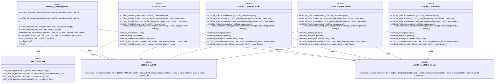

# Polyglot Codebase Knowledge Graph

> Generated offline by **readmenator**. 9 files, 237 symbols, 38 imports. Supports C, C++, Python, Go, Rust, JS/TS, Java, C#, Shell, PHP, Dart, GDScript, Nim, ASM, Ruby, Swift, Kotlin, Scala, Lua, Elixir.
> No LLMs. No tokens. Pure static analysis. See more [here](https://github.com/grisuno/ReadMenator)

**Start here:** Statistics Dashboard for scope, God Nodes for blast radius, Architecture Reference for per-file API. Agents: prefer `readmenator-agent/INDEX.md` + `SYMBOLS.md`.

**Wiki:** prefer `readmenator-wiki/index.md` for progressive disclosure: one synthesis page per community, `connections.json` with EXTRACTED vs INFERRED confidence, `queries.md` log, `REPORT.md` audit.

**Confidence:** EXTRACTED = parsed from source, INFERRED = heuristic bridge, AMBIGUOUS = reported, never hidden. See `readmenator-wiki/REPORT.md`.

**Total Files Parsed:** 9 | **Total Symbols Extracted:** 237 | **Total Imports:** 38
 | **Resolved Imports:** 4

<!-- ranking_model: v1.0 | weights: {ppr:0.45,auth:0.2,test:0.15,doc:0.1,fresh:0.1} | alpha:0.85 | commit:b3ca3bb | date:2026-07-18 -->


## Table of Contents

1. [Statistics Dashboard](#statistics-dashboard)
2. [Architectural Layers](#architectural-layers)
3. [Ranked Context](#ranked-context)
4. [God Nodes](#god-nodes)
5. [Community Analysis](#community-analysis)
6. [Suggested Questions](#suggested-questions)
7. [Hotspot Analysis](#hotspot-analysis)
8. [Change Impact Analysis](#change-impact-analysis)
9. [Suggested Linting Rules](#suggested-linting-rules)
10. [Dataflow Analysis](#dataflow-analysis)
11. [Orphans](#orphans)
12. [Query Recipes](#query-recipes)
13. [Structural Knowledge Map](#structural-knowledge-map)
14. [UML Class Diagram](#uml-class-diagram)
15. [Code Property Graph](#code-property-graph)
16. [Architecture Reference](#architecture-reference)
    - [C (3 files)](#c-3-files)
    - [H (2 files)](#h-2-files)
    - [PY (1 files)](#py-1-files)
    - [SH (3 files)](#sh-3-files)

---

## Statistics Dashboard

| Metric | Value |
|--------|-------|
| Total Files | 9 |
| Total Symbols | 237 |
| Total Imports | 38 |
| Call Edges | 0 |
| Inheritance Edges | 0 |
| Languages | 4 |
| Avg Symbols/File | 26.3 |
| Avg Imports/File | 4.2 |
| Resolved Imports | 4 |

### Top Files by Import Count (Fan-Out)

| File | Imports | Symbols | Language |
|------|---------|---------|----------|
| `beacon.c` | 24 | 15 | c |
| `cJSON.c` | 9 | 125 | c |
| `aes.c` | 2 | 43 | c |
| `aes.h` | 2 | 17 | h |
| `cJSON.h` | 1 | 37 | h |

### Top Files by Imported-By Count (Fan-In)

| File | Imported By | Symbols | Language |
|------|-------------|---------|----------|
| `aes.h` | 2 | 17 | h |
| `cJSON.h` | 2 | 37 | h |

---

## Architectural Layers

Auto-detected from path patterns, naming conventions, and imported frameworks.

| Layer | Files |
|-------|-------|
| utility | 7 |
| presentation | 2 |

### utility

- `aes.c` (c, 43 symbols)
- `aes.h` (h, 17 symbols)
- `app.py` (py, 0 symbols)
- `beacon.c` (c, 15 symbols)
- `cJSON.c` (c, 125 symbols)
- `cJSON.h` (h, 37 symbols)
- `install.sh` (sh, 0 symbols)

### presentation

- `andoid_build.sh` (sh, 0 symbols)
- `armbian_build.sh` (sh, 0 symbols)

---

## Ranked Context

Files ranked by composite score for the current query context. The ranking combines Personalized PageRank (query relevance), global authority, test coverage, documentation coverage, and code freshness. Model: v1.0.

| Rank | File | Composite | PPR | Authority | Test | Doc |
|------|------|-----------|-----|-----------|------|-----|
| 1 | `aes.h` | 0.2076 | 0.3013 | 0.3013 | 0.00 | 0.12 |
| 2 | `cJSON.h` | 0.2013 | 0.3013 | 0.3013 | 0.00 | 0.05 |
| 3 | `beacon.c` | 0.1194 | 0.1325 | 0.1325 | 0.00 | 0.33 |
| 4 | `aes.c` | 0.1163 | 0.1325 | 0.1325 | 0.00 | 0.30 |
| 5 | `cJSON.c` | 0.1069 | 0.1325 | 0.1325 | 0.00 | 0.21 |
| 6 | `app.py` | 0.1000 | 0.0000 | 0.0000 | 0.00 | 1.00 |
| 7 | `armbian_build.sh` | 0.1000 | 0.0000 | 0.0000 | 0.00 | 1.00 |
| 8 | `andoid_build.sh` | 0.0000 | 0.0000 | 0.0000 | 0.00 | 0.00 |
| 9 | `install.sh` | 0.0000 | 0.0000 | 0.0000 | 0.00 | 0.00 |

---

## God Nodes

Most architecturally central files ranked by combined import/export degree and symbol richness.

| File | Score | Connections | PageRank |
|------|-------|-------------|----------|
| `cJSON.c` | 14.5 | | 0.1325 |
| `cJSON.h` | 7.7 | | 0.3013 |
| `aes.c` | 6.3 | | 0.1325 |
| `aes.h` | 5.7 | | 0.3013 |
| `beacon.c` | 5.5 | | 0.1325 |
| `andoid_build.sh` | 0.0 | | 0.0000 |
| `app.py` | 0.0 | | 0.0000 |
| `armbian_build.sh` | 0.0 | | 0.0000 |
| `install.sh` | 0.0 | | 0.0000 |

---

## Community Analysis

Files grouped by import-based community detection. Cohesion measures how tightly connected each community is internally.

### root (Cohesion: 1.00)

**5 files** in this community:

- `aes.c` (c, 43 symbols)
- `aes.h` (h, 17 symbols)
- `beacon.c` (c, 15 symbols)
- `cJSON.c` (c, 125 symbols)
- `cJSON.h` (h, 37 symbols)

---

## Suggested Questions

Auto-generated exploration prompts based on graph structure:

- What does cJSON.c depend on, and what depends on it? (1 connections)
- What does cJSON.h depend on, and what depends on it? (2 connections)
- What does aes.c depend on, and what depends on it? (1 connections)
- How are the 5 files in 'root' related to each other?
- What is AES_ctx in aes.h and how is it used?

---

## Hotspot Analysis

Files ranked by combined complexity (symbol count) and centrality (connection count). High-scoring files are architecturally critical and may need refactoring attention.

| File | Complexity | Centrality | Combined | Symbols | Connections |
|------|-----------|------------|----------|---------|-------------|
| `aes.h` | 0.136 | 0.231 | 0.193 | 17 | 6 |
| `cJSON.h` | 0.296 | 0.192 | 0.234 | 37 | 5 |
| `beacon.c` | 0.120 | 1.000 | 0.648 | 15 | 26 |
| `aes.c` | 0.344 | 0.115 | 0.207 | 43 | 3 |
| `cJSON.c` | 1.000 | 0.385 | 0.631 | 125 | 10 |
| `app.py` | 0.000 | 0.000 | 0.000 | 0 | 0 |
| `armbian_build.sh` | 0.000 | 0.000 | 0.000 | 0 | 0 |
| `andoid_build.sh` | 0.000 | 0.000 | 0.000 | 0 | 0 |
| `install.sh` | 0.000 | 0.000 | 0.000 | 0 | 0 |

---

## Dataflow Analysis

Procedural intra-function dataflow findings (zero tokens, regex-based heuristics, all INFERRED). Each lead is grounded at file:line for manual review.

**5 findings** (DEAD_STORE: 2, UNCHECKED_ALLOC: 3).

| File | Function | Line | Kind | Variable | Description |
|------|----------|------|------|----------|-------------|
| `beacon.c` | `aes256_cfb_encrypt` | 122 | `UNCHECKED_ALLOC` | `ciphertext` | Result of allocator stored in `ciphertext` is never checked against NULL. |
| `beacon.c` | `aes256_cfb_decrypt` | 150 | `UNCHECKED_ALLOC` | `plaintext` | Result of allocator stored in `plaintext` is never checked against NULL. |
| `beacon.c` | `main` | 456 | `UNCHECKED_ALLOC` | `full_enc` | Result of allocator stored in `full_enc` is never checked against NULL. |
| `cJSON.c` | `print_array` | 1654 | `DEAD_STORE` | `output_pointer` | `output_pointer` assigned at line 1654 but never read afterwards. |
| `cJSON.c` | `print_object` | 1887 | `DEAD_STORE` | `output_pointer` | `output_pointer` assigned at line 1887 but never read afterwards. |

---

## Change Impact Analysis

Files sorted by how many other files would be affected if they changed. High-impact files should be changed with caution.

| File | Direct Dependents | Transitive Dependents | Total Impact |
|------|------------------|----------------------|--------------|
| `aes.h` | 2 | 0 | 2 |
| `cJSON.h` | 2 | 0 | 2 |
| `aes.c` | 0 | 0 | 0 |
| `andoid_build.sh` | 0 | 0 | 0 |
| `app.py` | 0 | 0 | 0 |
| `armbian_build.sh` | 0 | 0 | 0 |
| `beacon.c` | 0 | 0 | 0 |
| `cJSON.c` | 0 | 0 | 0 |
| `install.sh` | 0 | 0 | 0 |

---

## Suggested Linting Rules

Automatically suggested linting and security rules based on patterns detected in the codebase. These can be exported as Semgrep rules using the `--export-rules` flag.

| Rule ID | Severity | Description | Language | Matches |
|---------|----------|-------------|----------|---------|
| `RM001` | info | Large number of functions in c: 142 total | c | 142 |
| `RM002` | info | Large number of functions in h: 5 total | h | 5 |

---

## Orphans

Files with no documentation or low connectivity. These are candidates for documentation investment or cleanup.

- `andoid_build.sh` (0 symbols, no doc)
- `install.sh` (0 symbols, no doc)

---

## Query Recipes

Example queries you can run against this knowledge base using the ranking engine:

```
# Find files most relevant to a concept
readmenator query "Where is the import resolver implemented?"

# Rank files by relevance to a topic
readmenator query "How does documentation generation work?"

# Explain why a file ranks highly
readmenator query "explain readmenator/_documentation.py"

# Trace dependency paths with ranked context
readmenator query "path from CLI to exporter"
```

The ranking model uses the following signals:

- **Personalized PageRank** (45% weight): query-specific relevance via seed propagation
- **Global Authority** (20% weight): structural importance via standard PageRank
- **Test Coverage** (15% weight): fraction of symbols referenced in test files
- **Doc Coverage** (10% weight): presence of docstrings and file-level docs
- **Freshness** (10% weight): recent modification activity

Results include score decomposition and justification paths for each ranked item.

---

## Structural Knowledge Map


```mermaid
graph TD
    classDef mod fill:#1e1e1e,stroke:#ff6666,stroke-width:2px,color:#fff;
    classDef cls fill:#2d2d2d,stroke:#4ec9b0,stroke-width:2px,color:#fff;
    classDef fn fill:#333,stroke:#dcdcaa,stroke-width:1px,color:#dcdcaa;
    classDef ext fill:#111,stroke:#666,stroke-dasharray:5 5,color:#aaa;
    subgraph community_0 ["root"]
    beacon_c["beacon.c (c)"]
    class beacon_c mod;
    beacon_c_MemoryStruct["MemoryStruct"]
    class beacon_c_MemoryStruct cls;
    beacon_c --> beacon_c_MemoryStruct
    beacon_c_base64_encode["base64_encode"]
    class beacon_c_base64_encode fn;
    beacon_c --> beacon_c_base64_encode
    beacon_c_base64_decode["base64_decode"]
    class beacon_c_base64_decode fn;
    beacon_c --> beacon_c_base64_decode
    beacon_c_aes256_cfb_encrypt["aes256_cfb_encrypt"]
    class beacon_c_aes256_cfb_encrypt fn;
    beacon_c --> beacon_c_aes256_cfb_encrypt
    beacon_c_aes256_cfb_decrypt["aes256_cfb_decrypt"]
    class beacon_c_aes256_cfb_decrypt fn;
    beacon_c --> beacon_c_aes256_cfb_decrypt
    cJSON_c["cJSON.c (c)"]
    class cJSON_c mod;
    aes_c["aes.c (c)"]
    class aes_c mod;
    aes_h["aes.h (h)"]
    class aes_h mod;
    cJSON_h["cJSON.h (h)"]
    class cJSON_h mod;
    andoid_build_sh["andoid_build.sh (sh)"]
    class andoid_build_sh mod;
    app_py["app.py (py)"]
    class app_py mod;
    armbian_build_sh["armbian_build.sh (sh)"]
    class armbian_build_sh mod;
    install_sh["install.sh (sh)"]
    class install_sh mod;
    end
    aes_c -- resolved_imports --> aes_h
    beacon_c -- resolved_imports --> aes_h
    beacon_c -- resolved_imports --> cJSON_h
    cJSON_c -- resolved_imports --> cJSON_h
    ext_aes_h["aes.h"]
    class ext_aes_h ext;
    aes_c -.->|imports| ext_aes_h
    ext_string_h["string.h"]
    class ext_string_h ext;
    aes_c -.->|imports| ext_string_h
    ext_stdint_h["stdint.h"]
    class ext_stdint_h ext;
    aes_h -.->|imports| ext_stdint_h
    ext_stddef_h["stddef.h"]
    class ext_stddef_h ext;
    aes_h -.->|imports| ext_stddef_h
    ext_stdio_h["stdio.h"]
    class ext_stdio_h ext;
    beacon_c -.->|imports| ext_stdio_h
    ext_stdlib_h["stdlib.h"]
    class ext_stdlib_h ext;
    beacon_c -.->|imports| ext_stdlib_h
    beacon_c -.->|imports| ext_string_h
    ext_unistd_h["unistd.h"]
    class ext_unistd_h ext;
    beacon_c -.->|imports| ext_unistd_h
    ext_time_h["time.h"]
    class ext_time_h ext;
    beacon_c -.->|imports| ext_time_h
    ext_sys_types_h["types.h"]
    class ext_sys_types_h ext;
    beacon_c -.->|imports| ext_sys_types_h
    ext_sys_socket_h["socket.h"]
    class ext_sys_socket_h ext;
    beacon_c -.->|imports| ext_sys_socket_h
    ext_netinet_in_h["in.h"]
    class ext_netinet_in_h ext;
    beacon_c -.->|imports| ext_netinet_in_h
    ext_arpa_inet_h["inet.h"]
    class ext_arpa_inet_h ext;
    beacon_c -.->|imports| ext_arpa_inet_h
    ext_net_if_h["if.h"]
    class ext_net_if_h ext;
    beacon_c -.->|imports| ext_net_if_h
    ext_sys_ioctl_h["ioctl.h"]
    class ext_sys_ioctl_h ext;
    beacon_c -.->|imports| ext_sys_ioctl_h
    ext_pwd_h["pwd.h"]
    class ext_pwd_h ext;
    beacon_c -.->|imports| ext_pwd_h
    ext_errno_h["errno.h"]
    class ext_errno_h ext;
    beacon_c -.->|imports| ext_errno_h
    ext_curl_curl_h["curl.h"]
    class ext_curl_curl_h ext;
    beacon_c -.->|imports| ext_curl_curl_h
    ext_sys_mman_h["mman.h"]
    class ext_sys_mman_h ext;
    beacon_c -.->|imports| ext_sys_mman_h
    ext_fcntl_h["fcntl.h"]
    class ext_fcntl_h ext;
    beacon_c -.->|imports| ext_fcntl_h
    beacon_c -.->|imports| ext_stdint_h
    ext_sys_wait_h["wait.h"]
    class ext_sys_wait_h ext;
    beacon_c -.->|imports| ext_sys_wait_h
    ext_stdarg_h["stdarg.h"]
    class ext_stdarg_h ext;
    beacon_c -.->|imports| ext_stdarg_h
    ext_netdb_h["netdb.h"]
    class ext_netdb_h ext;
    beacon_c -.->|imports| ext_netdb_h
    ext_sys_utsname_h["utsname.h"]
    class ext_sys_utsname_h ext;
    beacon_c -.->|imports| ext_sys_utsname_h
    ext_openssl_rand_h["rand.h"]
    class ext_openssl_rand_h ext;
    beacon_c -.->|imports| ext_openssl_rand_h
    beacon_c -.->|imports| ext_aes_h
    ext_cJSON_h["cJSON.h"]
    class ext_cJSON_h ext;
    beacon_c -.->|imports| ext_cJSON_h
    cJSON_c -.->|imports| ext_string_h
    cJSON_c -.->|imports| ext_stdio_h
    ext_math_h["math.h"]
    class ext_math_h ext;
    cJSON_c -.->|imports| ext_math_h
    cJSON_c -.->|imports| ext_stdlib_h
    ext_limits_h["limits.h"]
    class ext_limits_h ext;
    cJSON_c -.->|imports| ext_limits_h
    ext_ctype_h["ctype.h"]
    class ext_ctype_h ext;
    cJSON_c -.->|imports| ext_ctype_h
    ext_float_h["float.h"]
    class ext_float_h ext;
    cJSON_c -.->|imports| ext_float_h
    ext_locale_h["locale.h"]
    class ext_locale_h ext;
    cJSON_c -.->|imports| ext_locale_h
    cJSON_c -.->|imports| ext_cJSON_h
    cJSON_h -.->|imports| ext_stddef_h
```

---

## UML Class Diagram

Auto-generated Mermaid class diagram from parsed class-level symbols. Shows classes, structs, interfaces, traits, and their methods with inheritance and dependency relationships.


```mermaid
classDiagram
  class aes_h_AES_ctx {
    <<struct>>
    +AES_init_ctx(struct AES_ctx* ctx, const uint8_t* key);
    +AES_init_ctx_iv(struct AES_ctx* ctx, const uint8_t* key, const uint8_t* iv);
    +AES_ctx_set_iv(struct AES_ctx* ctx, const uint8_t* iv);
    +AES_ECB_encrypt(const struct AES_ctx* ctx, uint8_t* buf);
  }
  class beacon_c_MemoryStruct {
    <<struct>>
    +base64_encode(const unsigned char* data, size_t input_length)
    +base64_decode(const char* data, size_t* out_len)
    +aes256_cfb_encrypt(const unsigned char* key, const unsigned char* iv,
            ...
    +aes256_cfb_decrypt(const unsigned char* key, const unsigned char* iv,
            ...
    +WriteMemoryCallback(void *contents, size_t size, size_t nmemb, void *userp)
    +https_request(const char* url, const char* method, const char* post_data)
    +exec_cmd(const char* cmd, int* out_len)
    +get_local_ips()
    +main()
  }
  class cJSON_c_internal_hooks {
    <<struct>>
    +CJSON_PUBLIC(const char *) cJSON_GetErrorPtr(void)
    +CJSON_PUBLIC(char *) cJSON_GetStringValue(const cJSON * const item)
    +CJSON_PUBLIC(double) cJSON_GetNumberValue(const cJSON * const item)
    +CJSON_PUBLIC(const char*) cJSON_Version(void)
    +case_insensitive_strcmp(const unsigned char *string1, const unsigned char *string2)
    +internal_malloc(size_t size)
    +internal_free(void *pointer)
    +internal_realloc(void *pointer, size_t size)
    +cJSON_strdup(const unsigned char* string, const internal_hooks * const hooks)
    +CJSON_PUBLIC(void) cJSON_InitHooks(cJSON_Hooks* hooks)
  }
  class cJSON_c_error {
    <<struct>>
    +CJSON_PUBLIC(const char *) cJSON_GetErrorPtr(void)
    +CJSON_PUBLIC(char *) cJSON_GetStringValue(const cJSON * const item)
    +CJSON_PUBLIC(double) cJSON_GetNumberValue(const cJSON * const item)
    +CJSON_PUBLIC(const char*) cJSON_Version(void)
    +case_insensitive_strcmp(const unsigned char *string1, const unsigned char *string2)
    +internal_malloc(size_t size)
    +internal_free(void *pointer)
    +internal_realloc(void *pointer, size_t size)
    +cJSON_strdup(const unsigned char* string, const internal_hooks * const hooks)
    +CJSON_PUBLIC(void) cJSON_InitHooks(cJSON_Hooks* hooks)
  }
  class cJSON_c_parse_buffer {
    <<struct>>
    +CJSON_PUBLIC(const char *) cJSON_GetErrorPtr(void)
    +CJSON_PUBLIC(char *) cJSON_GetStringValue(const cJSON * const item)
    +CJSON_PUBLIC(double) cJSON_GetNumberValue(const cJSON * const item)
    +CJSON_PUBLIC(const char*) cJSON_Version(void)
    +case_insensitive_strcmp(const unsigned char *string1, const unsigned char *string2)
    +internal_malloc(size_t size)
    +internal_free(void *pointer)
    +internal_realloc(void *pointer, size_t size)
    +cJSON_strdup(const unsigned char* string, const internal_hooks * const hooks)
    +CJSON_PUBLIC(void) cJSON_InitHooks(cJSON_Hooks* hooks)
  }
  class cJSON_c_printbuffer {
    <<struct>>
    +CJSON_PUBLIC(const char *) cJSON_GetErrorPtr(void)
    +CJSON_PUBLIC(char *) cJSON_GetStringValue(const cJSON * const item)
    +CJSON_PUBLIC(double) cJSON_GetNumberValue(const cJSON * const item)
    +CJSON_PUBLIC(const char*) cJSON_Version(void)
    +case_insensitive_strcmp(const unsigned char *string1, const unsigned char *string2)
    +internal_malloc(size_t size)
    +internal_free(void *pointer)
    +internal_realloc(void *pointer, size_t size)
    +cJSON_strdup(const unsigned char* string, const internal_hooks * const hooks)
    +CJSON_PUBLIC(void) cJSON_InitHooks(cJSON_Hooks* hooks)
  }
  class cJSON_h_cJSON {
    <<struct>>
    +sensitive(1) or case insensitive (0) */ CJSON_PUBLIC(cJSON_bool) cJSON_Compare(const cJSON * const a, const cJSON * const b, const cJSON_bo
  }
  class cJSON_h_cJSON_Hooks {
    <<struct>>
    +sensitive(1) or case insensitive (0) */ CJSON_PUBLIC(cJSON_bool) cJSON_Compare(const cJSON * const a, const cJSON * const b, const cJSON_bo
  }
  beacon_c_MemoryStruct --> aes_h_AES_ctx : uses
  beacon_c_MemoryStruct --> cJSON_h_cJSON : uses
  beacon_c_MemoryStruct --> cJSON_h_cJSON_Hooks : uses
  cJSON_c_error --> cJSON_h_cJSON : uses
  cJSON_c_error --> cJSON_h_cJSON_Hooks : uses
  cJSON_c_internal_hooks --> cJSON_h_cJSON : uses
  cJSON_c_internal_hooks --> cJSON_h_cJSON_Hooks : uses
  cJSON_c_parse_buffer --> cJSON_h_cJSON : uses
  cJSON_c_parse_buffer --> cJSON_h_cJSON_Hooks : uses
  cJSON_c_printbuffer --> cJSON_h_cJSON : uses
  cJSON_c_printbuffer --> cJSON_h_cJSON_Hooks : uses
```

---

## Code Property Graph

Machine-readable Code Property Graph (CPG) in JSON-LD format. This block allows AI agents to parse the full structural graph without additional file reads. Compatible with GraphRAG pipelines.

```json
{"@context": "https://schema.org", "analysis": {"communities": [{"cohesion": 1.0, "id": 0, "label": "root", "size": 5}], "god_nodes": [{"node_id": "cJSON.c", "score": 14.5}, {"node_id": "cJSON.h", "score": 7.7}, {"node_id": "aes.c", "score": 6.3}, {"node_id": "aes.h", "score": 5.7}, {"node_id": "beacon.c", "score": 5.5}, {"node_id": "andoid_build.sh", "score": 0.0}, {"node_id": "app.py", "score": 0.0}, {"node_id": "armbian_build.sh", "score": 0.0}, {"node_id": "install.sh", "score": 0.0}], "surprising_connections": []}, "edges": [{"confidence": "EXTRACTED", "relation": "imports", "source": "aes.c", "target": "aes.h"}, {"confidence": "EXTRACTED", "relation": "imports", "source": "aes.c", "target": "string.h"}, {"confidence": "EXTRACTED", "relation": "imports", "source": "aes.h", "target": "stdint.h"}, {"confidence": "EXTRACTED", "relation": "imports", "source": "aes.h", "target": "stddef.h"}, {"confidence": "EXTRACTED", "relation": "imports", "source": "beacon.c", "target": "stdio.h"}, {"confidence": "EXTRACTED", "relation": "imports", "source": "beacon.c", "target": "stdlib.h"}, {"confidence": "EXTRACTED", "relation": "imports", "source": "beacon.c", "target": "string.h"}, {"confidence": "EXTRACTED", "relation": "imports", "source": "beacon.c", "target": "unistd.h"}, {"confidence": "EXTRACTED", "relation": "imports", "source": "beacon.c", "target": "time.h"}, {"confidence": "EXTRACTED", "relation": "imports", "source": "beacon.c", "target": "sys/types.h"}, {"confidence": "EXTRACTED", "relation": "imports", "source": "beacon.c", "target": "sys/socket.h"}, {"confidence": "EXTRACTED", "relation": "imports", "source": "beacon.c", "target": "netinet/in.h"}, {"confidence": "EXTRACTED", "relation": "imports", "source": "beacon.c", "target": "arpa/inet.h"}, {"confidence": "EXTRACTED", "relation": "imports", "source": "beacon.c", "target": "net/if.h"}, {"confidence": "EXTRACTED", "relation": "imports", "source": "beacon.c", "target": "sys/ioctl.h"}, {"confidence": "EXTRACTED", "relation": "imports", "source": "beacon.c", "target": "pwd.h"}, {"confidence": "EXTRACTED", "relation": "imports", "source": "beacon.c", "target": "errno.h"}, {"confidence": "EXTRACTED", "relation": "imports", "source": "beacon.c", "target": "curl/curl.h"}, {"confidence": "EXTRACTED", "relation": "imports", "source": "beacon.c", "target": "sys/mman.h"}, {"confidence": "EXTRACTED", "relation": "imports", "source": "beacon.c", "target": "fcntl.h"}, {"confidence": "EXTRACTED", "relation": "imports", "source": "beacon.c", "target": "stdint.h"}, {"confidence": "EXTRACTED", "relation": "imports", "source": "beacon.c", "target": "sys/wait.h"}, {"confidence": "EXTRACTED", "relation": "imports", "source": "beacon.c", "target": "stdarg.h"}, {"confidence": "EXTRACTED", "relation": "imports", "source": "beacon.c", "target": "netdb.h"}, {"confidence": "EXTRACTED", "relation": "imports", "source": "beacon.c", "target": "sys/utsname.h"}, {"confidence": "EXTRACTED", "relation": "imports", "source": "beacon.c", "target": "openssl/rand.h"}, {"confidence": "EXTRACTED", "relation": "imports", "source": "beacon.c", "target": "aes.h"}, {"confidence": "EXTRACTED", "relation": "imports", "source": "beacon.c", "target": "cJSON.h"}, {"confidence": "EXTRACTED", "relation": "imports", "source": "cJSON.c", "target": "string.h"}, {"confidence": "EXTRACTED", "relation": "imports", "source": "cJSON.c", "target": "stdio.h"}, {"confidence": "EXTRACTED", "relation": "imports", "source": "cJSON.c", "target": "math.h"}, {"confidence": "EXTRACTED", "relation": "imports", "source": "cJSON.c", "target": "stdlib.h"}, {"confidence": "EXTRACTED", "relation": "imports", "source": "cJSON.c", "target": "limits.h"}, {"confidence": "EXTRACTED", "relation": "imports", "source": "cJSON.c", "target": "ctype.h"}, {"confidence": "EXTRACTED", "relation": "imports", "source": "cJSON.c", "target": "float.h"}, {"confidence": "EXTRACTED", "relation": "imports", "source": "cJSON.c", "target": "locale.h"}, {"confidence": "EXTRACTED", "relation": "imports", "source": "cJSON.c", "target": "cJSON.h"}, {"confidence": "EXTRACTED", "relation": "imports", "source": "cJSON.h", "target": "stddef.h"}, {"confidence": "EXTRACTED", "relation": "resolved_imports", "source": "aes.c", "target": "aes.h"}, {"confidence": "EXTRACTED", "relation": "resolved_imports", "source": "beacon.c", "target": "aes.h"}, {"confidence": "EXTRACTED", "relation": "resolved_imports", "source": "beacon.c", "target": "cJSON.h"}, {"confidence": "EXTRACTED", "relation": "resolved_imports", "source": "cJSON.c", "target": "cJSON.h"}], "generator": "readmenator", "metadata": {"edge_count": 42, "file_count": 9, "language_count": 4, "symbol_count": 237}, "nodes": [{"doc": "aes.c - tiny-AES-c (https://github.com/kokke/tiny-AES-c)", "id": "aes.c", "kind": "module", "label": "aes.c", "language": "c", "sha256": "12e247148b2d6453", "symbol_count": 43, "symbols": [{"kind": "function", "line": 13, "name": "getSBoxValue", "signature": "static uint8_t getSBoxValue(uint8_t num)"}, {"kind": "function", "line": 35, "name": "getSBoxInvert", "signature": "static uint8_t getSBoxInvert(uint8_t num)"}, {"kind": "function", "line": 57, "name": "Td0", "signature": "static uint8_t Td0(int x)"}, {"kind": "function", "line": 58, "name": "Td1", "signature": "static uint8_t Td1(int x)"}, {"kind": "function", "line": 59, "name": "Td2", "signature": "static uint8_t Td2(int x)"}, {"kind": "function", "line": 60, "name": "Td3", "signature": "static uint8_t Td3(int x)"}, {"kind": "function", "line": 61, "name": "Td4", "signature": "static uint8_t Td4(int x)"}, {"doc": "This function produces Nb(Nr+1) round keys. The round keys are used in each round to decrypt the states.", "kind": "function", "line": 166, "name": "KeyExpansion", "signature": "static void KeyExpansion(uint8_t* RoundKey, const uint8_t* Key)"}, {"kind": "function", "line": 239, "name": "AES_init_ctx", "signature": "void AES_init_ctx(struct AES_ctx* ctx, const uint8_t* key)"}, {"doc": "if (defined(CBC) && (CBC == 1)) || (defined(CTR) && (CTR == 1))", "kind": "function", "line": 244, "name": "AES_init_ctx_iv", "signature": "void AES_init_ctx_iv(struct AES_ctx* ctx, const uint8_t* key, const uint8_t* iv)"}, {"kind": "function", "line": 249, "name": "AES_ctx_set_iv", "signature": "void AES_ctx_set_iv(struct AES_ctx* ctx, const uint8_t* iv)"}, {"doc": "This function adds the round key to state. The round key is added to the state by an XOR function.", "kind": "function", "line": 257, "name": "AddRoundKey", "signature": "static void AddRoundKey(uint8_t round, state_t* state, const uint8_t* RoundKey)"}, {"doc": "The SubBytes Function Substitutes the values in the state matrix with values in an S-box.", "kind": "function", "line": 271, "name": "SubBytes", "signature": "static void SubBytes(state_t* state)"}, {"doc": "The ShiftRows() function shifts the rows in the state to the left. Each row is shifted with different offset. Offset = Row number. So the first row is not shifted.", "kind": "function", "line": 286, "name": "ShiftRows", "signature": "static void ShiftRows(state_t* state)"}, {"kind": "function", "line": 314, "name": "xtime", "signature": "static uint8_t xtime(uint8_t x)"}, {"doc": "MixColumns function mixes the columns of the state matrix", "kind": "function", "line": 320, "name": "MixColumns", "signature": "static void MixColumns(state_t* state)"}, {"doc": "Multiply is used to multiply numbers in the field GF(2^8) Note: The last call to xtime() is unneeded, but often ends up generating a smaller binary The compiler seems to be able to vectorize the operation better this way. See https://github.com/kokke/tiny-AES-c/pull/34 if MULTIPLY_AS_A_FUNCTION", "kind": "function", "line": 340, "name": "Multiply", "signature": "static uint8_t Multiply(uint8_t x, uint8_t y)"}, {"doc": "MixColumns function mixes the columns of the state matrix. The method used to multiply may be difficult to understand for the inexperienced. Please use the references to gain more information.", "kind": "function", "line": 370, "name": "InvMixColumns", "signature": "static void InvMixColumns(state_t* state)"}, {"doc": "The SubBytes Function Substitutes the values in the state matrix with values in an S-box.", "kind": "function", "line": 391, "name": "InvSubBytes", "signature": "static void InvSubBytes(state_t* state)"}, {"kind": "function", "line": 403, "name": "InvShiftRows", "signature": "static void InvShiftRows(state_t* state)"}, {"doc": "Cipher is the main function that encrypts the PlainText.", "kind": "function", "line": 433, "name": "Cipher", "signature": "static void Cipher(state_t* state, const uint8_t* RoundKey)"}, {"doc": "if (defined(CBC) && CBC == 1) || (defined(ECB) && ECB == 1)", "kind": "function", "line": 459, "name": "InvCipher", "signature": "static void InvCipher(state_t* state, const uint8_t* RoundKey)"}, {"kind": "function", "line": 490, "name": "AES_ECB_encrypt", "signature": "void AES_ECB_encrypt(const struct AES_ctx* ctx, uint8_t* buf)"}, {"kind": "function", "line": 496, "name": "AES_ECB_decrypt", "signature": "void AES_ECB_decrypt(const struct AES_ctx* ctx, uint8_t* buf)"}, {"kind": "function", "line": 512, "name": "XorWithIv", "signature": "static void XorWithIv(uint8_t* buf, const uint8_t* Iv)"}, {"kind": "function", "line": 521, "name": "AES_CBC_encrypt_buffer", "signature": "void AES_CBC_encrypt_buffer(struct AES_ctx *ctx, uint8_t* buf, size_t length)"}, {"kind": "function", "line": 536, "name": "AES_CBC_decrypt_buffer", "signature": "void AES_CBC_decrypt_buffer(struct AES_ctx* ctx, uint8_t* buf, size_t length)"}, {"doc": "XorWithIv(buf, ctx->Iv); memcpy(ctx->Iv, storeNextIv, AES_BLOCKLEN); buf += AES_BLOCKLEN; } } #endif // #if defined(CBC) && (CBC == 1) #if defined(CTR) && (CTR == 1) /* Symmetrical operation: same function for encrypting as for decrypting. Note any IV/nonce should never be reused with the same key", "kind": "function", "line": 558, "name": "AES_CTR_xcrypt_buffer", "signature": "void AES_CTR_xcrypt_buffer(struct AES_ctx* ctx, uint8_t* buf, size_t length)"}, {"kind": "macro", "line": 5, "name": "Nb", "signature": "#define Nb"}, {"kind": "macro", "line": 9, "name": "KEYLEN_256", "signature": "#define KEYLEN_256"}, {"kind": "macro", "line": 10, "name": "RKLENGTH", "signature": "#define RKLENGTH"}, {"kind": "macro", "line": 11, "name": "BLOCKLEN", "signature": "#define BLOCKLEN"}, {"kind": "macro", "line": 67, "name": "Nb", "signature": "#define Nb"}, {"kind": "macro", "line": 70, "name": "Nk", "signature": "#define Nk"}, {"kind": "macro", "line": 71, "name": "Nr", "signature": "#define Nr"}, {"kind": "macro", "line": 73, "name": "Nk", "signature": "#define Nk"}, {"kind": "macro", "line": 74, "name": "Nr", "signature": "#define Nr"}, {"kind": "macro", "line": 76, "name": "Nk", "signature": "#define Nk"}, {"kind": "macro", "line": 77, "name": "Nr", "signature": "#define Nr"}, {"kind": "macro", "line": 84, "name": "MULTIPLY_AS_A_FUNCTION", "signature": "#define MULTIPLY_AS_A_FUNCTION"}, {"kind": "macro", "line": 163, "name": "getSBoxValue", "signature": "#define getSBoxValue(num)"}, {"kind": "macro", "line": 349, "name": "Multiply", "signature": "#define Multiply(x, y)"}, {"kind": "macro", "line": 365, "name": "getSBoxInvert", "signature": "#define getSBoxInvert(num)"}]}, {"id": "aes.h", "kind": "module", "label": "aes.h", "language": "h", "sha256": "0f058c969c3e788c", "symbol_count": 17, "symbols": [{"kind": "struct", "line": 31, "name": "AES_ctx"}, {"kind": "function", "line": 38, "name": "AES_init_ctx", "signature": "void AES_init_ctx(struct AES_ctx* ctx, const uint8_t* key);"}, {"doc": "if (defined(CBC) && (CBC == 1)) || (defined(CTR) && (CTR == 1))", "kind": "function", "line": 40, "name": "AES_init_ctx_iv", "signature": "void AES_init_ctx_iv(struct AES_ctx* ctx, const uint8_t* key, const uint8_t* iv);"}, {"kind": "function", "line": 41, "name": "AES_ctx_set_iv", "signature": "void AES_ctx_set_iv(struct AES_ctx* ctx, const uint8_t* iv);"}, {"doc": "if defined(ECB) && (ECB == 1)", "kind": "function", "line": 45, "name": "AES_ECB_encrypt", "signature": "void AES_ECB_encrypt(const struct AES_ctx* ctx, uint8_t* buf);"}, {"kind": "macro", "line": 2, "name": "AES_H", "signature": "#define AES_H"}, {"kind": "macro", "line": 8, "name": "CBC", "signature": "#define CBC"}, {"kind": "macro", "line": 11, "name": "ECB", "signature": "#define ECB"}, {"kind": "macro", "line": 14, "name": "CTR", "signature": "#define CTR"}, {"kind": "macro", "line": 17, "name": "AES256", "signature": "#define AES256"}, {"kind": "macro", "line": 18, "name": "AES_BLOCKLEN", "signature": "#define AES_BLOCKLEN"}, {"kind": "macro", "line": 21, "name": "AES_KEYLEN", "signature": "#define AES_KEYLEN"}, {"kind": "macro", "line": 22, "name": "AES_keyExpSize", "signature": "#define AES_keyExpSize"}, {"kind": "macro", "line": 24, "name": "AES_KEYLEN", "signature": "#define AES_KEYLEN"}, {"kind": "macro", "line": 25, "name": "AES_keyExpSize", "signature": "#define AES_keyExpSize"}, {"kind": "macro", "line": 27, "name": "AES_KEYLEN", "signature": "#define AES_KEYLEN"}, {"kind": "macro", "line": 28, "name": "AES_keyExpSize", "signature": "#define AES_keyExpSize"}]}, {"id": "andoid_build.sh", "kind": "module", "label": "andoid_build.sh", "language": "sh", "sha256": "28750dd6a4dc3f8a", "symbol_count": 0, "symbols": []}, {"doc": "app.py  Autor: Gris Iscomeback Correo electrónico: grisiscomeback[at]gmail[dot]com Fecha de creación: xx/xx/xxxx Licencia: GPL v3  Descripción:", "id": "app.py", "kind": "module", "label": "app.py", "language": "py", "sha256": "57b21bdb023585b8", "symbol_count": 0, "symbols": []}, {"doc": "export CC=aarch64-linux-gnu-gcc", "id": "armbian_build.sh", "kind": "module", "label": "armbian_build.sh", "language": "sh", "sha256": "b539af38f25ecce2", "symbol_count": 0, "symbols": []}, {"id": "beacon.c", "kind": "module", "label": "beacon.c", "language": "c", "sha256": "dab75cad3a30c354", "symbol_count": 15, "symbols": [{"doc": "=== HTTPS REQUEST ===", "kind": "struct", "line": 177, "name": "MemoryStruct"}, {"kind": "function", "line": 50, "name": "base64_encode", "signature": "char* base64_encode(const unsigned char* data, size_t input_length)"}, {"kind": "function", "line": 76, "name": "base64_decode", "signature": "unsigned char* base64_decode(const char* data, size_t* out_len)"}, {"doc": "=== AES CFB ===", "kind": "function", "line": 118, "name": "aes256_cfb_encrypt", "signature": "unsigned char* aes256_cfb_encrypt(const unsigned char* key, const unsigned char* iv,\n            ..."}, {"kind": "function", "line": 146, "name": "aes256_cfb_decrypt", "signature": "unsigned char* aes256_cfb_decrypt(const unsigned char* key, const unsigned char* iv,\n            ..."}, {"kind": "function", "line": 182, "name": "WriteMemoryCallback", "signature": "static size_t WriteMemoryCallback(void *contents, size_t size, size_t nmemb, void *userp)"}, {"kind": "function", "line": 194, "name": "https_request", "signature": "char* https_request(const char* url, const char* method, const char* post_data)"}, {"doc": "=== EXEC CMD ===", "kind": "function", "line": 252, "name": "exec_cmd", "signature": "char* exec_cmd(const char* cmd, int* out_len)"}, {"doc": "=== GET LOCAL IPs ===", "kind": "function", "line": 297, "name": "get_local_ips", "signature": "char* get_local_ips()"}, {"doc": "=== MAIN ===", "kind": "function", "line": 340, "name": "main", "signature": "int main()"}, {"kind": "macro", "line": 1, "name": "_GNU_SOURCE", "signature": "#define _GNU_SOURCE"}, {"kind": "macro", "line": 29, "name": "C2_URL", "signature": "#define C2_URL"}, {"kind": "macro", "line": 30, "name": "CLIENT_ID", "signature": "#define CLIENT_ID"}, {"kind": "macro", "line": 31, "name": "MALEABLE", "signature": "#define MALEABLE"}, {"kind": "macro", "line": 33, "name": "USER_AGENTS_COUNT", "signature": "#define USER_AGENTS_COUNT"}]}, {"id": "cJSON.c", "kind": "module", "label": "cJSON.c", "language": "c", "sha256": "1e87d4d42a8960cc", "symbol_count": 125, "symbols": [{"kind": "struct", "line": 157, "name": "internal_hooks"}, {"kind": "struct", "line": 88, "name": "error"}, {"kind": "struct", "line": 291, "name": "parse_buffer"}, {"kind": "struct", "line": 482, "name": "printbuffer"}, {"kind": "function", "line": 95, "name": "CJSON_PUBLIC", "signature": "CJSON_PUBLIC(const char *) cJSON_GetErrorPtr(void)"}, {"kind": "function", "line": 100, "name": "CJSON_PUBLIC", "signature": "CJSON_PUBLIC(char *) cJSON_GetStringValue(const cJSON * const item)"}, {"kind": "function", "line": 110, "name": "CJSON_PUBLIC", "signature": "CJSON_PUBLIC(double) cJSON_GetNumberValue(const cJSON * const item)"}, {"kind": "function", "line": 125, "name": "CJSON_PUBLIC", "signature": "CJSON_PUBLIC(const char*) cJSON_Version(void)"}, {"doc": "/* This is a safeguard to prevent copy-pasters from using incompatible C and header files #if (CJSON_VERSION_MAJOR != 1) || (CJSON_VERSION_MINOR != 7) || (CJSON_VERSION_PATCH != 18) #error cJSON.h and cJSON.c have different versions. Make sure that both have the same. #endif CJSON_PUBLIC(const char*) cJSON_Version(void) { static char version[15]; sprintf(version, \"%i.%i.%i\", CJSON_VERSION_MAJOR, CJSON_VERSION_MINOR, CJSON_VERSION_PATCH); return version; } /* Case insensitive string comparison, doesn't consider two NULL pointers equal though", "kind": "function", "line": 134, "name": "case_insensitive_strcmp", "signature": "static int case_insensitive_strcmp(const unsigned char *string1, const unsigned char *string2)"}, {"doc": "} return tolower(*string1) - tolower(*string2); } typedef struct internal_hooks { void *(CJSON_CDECL *allocate)(size_t size); void (CJSON_CDECL *deallocate)(void *pointer); void *(CJSON_CDECL *reallocate)(void *pointer, size_t size); } internal_hooks; #if defined(_MSC_VER) /* work around MSVC error C2322: '...' address of dllimport '...' is not static", "kind": "function", "line": 166, "name": "internal_malloc", "signature": "static void * CJSON_CDECL internal_malloc(size_t size)"}, {"kind": "function", "line": 170, "name": "internal_free", "signature": "static void CJSON_CDECL internal_free(void *pointer)"}, {"kind": "function", "line": 174, "name": "internal_realloc", "signature": "static void * CJSON_CDECL internal_realloc(void *pointer, size_t size)"}, {"kind": "function", "line": 189, "name": "cJSON_strdup", "signature": "static unsigned char* cJSON_strdup(const unsigned char* string, const internal_hooks * const hooks)"}, {"kind": "function", "line": 210, "name": "CJSON_PUBLIC", "signature": "CJSON_PUBLIC(void) cJSON_InitHooks(cJSON_Hooks* hooks)"}, {"doc": "if (hooks->free_fn != NULL) { global_hooks.deallocate = hooks->free_fn; } /* use realloc only if both free and malloc are used global_hooks.reallocate = NULL; if ((global_hooks.allocate == malloc) && (global_hooks.deallocate == free)) { global_hooks.reallocate = realloc; } } /* Internal constructor.", "kind": "function", "line": 242, "name": "cJSON_New_Item", "signature": "static cJSON *cJSON_New_Item(const internal_hooks * const hooks)"}, {"doc": "item->valuestring = NULL; } if (!(item->type & cJSON_StringIsConst) && (item->string != NULL)) { global_hooks.deallocate(item->string); item->string = NULL; } global_hooks.deallocate(item); item = next; } } /* get the decimal point character of the current locale", "kind": "function", "line": 281, "name": "get_decimal_point", "signature": "static unsigned char get_decimal_point(void)"}, {"doc": "size_t offset; size_t depth; /* How deeply nested (in arrays/objects) is the input at the current offset. internal_hooks hooks; } parse_buffer; /* check if the given size is left to read in a given parse buffer (starting with 1) #define can_read(buffer, size) ((buffer != NULL) && (((buffer)->offset + size) <= (buffer)->length)) /* check if the buffer can be accessed at the given index (starting with 0) #define can_access_at_index(buffer, index) ((buffer != NULL) && (((buffer)->offset + index) < (buffer)->length)) #define cannot_access_at_index(buffer, index) (!can_access_at_index(buffer, index)) /* get a pointer to the buffer at the position #define buffer_at_offset(buffer) ((buffer)->content + (buffer)->offset) /* Parse the input text to generate a number, and populate the result into item.", "kind": "function", "line": 309, "name": "parse_number", "signature": "static cJSON_bool parse_number(cJSON * const item, parse_buffer * const input_buffer)"}, {"doc": "} typedef struct { unsigned char *buffer; size_t length; size_t offset; size_t depth; /* current nesting depth (for formatted printing) cJSON_bool noalloc; cJSON_bool format; /* is this print a formatted print internal_hooks hooks; } printbuffer; /* realloc printbuffer if necessary to have at least \"needed\" bytes more", "kind": "function", "line": 494, "name": "ensure", "signature": "static unsigned char* ensure(printbuffer * const p, size_t needed)"}, {"doc": "p->buffer = NULL; return NULL; } memcpy(newbuffer, p->buffer, p->offset + 1); p->hooks.deallocate(p->buffer); } p->length = newsize; p->buffer = newbuffer; return newbuffer + p->offset; } /* calculate the new length of the string in a printbuffer and update the offset", "kind": "function", "line": 579, "name": "update_offset", "signature": "static void update_offset(printbuffer * const buffer)"}, {"doc": "/* calculate the new length of the string in a printbuffer and update the offset static void update_offset(printbuffer * const buffer) { const unsigned char *buffer_pointer = NULL; if ((buffer == NULL) || (buffer->buffer == NULL)) { return; } buffer_pointer = buffer->buffer + buffer->offset; buffer->offset += strlen((const char*)buffer_pointer); } /* securely comparison of floating-point variables", "kind": "function", "line": 592, "name": "compare_double", "signature": "static cJSON_bool compare_double(double a, double b)"}, {"doc": "} buffer_pointer = buffer->buffer + buffer->offset; buffer->offset += strlen((const char*)buffer_pointer); } /* securely comparison of floating-point variables static cJSON_bool compare_double(double a, double b) { double maxVal = fabs(a) > fabs(b) ? fabs(a) : fabs(b); return (fabs(a - b) <= maxVal * DBL_EPSILON); } /* Render the number nicely from the given item into a string.", "kind": "function", "line": 599, "name": "print_number", "signature": "static cJSON_bool print_number(const cJSON * const item, printbuffer * const output_buffer)"}, {"doc": "output_pointer[i] = '.'; continue; } output_pointer[i] = number_buffer[i]; } output_pointer[i] = '\\0'; output_buffer->offset += (size_t)length; return true; } /* parse 4 digit hexadecimal number", "kind": "function", "line": 669, "name": "parse_hex4", "signature": "static unsigned parse_hex4(const unsigned char * const input)"}, {"doc": "converts a UTF-16 literal to UTF-8 * A literal can be one or two sequences of the form \\uXXXX", "kind": "function", "line": 706, "name": "utf16_literal_to_utf8", "signature": "static unsigned char utf16_literal_to_utf8(const unsigned char * const input_pointer, const unsig..."}, {"doc": "else { (*output_pointer)[0] = (unsigned char)(codepoint & 0x7F); } output_pointer += utf8_length; return sequence_length; fail: return 0; } /* Parse the input text into an unescaped cinput, and populate item.", "kind": "function", "line": 827, "name": "parse_string", "signature": "static cJSON_bool parse_string(cJSON * const item, parse_buffer * const input_buffer)"}, {"doc": "{ input_buffer->hooks.deallocate(output); output = NULL; } if (input_pointer != NULL) { input_buffer->offset = (size_t)(input_pointer - input_buffer->content); } return false; } /* Render the cstring provided to an escaped version that can be printed.", "kind": "function", "line": 957, "name": "print_string_ptr", "signature": "static cJSON_bool print_string_ptr(const unsigned char * const input, printbuffer * const output_..."}, {"doc": "/* escape and print as unicode codepoint sprintf((char*)output_pointer, \"u%04x\", *input_pointer); output_pointer += 4; break; } } } output[output_length + 1] = '\"'; output[output_length + 2] = '\\0'; return true; } /* Invoke print_string_ptr (which is useful) on an item.", "kind": "function", "line": 1079, "name": "print_string", "signature": "static cJSON_bool print_string(const cJSON * const item, printbuffer * const p)"}, {"doc": "static cJSON_bool print_string(const cJSON * const item, printbuffer * const p) { return print_string_ptr((unsigned char*)item->valuestring, p); } /* Predeclare these prototypes. static cJSON_bool parse_value(cJSON * const item, parse_buffer * const input_buffer); static cJSON_bool print_value(const cJSON * const item, printbuffer * const output_buffer); static cJSON_bool parse_array(cJSON * const item, parse_buffer * const input_buffer); static cJSON_bool print_array(const cJSON * const item, printbuffer * const output_buffer); static cJSON_bool parse_object(cJSON * const item, parse_buffer * const input_buffer); static cJSON_bool print_object(const cJSON * const item, printbuffer * const output_buffer); /* Utility to jump whitespace and cr/lf", "kind": "function", "line": 1093, "name": "buffer_skip_whitespace", "signature": "static parse_buffer *buffer_skip_whitespace(parse_buffer * const buffer)"}, {"doc": "while (can_access_at_index(buffer, 0) && (buffer_at_offset(buffer)[0] <= 32)) { buffer->offset++; } if (buffer->offset == buffer->length) { buffer->offset--; } return buffer; } /* skip the UTF-8 BOM (byte order mark) if it is at the beginning of a buffer", "kind": "function", "line": 1119, "name": "skip_utf8_bom", "signature": "static parse_buffer *skip_utf8_bom(parse_buffer * const buffer)"}, {"kind": "function", "line": 1134, "name": "CJSON_PUBLIC", "signature": "CJSON_PUBLIC(cJSON *) cJSON_ParseWithOpts(const char *value, const char **return_parse_end, cJSON..."}, {"kind": "function", "line": 1236, "name": "CJSON_PUBLIC", "signature": "CJSON_PUBLIC(cJSON *) cJSON_ParseWithLength(const char *value, size_t buffer_length)"}, {"kind": "function", "line": 1243, "name": "print", "signature": "static unsigned char *print(const cJSON * const item, cJSON_bool format, const internal_hooks * c..."}, {"kind": "function", "line": 1316, "name": "CJSON_PUBLIC", "signature": "CJSON_PUBLIC(char *) cJSON_PrintUnformatted(const cJSON *item)"}, {"kind": "function", "line": 1321, "name": "CJSON_PUBLIC", "signature": "CJSON_PUBLIC(char *) cJSON_PrintBuffered(const cJSON *item, int prebuffer, cJSON_bool fmt)"}, {"kind": "function", "line": 1352, "name": "CJSON_PUBLIC", "signature": "CJSON_PUBLIC(cJSON_bool) cJSON_PrintPreallocated(cJSON *item, char *buffer, const int length, con..."}, {"doc": "return false; } p.buffer = (unsigned char*)buffer; p.length = (size_t)length; p.offset = 0; p.noalloc = true; p.format = format; p.hooks = global_hooks; return print_value(item, &p); } /* Parser core - when encountering text, process appropriately.", "kind": "function", "line": 1372, "name": "parse_value", "signature": "static cJSON_bool parse_value(cJSON * const item, parse_buffer * const input_buffer)"}, {"doc": "if (can_access_at_index(input_buffer, 0) && (buffer_at_offset(input_buffer)[0] == '[')) { return parse_array(item, input_buffer); } /* object if (can_access_at_index(input_buffer, 0) && (buffer_at_offset(input_buffer)[0] == '{')) { return parse_object(item, input_buffer); } return false; } /* Render a value to text.", "kind": "function", "line": 1427, "name": "print_value", "signature": "static cJSON_bool print_value(const cJSON * const item, printbuffer * const output_buffer)"}, {"doc": "return print_string(item, output_buffer); case cJSON_Array: return print_array(item, output_buffer); case cJSON_Object: return print_object(item, output_buffer); default: return false; } } /* Build an array from input text.", "kind": "function", "line": 1501, "name": "parse_array", "signature": "static cJSON_bool parse_array(cJSON * const item, parse_buffer * const input_buffer)"}, {"doc": "input_buffer->offset++; return true; fail: if (head != NULL) { cJSON_Delete(head); } return false; } /* Render an array to text", "kind": "function", "line": 1599, "name": "print_array", "signature": "static cJSON_bool print_array(const cJSON * const item, printbuffer * const output_buffer)"}, {"doc": "output_pointer = ensure(output_buffer, 2); if (output_pointer == NULL) { return false; } output_pointer++ = ']'; output_pointer = '\\0'; output_buffer->depth--; return true; } /* Build an object from the text.", "kind": "function", "line": 1661, "name": "parse_object", "signature": "static cJSON_bool parse_object(cJSON * const item, parse_buffer * const input_buffer)"}, {"doc": "input_buffer->offset++; return true; fail: if (head != NULL) { cJSON_Delete(head); } return false; } /* Render an object to text.", "kind": "function", "line": 1780, "name": "print_object", "signature": "static cJSON_bool print_object(const cJSON * const item, printbuffer * const output_buffer)"}, {"kind": "function", "line": 1916, "name": "get_array_item", "signature": "static cJSON* get_array_item(const cJSON *array, size_t index)"}, {"kind": "function", "line": 1935, "name": "CJSON_PUBLIC", "signature": "CJSON_PUBLIC(cJSON *) cJSON_GetArrayItem(const cJSON *array, int index)"}, {"kind": "function", "line": 1945, "name": "get_object_item", "signature": "static cJSON *get_object_item(const cJSON * const object, const char * const name, const cJSON_bo..."}, {"kind": "function", "line": 1977, "name": "CJSON_PUBLIC", "signature": "CJSON_PUBLIC(cJSON *) cJSON_GetObjectItem(const cJSON * const object, const char * const string)"}, {"kind": "function", "line": 1982, "name": "CJSON_PUBLIC", "signature": "CJSON_PUBLIC(cJSON *) cJSON_GetObjectItemCaseSensitive(const cJSON * const object, const char * c..."}, {"kind": "function", "line": 1987, "name": "CJSON_PUBLIC", "signature": "CJSON_PUBLIC(cJSON_bool) cJSON_HasObjectItem(const cJSON *object, const char *string)"}, {"doc": "return get_object_item(object, string, false); } CJSON_PUBLIC(cJSON *) cJSON_GetObjectItemCaseSensitive(const cJSON * const object, const char * const string) { return get_object_item(object, string, true); } CJSON_PUBLIC(cJSON_bool) cJSON_HasObjectItem(const cJSON *object, const char *string) { return cJSON_GetObjectItem(object, string) ? 1 : 0; } /* Utility for array list handling.", "kind": "function", "line": 1993, "name": "suffix_object", "signature": "static void suffix_object(cJSON *prev, cJSON *item)"}, {"doc": "CJSON_PUBLIC(cJSON_bool) cJSON_HasObjectItem(const cJSON *object, const char *string) { return cJSON_GetObjectItem(object, string) ? 1 : 0; } /* Utility for array list handling. static void suffix_object(cJSON *prev, cJSON *item) { prev->next = item; item->prev = prev; } /* Utility for handling references.", "kind": "function", "line": 2000, "name": "create_reference", "signature": "static cJSON *create_reference(const cJSON *item, const internal_hooks * const hooks)"}, {"kind": "function", "line": 2021, "name": "add_item_to_array", "signature": "static cJSON_bool add_item_to_array(cJSON *array, cJSON *item)"}, {"doc": "/* Add item to array/object. CJSON_PUBLIC(cJSON_bool) cJSON_AddItemToArray(cJSON *array, cJSON *item) { return add_item_to_array(array, item); } #if defined(__clang__) || (defined(__GNUC__) && ((__GNUC__ > 4) || ((__GNUC__ == 4) && (__GNUC__-MINOR__ > 5)))) #pragma GCC diagnostic push #endif #ifdef __GNUC__ #pragma GCC diagnostic ignored \"-Wcast-qual\" #endif /* helper function to cast away const", "kind": "function", "line": 2066, "name": "cast_away_const", "signature": "static void* cast_away_const(const void* string)"}, {"kind": "function", "line": 2075, "name": "add_item_to_object", "signature": "static cJSON_bool add_item_to_object(cJSON * const object, const char * const string, cJSON * con..."}, {"kind": "function", "line": 2112, "name": "CJSON_PUBLIC", "signature": "CJSON_PUBLIC(cJSON_bool) cJSON_AddItemToObject(cJSON *object, const char *string, cJSON *item)"}, {"kind": "function", "line": 2123, "name": "CJSON_PUBLIC", "signature": "CJSON_PUBLIC(cJSON_bool) cJSON_AddItemReferenceToArray(cJSON *array, cJSON *item)"}, {"kind": "function", "line": 2133, "name": "CJSON_PUBLIC", "signature": "CJSON_PUBLIC(cJSON_bool) cJSON_AddItemReferenceToObject(cJSON *object, const char *string, cJSON ..."}, {"kind": "function", "line": 2143, "name": "CJSON_PUBLIC", "signature": "CJSON_PUBLIC(cJSON*) cJSON_AddNullToObject(cJSON * const object, const char * const name)"}, {"kind": "function", "line": 2155, "name": "CJSON_PUBLIC", "signature": "CJSON_PUBLIC(cJSON*) cJSON_AddTrueToObject(cJSON * const object, const char * const name)"}, {"kind": "function", "line": 2167, "name": "CJSON_PUBLIC", "signature": "CJSON_PUBLIC(cJSON*) cJSON_AddFalseToObject(cJSON * const object, const char * const name)"}, {"kind": "function", "line": 2179, "name": "CJSON_PUBLIC", "signature": "CJSON_PUBLIC(cJSON*) cJSON_AddBoolToObject(cJSON * const object, const char * const name, const c..."}, {"kind": "function", "line": 2191, "name": "CJSON_PUBLIC", "signature": "CJSON_PUBLIC(cJSON*) cJSON_AddNumberToObject(cJSON * const object, const char * const name, const..."}, {"kind": "function", "line": 2203, "name": "CJSON_PUBLIC", "signature": "CJSON_PUBLIC(cJSON*) cJSON_AddStringToObject(cJSON * const object, const char * const name, const..."}, {"kind": "function", "line": 2215, "name": "CJSON_PUBLIC", "signature": "CJSON_PUBLIC(cJSON*) cJSON_AddRawToObject(cJSON * const object, const char * const name, const ch..."}, {"kind": "function", "line": 2227, "name": "CJSON_PUBLIC", "signature": "CJSON_PUBLIC(cJSON*) cJSON_AddObjectToObject(cJSON * const object, const char * const name)"}, {"kind": "function", "line": 2239, "name": "CJSON_PUBLIC", "signature": "CJSON_PUBLIC(cJSON*) cJSON_AddArrayToObject(cJSON * const object, const char * const name)"}, {"kind": "function", "line": 2251, "name": "CJSON_PUBLIC", "signature": "CJSON_PUBLIC(cJSON *) cJSON_DetachItemViaPointer(cJSON *parent, cJSON * const item)"}, {"kind": "function", "line": 2287, "name": "CJSON_PUBLIC", "signature": "CJSON_PUBLIC(cJSON *) cJSON_DetachItemFromArray(cJSON *array, int which)"}, {"kind": "function", "line": 2297, "name": "CJSON_PUBLIC", "signature": "CJSON_PUBLIC(void) cJSON_DeleteItemFromArray(cJSON *array, int which)"}, {"kind": "function", "line": 2302, "name": "CJSON_PUBLIC", "signature": "CJSON_PUBLIC(cJSON *) cJSON_DetachItemFromObject(cJSON *object, const char *string)"}, {"kind": "function", "line": 2309, "name": "CJSON_PUBLIC", "signature": "CJSON_PUBLIC(cJSON *) cJSON_DetachItemFromObjectCaseSensitive(cJSON *object, const char *string)"}, {"kind": "function", "line": 2316, "name": "CJSON_PUBLIC", "signature": "CJSON_PUBLIC(void) cJSON_DeleteItemFromObject(cJSON *object, const char *string)"}, {"kind": "function", "line": 2321, "name": "CJSON_PUBLIC", "signature": "CJSON_PUBLIC(void) cJSON_DeleteItemFromObjectCaseSensitive(cJSON *object, const char *string)"}, {"kind": "function", "line": 2363, "name": "CJSON_PUBLIC", "signature": "CJSON_PUBLIC(cJSON_bool) cJSON_ReplaceItemViaPointer(cJSON * const parent, cJSON * const item, cJ..."}, {"kind": "function", "line": 2413, "name": "CJSON_PUBLIC", "signature": "CJSON_PUBLIC(cJSON_bool) cJSON_ReplaceItemInArray(cJSON *array, int which, cJSON *newitem)"}, {"kind": "function", "line": 2423, "name": "replace_item_in_object", "signature": "static cJSON_bool replace_item_in_object(cJSON *object, const char *string, cJSON *replacement, c..."}, {"kind": "function", "line": 2446, "name": "CJSON_PUBLIC", "signature": "CJSON_PUBLIC(cJSON_bool) cJSON_ReplaceItemInObject(cJSON *object, const char *string, cJSON *newi..."}, {"kind": "function", "line": 2451, "name": "CJSON_PUBLIC", "signature": "CJSON_PUBLIC(cJSON_bool) cJSON_ReplaceItemInObjectCaseSensitive(cJSON *object, const char *string..."}, {"kind": "function", "line": 2468, "name": "CJSON_PUBLIC", "signature": "CJSON_PUBLIC(cJSON *) cJSON_CreateTrue(void)"}, {"kind": "function", "line": 2479, "name": "CJSON_PUBLIC", "signature": "CJSON_PUBLIC(cJSON *) cJSON_CreateFalse(void)"}, {"kind": "function", "line": 2490, "name": "CJSON_PUBLIC", "signature": "CJSON_PUBLIC(cJSON *) cJSON_CreateBool(cJSON_bool boolean)"}, {"kind": "function", "line": 2501, "name": "CJSON_PUBLIC", "signature": "CJSON_PUBLIC(cJSON *) cJSON_CreateNumber(double num)"}, {"kind": "function", "line": 2526, "name": "CJSON_PUBLIC", "signature": "CJSON_PUBLIC(cJSON *) cJSON_CreateString(const char *string)"}, {"kind": "function", "line": 2543, "name": "CJSON_PUBLIC", "signature": "CJSON_PUBLIC(cJSON *) cJSON_CreateStringReference(const char *string)"}, {"kind": "function", "line": 2555, "name": "CJSON_PUBLIC", "signature": "CJSON_PUBLIC(cJSON *) cJSON_CreateObjectReference(const cJSON *child)"}, {"kind": "function", "line": 2567, "name": "CJSON_PUBLIC", "signature": "CJSON_PUBLIC(cJSON *) cJSON_CreateArrayReference(const cJSON *child)"}, {"kind": "function", "line": 2579, "name": "CJSON_PUBLIC", "signature": "CJSON_PUBLIC(cJSON *) cJSON_CreateRaw(const char *raw)"}, {"kind": "function", "line": 2596, "name": "CJSON_PUBLIC", "signature": "CJSON_PUBLIC(cJSON *) cJSON_CreateArray(void)"}, {"kind": "function", "line": 2607, "name": "CJSON_PUBLIC", "signature": "CJSON_PUBLIC(cJSON *) cJSON_CreateObject(void)"}, {"kind": "function", "line": 2659, "name": "CJSON_PUBLIC", "signature": "CJSON_PUBLIC(cJSON *) cJSON_CreateFloatArray(const float *numbers, int count)"}, {"kind": "function", "line": 2699, "name": "CJSON_PUBLIC", "signature": "CJSON_PUBLIC(cJSON *) cJSON_CreateDoubleArray(const double *numbers, int count)"}, {"kind": "function", "line": 2739, "name": "CJSON_PUBLIC", "signature": "CJSON_PUBLIC(cJSON *) cJSON_CreateStringArray(const char *const *strings, int count)"}, {"kind": "function", "line": 2786, "name": "cJSON_Duplicate_rec", "signature": "cJSON * cJSON_Duplicate_rec(const cJSON *item, size_t depth, cJSON_bool recurse)"}, {"kind": "function", "line": 2873, "name": "skip_oneline_comment", "signature": "static void skip_oneline_comment(char **input)"}, {"kind": "function", "line": 2886, "name": "skip_multiline_comment", "signature": "static void skip_multiline_comment(char **input)"}, {"kind": "function", "line": 2900, "name": "minify_string", "signature": "static void minify_string(char **input, char **output)"}, {"kind": "function", "line": 2922, "name": "CJSON_PUBLIC", "signature": "CJSON_PUBLIC(void) cJSON_Minify(char *json)"}, {"kind": "function", "line": 2972, "name": "CJSON_PUBLIC", "signature": "CJSON_PUBLIC(cJSON_bool) cJSON_IsInvalid(const cJSON * const item)"}, {"kind": "function", "line": 2982, "name": "CJSON_PUBLIC", "signature": "CJSON_PUBLIC(cJSON_bool) cJSON_IsFalse(const cJSON * const item)"}, {"kind": "function", "line": 2992, "name": "CJSON_PUBLIC", "signature": "CJSON_PUBLIC(cJSON_bool) cJSON_IsTrue(const cJSON * const item)"}, {"kind": "function", "line": 3002, "name": "CJSON_PUBLIC", "signature": "CJSON_PUBLIC(cJSON_bool) cJSON_IsBool(const cJSON * const item)"}, {"kind": "function", "line": 3012, "name": "CJSON_PUBLIC", "signature": "CJSON_PUBLIC(cJSON_bool) cJSON_IsNull(const cJSON * const item)"}, {"kind": "function", "line": 3022, "name": "CJSON_PUBLIC", "signature": "CJSON_PUBLIC(cJSON_bool) cJSON_IsNumber(const cJSON * const item)"}, {"kind": "function", "line": 3032, "name": "CJSON_PUBLIC", "signature": "CJSON_PUBLIC(cJSON_bool) cJSON_IsString(const cJSON * const item)"}, {"kind": "function", "line": 3042, "name": "CJSON_PUBLIC", "signature": "CJSON_PUBLIC(cJSON_bool) cJSON_IsArray(const cJSON * const item)"}, {"kind": "function", "line": 3052, "name": "CJSON_PUBLIC", "signature": "CJSON_PUBLIC(cJSON_bool) cJSON_IsObject(const cJSON * const item)"}, {"kind": "function", "line": 3062, "name": "CJSON_PUBLIC", "signature": "CJSON_PUBLIC(cJSON_bool) cJSON_IsRaw(const cJSON * const item)"}, {"kind": "function", "line": 3072, "name": "CJSON_PUBLIC", "signature": "CJSON_PUBLIC(cJSON_bool) cJSON_Compare(const cJSON * const a, const cJSON * const b, const cJSON_..."}, {"kind": "function", "line": 3157, "name": "cJSON_ArrayForEach", "signature": "cJSON_ArrayForEach(a_element, a)"}, {"doc": "doing this twice, once on a and b to prevent true comparison if a subset of b * TODO: Do this the proper way, this is just a fix for now", "kind": "function", "line": 3173, "name": "cJSON_ArrayForEach", "signature": "cJSON_ArrayForEach(b_element, b)"}, {"kind": "function", "line": 3194, "name": "CJSON_PUBLIC", "signature": "CJSON_PUBLIC(void *) cJSON_malloc(size_t size)"}, {"kind": "function", "line": 3199, "name": "CJSON_PUBLIC", "signature": "CJSON_PUBLIC(void) cJSON_free(void *object)"}, {"kind": "macro", "line": 28, "name": "_CRT_SECURE_NO_DEPRECATE", "signature": "#define _CRT_SECURE_NO_DEPRECATE"}, {"kind": "macro", "line": 65, "name": "true", "signature": "#define true"}, {"kind": "macro", "line": 70, "name": "false", "signature": "#define false"}, {"kind": "macro", "line": 74, "name": "isinf", "signature": "#define isinf(d)"}, {"kind": "macro", "line": 77, "name": "isnan", "signature": "#define isnan(d)"}, {"kind": "macro", "line": 82, "name": "NAN", "signature": "#define NAN"}, {"kind": "macro", "line": 84, "name": "NAN", "signature": "#define NAN"}, {"kind": "macro", "line": 179, "name": "internal_malloc", "signature": "#define internal_malloc"}, {"kind": "macro", "line": 180, "name": "internal_free", "signature": "#define internal_free"}, {"kind": "macro", "line": 181, "name": "internal_realloc", "signature": "#define internal_realloc"}, {"kind": "macro", "line": 185, "name": "static_strlen", "signature": "#define static_strlen(string_literal)"}, {"kind": "macro", "line": 301, "name": "can_read", "signature": "#define can_read(buffer, size)"}, {"kind": "macro", "line": 303, "name": "can_access_at_index", "signature": "#define can_access_at_index(buffer, index)"}, {"kind": "macro", "line": 304, "name": "cannot_access_at_index", "signature": "#define cannot_access_at_index(buffer, index)"}, {"kind": "macro", "line": 306, "name": "buffer_at_offset", "signature": "#define buffer_at_offset(buffer)"}, {"kind": "macro", "line": 1241, "name": "cjson_min", "signature": "#define cjson_min(a, b)"}]}, {"id": "cJSON.h", "kind": "module", "label": "cJSON.h", "language": "h", "sha256": "b660b400b8461ea8", "symbol_count": 37, "symbols": [{"doc": "#define cJSON_Invalid (0) #define cJSON_False  (1 << 0) #define cJSON_True   (1 << 1) #define cJSON_NULL   (1 << 2) #define cJSON_Number (1 << 3) #define cJSON_String (1 << 4) #define cJSON_Array  (1 << 5) #define cJSON_Object (1 << 6) #define cJSON_Raw    (1 << 7) /* raw json #define cJSON_IsReference 256 #define cJSON_StringIsConst 512 /* The cJSON structure:", "kind": "struct", "line": 92, "name": "cJSON"}, {"kind": "struct", "line": 114, "name": "cJSON_Hooks"}, {"kind": "type_alias", "line": 120, "name": "cJSON_bool", "signature": "typedef int cJSON_bool;"}, {"kind": "function", "line": 249, "name": "sensitive", "signature": "* case_sensitive determines if object keys are treated case sensitive (1) or case insensitive (0) */ CJSON_PUBLIC(cJSON_bool) cJSON_Compare(const cJSON * const a, const cJSON * const b, const cJSON_bo"}, {"doc": "ifdef __cplusplus", "kind": "variable", "line": 27, "name": "next", "signature": "extern \"C\" { #endif #if !defined(__WINDOWS__) && (defined(WIN32) || defined(WIN64) || defined(_MSC_VER) || defined(_WIN32)) #define __WINDOWS__ #endif #ifdef __WINDOWS__ /* When compiling for windows,"}, {"kind": "macro", "line": 24, "name": "cJSON__h", "signature": "#define cJSON__h"}, {"kind": "macro", "line": 32, "name": "__WINDOWS__", "signature": "#define __WINDOWS__"}, {"kind": "macro", "line": 44, "name": "CJSON_CDECL", "signature": "#define CJSON_CDECL"}, {"kind": "macro", "line": 45, "name": "CJSON_STDCALL", "signature": "#define CJSON_STDCALL"}, {"kind": "macro", "line": 49, "name": "CJSON_EXPORT_SYMBOLS", "signature": "#define CJSON_EXPORT_SYMBOLS"}, {"kind": "macro", "line": 53, "name": "CJSON_PUBLIC", "signature": "#define CJSON_PUBLIC(type)"}, {"kind": "macro", "line": 55, "name": "CJSON_PUBLIC", "signature": "#define CJSON_PUBLIC(type)"}, {"kind": "macro", "line": 57, "name": "CJSON_PUBLIC", "signature": "#define CJSON_PUBLIC(type)"}, {"kind": "macro", "line": 60, "name": "CJSON_CDECL", "signature": "#define CJSON_CDECL"}, {"kind": "macro", "line": 61, "name": "CJSON_STDCALL", "signature": "#define CJSON_STDCALL"}, {"kind": "macro", "line": 64, "name": "CJSON_PUBLIC", "signature": "#define CJSON_PUBLIC(type)"}, {"kind": "macro", "line": 66, "name": "CJSON_PUBLIC", "signature": "#define CJSON_PUBLIC(type)"}, {"kind": "macro", "line": 71, "name": "CJSON_VERSION_MAJOR", "signature": "#define CJSON_VERSION_MAJOR"}, {"kind": "macro", "line": 72, "name": "CJSON_VERSION_MINOR", "signature": "#define CJSON_VERSION_MINOR"}, {"kind": "macro", "line": 73, "name": "CJSON_VERSION_PATCH", "signature": "#define CJSON_VERSION_PATCH"}, {"kind": "macro", "line": 78, "name": "cJSON_Invalid", "signature": "#define cJSON_Invalid"}, {"kind": "macro", "line": 79, "name": "cJSON_False", "signature": "#define cJSON_False"}, {"kind": "macro", "line": 80, "name": "cJSON_True", "signature": "#define cJSON_True"}, {"kind": "macro", "line": 81, "name": "cJSON_NULL", "signature": "#define cJSON_NULL"}, {"kind": "macro", "line": 82, "name": "cJSON_Number", "signature": "#define cJSON_Number"}, {"kind": "macro", "line": 83, "name": "cJSON_String", "signature": "#define cJSON_String"}, {"kind": "macro", "line": 84, "name": "cJSON_Array", "signature": "#define cJSON_Array"}, {"kind": "macro", "line": 85, "name": "cJSON_Object", "signature": "#define cJSON_Object"}, {"kind": "macro", "line": 86, "name": "cJSON_Raw", "signature": "#define cJSON_Raw"}, {"kind": "macro", "line": 88, "name": "cJSON_IsReference", "signature": "#define cJSON_IsReference"}, {"kind": "macro", "line": 89, "name": "cJSON_StringIsConst", "signature": "#define cJSON_StringIsConst"}, {"kind": "macro", "line": 126, "name": "CJSON_NESTING_LIMIT", "signature": "#define CJSON_NESTING_LIMIT"}, {"kind": "macro", "line": 132, "name": "CJSON_CIRCULAR_LIMIT", "signature": "#define CJSON_CIRCULAR_LIMIT"}, {"kind": "macro", "line": 270, "name": "cJSON_SetIntValue", "signature": "#define cJSON_SetIntValue(object, number)"}, {"kind": "macro", "line": 273, "name": "cJSON_SetNumberValue", "signature": "#define cJSON_SetNumberValue(object, number)"}, {"kind": "macro", "line": 278, "name": "cJSON_SetBoolValue", "signature": "#define cJSON_SetBoolValue(object, boolValue)"}, {"kind": "macro", "line": 285, "name": "cJSON_ArrayForEach", "signature": "#define cJSON_ArrayForEach(element, array)"}]}, {"id": "install.sh", "kind": "module", "label": "install.sh", "language": "sh", "sha256": "c907d80fd6734993", "symbol_count": 0, "symbols": []}], "type": "CodePropertyGraph", "version": "1.0"}
```

---

## Architecture Reference

### C (3 files)

#### `aes.c`
**Path:** `aes.c`
**File Doc:** *aes.c - tiny-AES-c (https://github.com/kokke/tiny-AES-c)*

**Functions:**
- `getSBoxValue` (line 13) `static uint8_t getSBoxValue(uint8_t num)`
- `getSBoxInvert` (line 35) `static uint8_t getSBoxInvert(uint8_t num)`
- `Td0` (line 57) `static uint8_t Td0(int x)`
- `Td1` (line 58) `static uint8_t Td1(int x)`
- `Td2` (line 59) `static uint8_t Td2(int x)`
- `Td3` (line 60) `static uint8_t Td3(int x)`
- `Td4` (line 61) `static uint8_t Td4(int x)`
- `KeyExpansion` (line 166) `static void KeyExpansion(uint8_t* RoundKey, const uint8_t* Key)` - *This function produces Nb(Nr+1) round keys. The round keys are used in each round to decrypt the states.*
- `AES_init_ctx` (line 239) `void AES_init_ctx(struct AES_ctx* ctx, const uint8_t* key)`
- `AES_init_ctx_iv` (line 244) `void AES_init_ctx_iv(struct AES_ctx* ctx, const uint8_t* key, const uint8_t* iv)` - *if (defined(CBC) && (CBC == 1)) || (defined(CTR) && (CTR == 1))*
- `AES_ctx_set_iv` (line 249) `void AES_ctx_set_iv(struct AES_ctx* ctx, const uint8_t* iv)`
- `AddRoundKey` (line 257) `static void AddRoundKey(uint8_t round, state_t* state, const uint8_t* RoundKey)` - *This function adds the round key to state. The round key is added to the state by an XOR function.*
- `SubBytes` (line 271) `static void SubBytes(state_t* state)` - *The SubBytes Function Substitutes the values in the state matrix with values in an S-box.*
- `ShiftRows` (line 286) `static void ShiftRows(state_t* state)` - *The ShiftRows() function shifts the rows in the state to the left. Each row is shifted with different offset. Offset = Row number. So the first row is not shifted.*
- `xtime` (line 314) `static uint8_t xtime(uint8_t x)`
- `MixColumns` (line 320) `static void MixColumns(state_t* state)` - *MixColumns function mixes the columns of the state matrix*
- `Multiply` (line 340) `static uint8_t Multiply(uint8_t x, uint8_t y)` - *Multiply is used to multiply numbers in the field GF(2^8) Note: The last call to xtime() is unneeded, but often ends up generating a smaller binary The compiler seems to be able to vectorize the operation better this way. See https://github.com/kokke/tiny-AES-c/pull/34 if MULTIPLY_AS_A_FUNCTION*
- `InvMixColumns` (line 370) `static void InvMixColumns(state_t* state)` - *MixColumns function mixes the columns of the state matrix. The method used to multiply may be difficult to understand for the inexperienced. Please use the references to gain more information.*
- `InvSubBytes` (line 391) `static void InvSubBytes(state_t* state)` - *The SubBytes Function Substitutes the values in the state matrix with values in an S-box.*
- `InvShiftRows` (line 403) `static void InvShiftRows(state_t* state)`
- `Cipher` (line 433) `static void Cipher(state_t* state, const uint8_t* RoundKey)` - *Cipher is the main function that encrypts the PlainText.*
- `InvCipher` (line 459) `static void InvCipher(state_t* state, const uint8_t* RoundKey)` - *if (defined(CBC) && CBC == 1) || (defined(ECB) && ECB == 1)*
- `AES_ECB_encrypt` (line 490) `void AES_ECB_encrypt(const struct AES_ctx* ctx, uint8_t* buf)`
- `AES_ECB_decrypt` (line 496) `void AES_ECB_decrypt(const struct AES_ctx* ctx, uint8_t* buf)`
- `XorWithIv` (line 512) `static void XorWithIv(uint8_t* buf, const uint8_t* Iv)`
- `AES_CBC_encrypt_buffer` (line 521) `void AES_CBC_encrypt_buffer(struct AES_ctx *ctx, uint8_t* buf, size_t length)`
- `AES_CBC_decrypt_buffer` (line 536) `void AES_CBC_decrypt_buffer(struct AES_ctx* ctx, uint8_t* buf, size_t length)`
- `AES_CTR_xcrypt_buffer` (line 558) `void AES_CTR_xcrypt_buffer(struct AES_ctx* ctx, uint8_t* buf, size_t length)` - *XorWithIv(buf, ctx->Iv); memcpy(ctx->Iv, storeNextIv, AES_BLOCKLEN); buf += AES_BLOCKLEN; } } #endif // #if defined(CBC) && (CBC == 1) #if defined(CTR) && (CTR == 1) /* Symmetrical operation: same function for encrypting as for decrypting. Note any IV/nonce should never be reused with the same key*

**Macros:**
- `Nb` (line 5) `#define Nb`
- `KEYLEN_256` (line 9) `#define KEYLEN_256`
- `RKLENGTH` (line 10) `#define RKLENGTH`
- `BLOCKLEN` (line 11) `#define BLOCKLEN`
- `Nb` (line 67) `#define Nb`
- `Nk` (line 70) `#define Nk`
- `Nr` (line 71) `#define Nr`
- `Nk` (line 73) `#define Nk`
- `Nr` (line 74) `#define Nr`
- `Nk` (line 76) `#define Nk`
- `Nr` (line 77) `#define Nr`
- `MULTIPLY_AS_A_FUNCTION` (line 84) `#define MULTIPLY_AS_A_FUNCTION`
- `getSBoxValue` (line 163) `#define getSBoxValue(num)`
- `Multiply` (line 349) `#define Multiply(x, y)`
- `getSBoxInvert` (line 365) `#define getSBoxInvert(num)`

#### `beacon.c`
**Path:** `beacon.c`

**Functions:**
- `base64_encode` (line 50) `char* base64_encode(const unsigned char* data, size_t input_length)`
- `base64_decode` (line 76) `unsigned char* base64_decode(const char* data, size_t* out_len)`
- `aes256_cfb_encrypt` (line 118) `unsigned char* aes256_cfb_encrypt(const unsigned char* key, const unsigned char* iv,
            ...` - *=== AES CFB ===*
- `aes256_cfb_decrypt` (line 146) `unsigned char* aes256_cfb_decrypt(const unsigned char* key, const unsigned char* iv,
            ...`
- `WriteMemoryCallback` (line 182) `static size_t WriteMemoryCallback(void *contents, size_t size, size_t nmemb, void *userp)`
- `https_request` (line 194) `char* https_request(const char* url, const char* method, const char* post_data)`
- `exec_cmd` (line 252) `char* exec_cmd(const char* cmd, int* out_len)` - *=== EXEC CMD ===*
- `get_local_ips` (line 297) `char* get_local_ips()` - *=== GET LOCAL IPs ===*
- `main` (line 340) `int main()` - *=== MAIN ===*

**Macros:**
- `_GNU_SOURCE` (line 1) `#define _GNU_SOURCE`
- `C2_URL` (line 29) `#define C2_URL`
- `CLIENT_ID` (line 30) `#define CLIENT_ID`
- `MALEABLE` (line 31) `#define MALEABLE`
- `USER_AGENTS_COUNT` (line 33) `#define USER_AGENTS_COUNT`

**Structs:**
- `MemoryStruct` (line 177) - *=== HTTPS REQUEST ===*

#### `cJSON.c`
**Path:** `cJSON.c`

**Functions:**
- `CJSON_PUBLIC` (line 95) `CJSON_PUBLIC(const char *) cJSON_GetErrorPtr(void)`
- `CJSON_PUBLIC` (line 100) `CJSON_PUBLIC(char *) cJSON_GetStringValue(const cJSON * const item)`
- `CJSON_PUBLIC` (line 110) `CJSON_PUBLIC(double) cJSON_GetNumberValue(const cJSON * const item)`
- `CJSON_PUBLIC` (line 125) `CJSON_PUBLIC(const char*) cJSON_Version(void)`
- `case_insensitive_strcmp` (line 134) `static int case_insensitive_strcmp(const unsigned char *string1, const unsigned char *string2)` - */* This is a safeguard to prevent copy-pasters from using incompatible C and header files #if (CJSON_VERSION_MAJOR != 1) || (CJSON_VERSION_MINOR != 7) || (CJSON_VERSION_PATCH != 18) #error cJSON.h and cJSON.c have different versions. Make sure that both have the same. #endif CJSON_PUBLIC(const char*) cJSON_Version(void) { static char version[15]; sprintf(version, "%i.%i.%i", CJSON_VERSION_MAJOR, CJSON_VERSION_MINOR, CJSON_VERSION_PATCH); return version; } /* Case insensitive string comparison, doesn't consider two NULL pointers equal though*
- `internal_malloc` (line 166) `static void * CJSON_CDECL internal_malloc(size_t size)` - *} return tolower(*string1) - tolower(*string2); } typedef struct internal_hooks { void *(CJSON_CDECL *allocate)(size_t size); void (CJSON_CDECL *deallocate)(void *pointer); void *(CJSON_CDECL *reallocate)(void *pointer, size_t size); } internal_hooks; #if defined(_MSC_VER) /* work around MSVC error C2322: '...' address of dllimport '...' is not static*
- `internal_free` (line 170) `static void CJSON_CDECL internal_free(void *pointer)`
- `internal_realloc` (line 174) `static void * CJSON_CDECL internal_realloc(void *pointer, size_t size)`
- `cJSON_strdup` (line 189) `static unsigned char* cJSON_strdup(const unsigned char* string, const internal_hooks * const hooks)`
- `CJSON_PUBLIC` (line 210) `CJSON_PUBLIC(void) cJSON_InitHooks(cJSON_Hooks* hooks)`
- `cJSON_New_Item` (line 242) `static cJSON *cJSON_New_Item(const internal_hooks * const hooks)` - *if (hooks->free_fn != NULL) { global_hooks.deallocate = hooks->free_fn; } /* use realloc only if both free and malloc are used global_hooks.reallocate = NULL; if ((global_hooks.allocate == malloc) && (global_hooks.deallocate == free)) { global_hooks.reallocate = realloc; } } /* Internal constructor.*
- `get_decimal_point` (line 281) `static unsigned char get_decimal_point(void)` - *item->valuestring = NULL; } if (!(item->type & cJSON_StringIsConst) && (item->string != NULL)) { global_hooks.deallocate(item->string); item->string = NULL; } global_hooks.deallocate(item); item = next; } } /* get the decimal point character of the current locale*
- `parse_number` (line 309) `static cJSON_bool parse_number(cJSON * const item, parse_buffer * const input_buffer)` - *size_t offset; size_t depth; /* How deeply nested (in arrays/objects) is the input at the current offset. internal_hooks hooks; } parse_buffer; /* check if the given size is left to read in a given parse buffer (starting with 1) #define can_read(buffer, size) ((buffer != NULL) && (((buffer)->offset + size) <= (buffer)->length)) /* check if the buffer can be accessed at the given index (starting with 0) #define can_access_at_index(buffer, index) ((buffer != NULL) && (((buffer)->offset + index) < (buffer)->length)) #define cannot_access_at_index(buffer, index) (!can_access_at_index(buffer, index)) /* get a pointer to the buffer at the position #define buffer_at_offset(buffer) ((buffer)->content + (buffer)->offset) /* Parse the input text to generate a number, and populate the result into item.*
- `ensure` (line 494) `static unsigned char* ensure(printbuffer * const p, size_t needed)` - *} typedef struct { unsigned char *buffer; size_t length; size_t offset; size_t depth; /* current nesting depth (for formatted printing) cJSON_bool noalloc; cJSON_bool format; /* is this print a formatted print internal_hooks hooks; } printbuffer; /* realloc printbuffer if necessary to have at least "needed" bytes more*
- `update_offset` (line 579) `static void update_offset(printbuffer * const buffer)` - *p->buffer = NULL; return NULL; } memcpy(newbuffer, p->buffer, p->offset + 1); p->hooks.deallocate(p->buffer); } p->length = newsize; p->buffer = newbuffer; return newbuffer + p->offset; } /* calculate the new length of the string in a printbuffer and update the offset*
- `compare_double` (line 592) `static cJSON_bool compare_double(double a, double b)` - */* calculate the new length of the string in a printbuffer and update the offset static void update_offset(printbuffer * const buffer) { const unsigned char *buffer_pointer = NULL; if ((buffer == NULL) || (buffer->buffer == NULL)) { return; } buffer_pointer = buffer->buffer + buffer->offset; buffer->offset += strlen((const char*)buffer_pointer); } /* securely comparison of floating-point variables*
- `print_number` (line 599) `static cJSON_bool print_number(const cJSON * const item, printbuffer * const output_buffer)` - *} buffer_pointer = buffer->buffer + buffer->offset; buffer->offset += strlen((const char*)buffer_pointer); } /* securely comparison of floating-point variables static cJSON_bool compare_double(double a, double b) { double maxVal = fabs(a) > fabs(b) ? fabs(a) : fabs(b); return (fabs(a - b) <= maxVal * DBL_EPSILON); } /* Render the number nicely from the given item into a string.*
- `parse_hex4` (line 669) `static unsigned parse_hex4(const unsigned char * const input)` - *output_pointer[i] = '.'; continue; } output_pointer[i] = number_buffer[i]; } output_pointer[i] = '\0'; output_buffer->offset += (size_t)length; return true; } /* parse 4 digit hexadecimal number*
- `utf16_literal_to_utf8` (line 706) `static unsigned char utf16_literal_to_utf8(const unsigned char * const input_pointer, const unsig...` - *converts a UTF-16 literal to UTF-8 * A literal can be one or two sequences of the form \uXXXX*
- `parse_string` (line 827) `static cJSON_bool parse_string(cJSON * const item, parse_buffer * const input_buffer)` - *else { (*output_pointer)[0] = (unsigned char)(codepoint & 0x7F); } output_pointer += utf8_length; return sequence_length; fail: return 0; } /* Parse the input text into an unescaped cinput, and populate item.*
- `print_string_ptr` (line 957) `static cJSON_bool print_string_ptr(const unsigned char * const input, printbuffer * const output_...` - *{ input_buffer->hooks.deallocate(output); output = NULL; } if (input_pointer != NULL) { input_buffer->offset = (size_t)(input_pointer - input_buffer->content); } return false; } /* Render the cstring provided to an escaped version that can be printed.*
- `print_string` (line 1079) `static cJSON_bool print_string(const cJSON * const item, printbuffer * const p)` - */* escape and print as unicode codepoint sprintf((char*)output_pointer, "u%04x", *input_pointer); output_pointer += 4; break; } } } output[output_length + 1] = '"'; output[output_length + 2] = '\0'; return true; } /* Invoke print_string_ptr (which is useful) on an item.*
- `buffer_skip_whitespace` (line 1093) `static parse_buffer *buffer_skip_whitespace(parse_buffer * const buffer)` - *static cJSON_bool print_string(const cJSON * const item, printbuffer * const p) { return print_string_ptr((unsigned char*)item->valuestring, p); } /* Predeclare these prototypes. static cJSON_bool parse_value(cJSON * const item, parse_buffer * const input_buffer); static cJSON_bool print_value(const cJSON * const item, printbuffer * const output_buffer); static cJSON_bool parse_array(cJSON * const item, parse_buffer * const input_buffer); static cJSON_bool print_array(const cJSON * const item, printbuffer * const output_buffer); static cJSON_bool parse_object(cJSON * const item, parse_buffer * const input_buffer); static cJSON_bool print_object(const cJSON * const item, printbuffer * const output_buffer); /* Utility to jump whitespace and cr/lf*
- `skip_utf8_bom` (line 1119) `static parse_buffer *skip_utf8_bom(parse_buffer * const buffer)` - *while (can_access_at_index(buffer, 0) && (buffer_at_offset(buffer)[0] <= 32)) { buffer->offset++; } if (buffer->offset == buffer->length) { buffer->offset--; } return buffer; } /* skip the UTF-8 BOM (byte order mark) if it is at the beginning of a buffer*
- `CJSON_PUBLIC` (line 1134) `CJSON_PUBLIC(cJSON *) cJSON_ParseWithOpts(const char *value, const char **return_parse_end, cJSON...`
- `CJSON_PUBLIC` (line 1236) `CJSON_PUBLIC(cJSON *) cJSON_ParseWithLength(const char *value, size_t buffer_length)`
- `print` (line 1243) `static unsigned char *print(const cJSON * const item, cJSON_bool format, const internal_hooks * c...`
- `CJSON_PUBLIC` (line 1316) `CJSON_PUBLIC(char *) cJSON_PrintUnformatted(const cJSON *item)`
- `CJSON_PUBLIC` (line 1321) `CJSON_PUBLIC(char *) cJSON_PrintBuffered(const cJSON *item, int prebuffer, cJSON_bool fmt)`
- `CJSON_PUBLIC` (line 1352) `CJSON_PUBLIC(cJSON_bool) cJSON_PrintPreallocated(cJSON *item, char *buffer, const int length, con...`
- `parse_value` (line 1372) `static cJSON_bool parse_value(cJSON * const item, parse_buffer * const input_buffer)` - *return false; } p.buffer = (unsigned char*)buffer; p.length = (size_t)length; p.offset = 0; p.noalloc = true; p.format = format; p.hooks = global_hooks; return print_value(item, &p); } /* Parser core - when encountering text, process appropriately.*
- `print_value` (line 1427) `static cJSON_bool print_value(const cJSON * const item, printbuffer * const output_buffer)` - *if (can_access_at_index(input_buffer, 0) && (buffer_at_offset(input_buffer)[0] == '[')) { return parse_array(item, input_buffer); } /* object if (can_access_at_index(input_buffer, 0) && (buffer_at_offset(input_buffer)[0] == '{')) { return parse_object(item, input_buffer); } return false; } /* Render a value to text.*
- `parse_array` (line 1501) `static cJSON_bool parse_array(cJSON * const item, parse_buffer * const input_buffer)` - *return print_string(item, output_buffer); case cJSON_Array: return print_array(item, output_buffer); case cJSON_Object: return print_object(item, output_buffer); default: return false; } } /* Build an array from input text.*
- `print_array` (line 1599) `static cJSON_bool print_array(const cJSON * const item, printbuffer * const output_buffer)` - *input_buffer->offset++; return true; fail: if (head != NULL) { cJSON_Delete(head); } return false; } /* Render an array to text*
- `parse_object` (line 1661) `static cJSON_bool parse_object(cJSON * const item, parse_buffer * const input_buffer)` - *output_pointer = ensure(output_buffer, 2); if (output_pointer == NULL) { return false; } output_pointer++ = ']'; output_pointer = '\0'; output_buffer->depth--; return true; } /* Build an object from the text.*
- `print_object` (line 1780) `static cJSON_bool print_object(const cJSON * const item, printbuffer * const output_buffer)` - *input_buffer->offset++; return true; fail: if (head != NULL) { cJSON_Delete(head); } return false; } /* Render an object to text.*
- `get_array_item` (line 1916) `static cJSON* get_array_item(const cJSON *array, size_t index)`
- `CJSON_PUBLIC` (line 1935) `CJSON_PUBLIC(cJSON *) cJSON_GetArrayItem(const cJSON *array, int index)`
- `get_object_item` (line 1945) `static cJSON *get_object_item(const cJSON * const object, const char * const name, const cJSON_bo...`
- `CJSON_PUBLIC` (line 1977) `CJSON_PUBLIC(cJSON *) cJSON_GetObjectItem(const cJSON * const object, const char * const string)`
- `CJSON_PUBLIC` (line 1982) `CJSON_PUBLIC(cJSON *) cJSON_GetObjectItemCaseSensitive(const cJSON * const object, const char * c...`
- `CJSON_PUBLIC` (line 1987) `CJSON_PUBLIC(cJSON_bool) cJSON_HasObjectItem(const cJSON *object, const char *string)`
- `suffix_object` (line 1993) `static void suffix_object(cJSON *prev, cJSON *item)` - *return get_object_item(object, string, false); } CJSON_PUBLIC(cJSON *) cJSON_GetObjectItemCaseSensitive(const cJSON * const object, const char * const string) { return get_object_item(object, string, true); } CJSON_PUBLIC(cJSON_bool) cJSON_HasObjectItem(const cJSON *object, const char *string) { return cJSON_GetObjectItem(object, string) ? 1 : 0; } /* Utility for array list handling.*
- `create_reference` (line 2000) `static cJSON *create_reference(const cJSON *item, const internal_hooks * const hooks)` - *CJSON_PUBLIC(cJSON_bool) cJSON_HasObjectItem(const cJSON *object, const char *string) { return cJSON_GetObjectItem(object, string) ? 1 : 0; } /* Utility for array list handling. static void suffix_object(cJSON *prev, cJSON *item) { prev->next = item; item->prev = prev; } /* Utility for handling references.*
- `add_item_to_array` (line 2021) `static cJSON_bool add_item_to_array(cJSON *array, cJSON *item)`
- `cast_away_const` (line 2066) `static void* cast_away_const(const void* string)` - */* Add item to array/object. CJSON_PUBLIC(cJSON_bool) cJSON_AddItemToArray(cJSON *array, cJSON *item) { return add_item_to_array(array, item); } #if defined(__clang__) || (defined(__GNUC__) && ((__GNUC__ > 4) || ((__GNUC__ == 4) && (__GNUC__-MINOR__ > 5)))) #pragma GCC diagnostic push #endif #ifdef __GNUC__ #pragma GCC diagnostic ignored "-Wcast-qual" #endif /* helper function to cast away const*
- `add_item_to_object` (line 2075) `static cJSON_bool add_item_to_object(cJSON * const object, const char * const string, cJSON * con...`
- `CJSON_PUBLIC` (line 2112) `CJSON_PUBLIC(cJSON_bool) cJSON_AddItemToObject(cJSON *object, const char *string, cJSON *item)`
- `CJSON_PUBLIC` (line 2123) `CJSON_PUBLIC(cJSON_bool) cJSON_AddItemReferenceToArray(cJSON *array, cJSON *item)`
- `CJSON_PUBLIC` (line 2133) `CJSON_PUBLIC(cJSON_bool) cJSON_AddItemReferenceToObject(cJSON *object, const char *string, cJSON ...`
- `CJSON_PUBLIC` (line 2143) `CJSON_PUBLIC(cJSON*) cJSON_AddNullToObject(cJSON * const object, const char * const name)`
- `CJSON_PUBLIC` (line 2155) `CJSON_PUBLIC(cJSON*) cJSON_AddTrueToObject(cJSON * const object, const char * const name)`
- `CJSON_PUBLIC` (line 2167) `CJSON_PUBLIC(cJSON*) cJSON_AddFalseToObject(cJSON * const object, const char * const name)`
- `CJSON_PUBLIC` (line 2179) `CJSON_PUBLIC(cJSON*) cJSON_AddBoolToObject(cJSON * const object, const char * const name, const c...`
- `CJSON_PUBLIC` (line 2191) `CJSON_PUBLIC(cJSON*) cJSON_AddNumberToObject(cJSON * const object, const char * const name, const...`
- `CJSON_PUBLIC` (line 2203) `CJSON_PUBLIC(cJSON*) cJSON_AddStringToObject(cJSON * const object, const char * const name, const...`
- `CJSON_PUBLIC` (line 2215) `CJSON_PUBLIC(cJSON*) cJSON_AddRawToObject(cJSON * const object, const char * const name, const ch...`
- `CJSON_PUBLIC` (line 2227) `CJSON_PUBLIC(cJSON*) cJSON_AddObjectToObject(cJSON * const object, const char * const name)`
- `CJSON_PUBLIC` (line 2239) `CJSON_PUBLIC(cJSON*) cJSON_AddArrayToObject(cJSON * const object, const char * const name)`
- `CJSON_PUBLIC` (line 2251) `CJSON_PUBLIC(cJSON *) cJSON_DetachItemViaPointer(cJSON *parent, cJSON * const item)`
- `CJSON_PUBLIC` (line 2287) `CJSON_PUBLIC(cJSON *) cJSON_DetachItemFromArray(cJSON *array, int which)`
- `CJSON_PUBLIC` (line 2297) `CJSON_PUBLIC(void) cJSON_DeleteItemFromArray(cJSON *array, int which)`
- `CJSON_PUBLIC` (line 2302) `CJSON_PUBLIC(cJSON *) cJSON_DetachItemFromObject(cJSON *object, const char *string)`
- `CJSON_PUBLIC` (line 2309) `CJSON_PUBLIC(cJSON *) cJSON_DetachItemFromObjectCaseSensitive(cJSON *object, const char *string)`
- `CJSON_PUBLIC` (line 2316) `CJSON_PUBLIC(void) cJSON_DeleteItemFromObject(cJSON *object, const char *string)`
- `CJSON_PUBLIC` (line 2321) `CJSON_PUBLIC(void) cJSON_DeleteItemFromObjectCaseSensitive(cJSON *object, const char *string)`
- `CJSON_PUBLIC` (line 2363) `CJSON_PUBLIC(cJSON_bool) cJSON_ReplaceItemViaPointer(cJSON * const parent, cJSON * const item, cJ...`
- `CJSON_PUBLIC` (line 2413) `CJSON_PUBLIC(cJSON_bool) cJSON_ReplaceItemInArray(cJSON *array, int which, cJSON *newitem)`
- `replace_item_in_object` (line 2423) `static cJSON_bool replace_item_in_object(cJSON *object, const char *string, cJSON *replacement, c...`
- `CJSON_PUBLIC` (line 2446) `CJSON_PUBLIC(cJSON_bool) cJSON_ReplaceItemInObject(cJSON *object, const char *string, cJSON *newi...`
- `CJSON_PUBLIC` (line 2451) `CJSON_PUBLIC(cJSON_bool) cJSON_ReplaceItemInObjectCaseSensitive(cJSON *object, const char *string...`
- `CJSON_PUBLIC` (line 2468) `CJSON_PUBLIC(cJSON *) cJSON_CreateTrue(void)`
- `CJSON_PUBLIC` (line 2479) `CJSON_PUBLIC(cJSON *) cJSON_CreateFalse(void)`
- `CJSON_PUBLIC` (line 2490) `CJSON_PUBLIC(cJSON *) cJSON_CreateBool(cJSON_bool boolean)`
- `CJSON_PUBLIC` (line 2501) `CJSON_PUBLIC(cJSON *) cJSON_CreateNumber(double num)`
- `CJSON_PUBLIC` (line 2526) `CJSON_PUBLIC(cJSON *) cJSON_CreateString(const char *string)`
- `CJSON_PUBLIC` (line 2543) `CJSON_PUBLIC(cJSON *) cJSON_CreateStringReference(const char *string)`
- `CJSON_PUBLIC` (line 2555) `CJSON_PUBLIC(cJSON *) cJSON_CreateObjectReference(const cJSON *child)`
- `CJSON_PUBLIC` (line 2567) `CJSON_PUBLIC(cJSON *) cJSON_CreateArrayReference(const cJSON *child)`
- `CJSON_PUBLIC` (line 2579) `CJSON_PUBLIC(cJSON *) cJSON_CreateRaw(const char *raw)`
- `CJSON_PUBLIC` (line 2596) `CJSON_PUBLIC(cJSON *) cJSON_CreateArray(void)`
- `CJSON_PUBLIC` (line 2607) `CJSON_PUBLIC(cJSON *) cJSON_CreateObject(void)`
- `CJSON_PUBLIC` (line 2659) `CJSON_PUBLIC(cJSON *) cJSON_CreateFloatArray(const float *numbers, int count)`
- `CJSON_PUBLIC` (line 2699) `CJSON_PUBLIC(cJSON *) cJSON_CreateDoubleArray(const double *numbers, int count)`
- `CJSON_PUBLIC` (line 2739) `CJSON_PUBLIC(cJSON *) cJSON_CreateStringArray(const char *const *strings, int count)`
- `cJSON_Duplicate_rec` (line 2786) `cJSON * cJSON_Duplicate_rec(const cJSON *item, size_t depth, cJSON_bool recurse)`
- `skip_oneline_comment` (line 2873) `static void skip_oneline_comment(char **input)`
- `skip_multiline_comment` (line 2886) `static void skip_multiline_comment(char **input)`
- `minify_string` (line 2900) `static void minify_string(char **input, char **output)`
- `CJSON_PUBLIC` (line 2922) `CJSON_PUBLIC(void) cJSON_Minify(char *json)`
- `CJSON_PUBLIC` (line 2972) `CJSON_PUBLIC(cJSON_bool) cJSON_IsInvalid(const cJSON * const item)`
- `CJSON_PUBLIC` (line 2982) `CJSON_PUBLIC(cJSON_bool) cJSON_IsFalse(const cJSON * const item)`
- `CJSON_PUBLIC` (line 2992) `CJSON_PUBLIC(cJSON_bool) cJSON_IsTrue(const cJSON * const item)`
- `CJSON_PUBLIC` (line 3002) `CJSON_PUBLIC(cJSON_bool) cJSON_IsBool(const cJSON * const item)`
- `CJSON_PUBLIC` (line 3012) `CJSON_PUBLIC(cJSON_bool) cJSON_IsNull(const cJSON * const item)`
- `CJSON_PUBLIC` (line 3022) `CJSON_PUBLIC(cJSON_bool) cJSON_IsNumber(const cJSON * const item)`
- `CJSON_PUBLIC` (line 3032) `CJSON_PUBLIC(cJSON_bool) cJSON_IsString(const cJSON * const item)`
- `CJSON_PUBLIC` (line 3042) `CJSON_PUBLIC(cJSON_bool) cJSON_IsArray(const cJSON * const item)`
- `CJSON_PUBLIC` (line 3052) `CJSON_PUBLIC(cJSON_bool) cJSON_IsObject(const cJSON * const item)`
- `CJSON_PUBLIC` (line 3062) `CJSON_PUBLIC(cJSON_bool) cJSON_IsRaw(const cJSON * const item)`
- `CJSON_PUBLIC` (line 3072) `CJSON_PUBLIC(cJSON_bool) cJSON_Compare(const cJSON * const a, const cJSON * const b, const cJSON_...`
- `cJSON_ArrayForEach` (line 3157) `cJSON_ArrayForEach(a_element, a)`
- `cJSON_ArrayForEach` (line 3173) `cJSON_ArrayForEach(b_element, b)` - *doing this twice, once on a and b to prevent true comparison if a subset of b * TODO: Do this the proper way, this is just a fix for now*
- `CJSON_PUBLIC` (line 3194) `CJSON_PUBLIC(void *) cJSON_malloc(size_t size)`
- `CJSON_PUBLIC` (line 3199) `CJSON_PUBLIC(void) cJSON_free(void *object)`

**Macros:**
- `_CRT_SECURE_NO_DEPRECATE` (line 28) `#define _CRT_SECURE_NO_DEPRECATE`
- `true` (line 65) `#define true`
- `false` (line 70) `#define false`
- `isinf` (line 74) `#define isinf(d)`
- `isnan` (line 77) `#define isnan(d)`
- `NAN` (line 82) `#define NAN`
- `NAN` (line 84) `#define NAN`
- `internal_malloc` (line 179) `#define internal_malloc`
- `internal_free` (line 180) `#define internal_free`
- `internal_realloc` (line 181) `#define internal_realloc`
- `static_strlen` (line 185) `#define static_strlen(string_literal)`
- `can_read` (line 301) `#define can_read(buffer, size)`
- `can_access_at_index` (line 303) `#define can_access_at_index(buffer, index)`
- `cannot_access_at_index` (line 304) `#define cannot_access_at_index(buffer, index)`
- `buffer_at_offset` (line 306) `#define buffer_at_offset(buffer)`
- `cjson_min` (line 1241) `#define cjson_min(a, b)`

**Structs:**
- `internal_hooks` (line 157)
- `error` (line 88)
- `parse_buffer` (line 291)
- `printbuffer` (line 482)

### H (2 files)

#### `aes.h`
**Path:** `aes.h`

**Imported by:** `aes.c`, `beacon.c`

**Functions:**
- `AES_init_ctx` (line 38) `void AES_init_ctx(struct AES_ctx* ctx, const uint8_t* key);`
- `AES_init_ctx_iv` (line 40) `void AES_init_ctx_iv(struct AES_ctx* ctx, const uint8_t* key, const uint8_t* iv);` - *if (defined(CBC) && (CBC == 1)) || (defined(CTR) && (CTR == 1))*
- `AES_ctx_set_iv` (line 41) `void AES_ctx_set_iv(struct AES_ctx* ctx, const uint8_t* iv);`
- `AES_ECB_encrypt` (line 45) `void AES_ECB_encrypt(const struct AES_ctx* ctx, uint8_t* buf);` - *if defined(ECB) && (ECB == 1)*

**Macros:**
- `AES_H` (line 2) `#define AES_H`
- `CBC` (line 8) `#define CBC`
- `ECB` (line 11) `#define ECB`
- `CTR` (line 14) `#define CTR`
- `AES256` (line 17) `#define AES256`
- `AES_BLOCKLEN` (line 18) `#define AES_BLOCKLEN`
- `AES_KEYLEN` (line 21) `#define AES_KEYLEN`
- `AES_keyExpSize` (line 22) `#define AES_keyExpSize`
- `AES_KEYLEN` (line 24) `#define AES_KEYLEN`
- `AES_keyExpSize` (line 25) `#define AES_keyExpSize`
- `AES_KEYLEN` (line 27) `#define AES_KEYLEN`
- `AES_keyExpSize` (line 28) `#define AES_keyExpSize`

**Structs:**
- `AES_ctx` (line 31)

#### `cJSON.h`
**Path:** `cJSON.h`

**Imported by:** `beacon.c`, `cJSON.c`

**Functions:**
- `sensitive` (line 249) `* case_sensitive determines if object keys are treated case sensitive (1) or case insensitive (0) */ CJSON_PUBLIC(cJSON_bool) cJSON_Compare(const cJSON * const a, const cJSON * const b, const cJSON_bo`

**Macros:**
- `cJSON__h` (line 24) `#define cJSON__h`
- `__WINDOWS__` (line 32) `#define __WINDOWS__`
- `CJSON_CDECL` (line 44) `#define CJSON_CDECL`
- `CJSON_STDCALL` (line 45) `#define CJSON_STDCALL`
- `CJSON_EXPORT_SYMBOLS` (line 49) `#define CJSON_EXPORT_SYMBOLS`
- `CJSON_PUBLIC` (line 53) `#define CJSON_PUBLIC(type)`
- `CJSON_PUBLIC` (line 55) `#define CJSON_PUBLIC(type)`
- `CJSON_PUBLIC` (line 57) `#define CJSON_PUBLIC(type)`
- `CJSON_CDECL` (line 60) `#define CJSON_CDECL`
- `CJSON_STDCALL` (line 61) `#define CJSON_STDCALL`
- `CJSON_PUBLIC` (line 64) `#define CJSON_PUBLIC(type)`
- `CJSON_PUBLIC` (line 66) `#define CJSON_PUBLIC(type)`
- `CJSON_VERSION_MAJOR` (line 71) `#define CJSON_VERSION_MAJOR`
- `CJSON_VERSION_MINOR` (line 72) `#define CJSON_VERSION_MINOR`
- `CJSON_VERSION_PATCH` (line 73) `#define CJSON_VERSION_PATCH`
- `cJSON_Invalid` (line 78) `#define cJSON_Invalid`
- `cJSON_False` (line 79) `#define cJSON_False`
- `cJSON_True` (line 80) `#define cJSON_True`
- `cJSON_NULL` (line 81) `#define cJSON_NULL`
- `cJSON_Number` (line 82) `#define cJSON_Number`
- `cJSON_String` (line 83) `#define cJSON_String`
- `cJSON_Array` (line 84) `#define cJSON_Array`
- `cJSON_Object` (line 85) `#define cJSON_Object`
- `cJSON_Raw` (line 86) `#define cJSON_Raw`
- `cJSON_IsReference` (line 88) `#define cJSON_IsReference`
- `cJSON_StringIsConst` (line 89) `#define cJSON_StringIsConst`
- `CJSON_NESTING_LIMIT` (line 126) `#define CJSON_NESTING_LIMIT`
- `CJSON_CIRCULAR_LIMIT` (line 132) `#define CJSON_CIRCULAR_LIMIT`
- `cJSON_SetIntValue` (line 270) `#define cJSON_SetIntValue(object, number)`
- `cJSON_SetNumberValue` (line 273) `#define cJSON_SetNumberValue(object, number)`
- `cJSON_SetBoolValue` (line 278) `#define cJSON_SetBoolValue(object, boolValue)`
- `cJSON_ArrayForEach` (line 285) `#define cJSON_ArrayForEach(element, array)`

**Structs:**
- `cJSON` (line 92) - *#define cJSON_Invalid (0) #define cJSON_False  (1 << 0) #define cJSON_True   (1 << 1) #define cJSON_NULL   (1 << 2) #define cJSON_Number (1 << 3) #define cJSON_String (1 << 4) #define cJSON_Array  (1 << 5) #define cJSON_Object (1 << 6) #define cJSON_Raw    (1 << 7) /* raw json #define cJSON_IsReference 256 #define cJSON_StringIsConst 512 /* The cJSON structure:*
- `cJSON_Hooks` (line 114)

**Type_Aliases:**
- `cJSON_bool` (line 120) `typedef int cJSON_bool;`

**Variables:**
- `next` (line 27) `extern "C" { #endif #if !defined(__WINDOWS__) && (defined(WIN32) || defined(WIN64) || defined(_MSC_VER) || defined(_WIN32)) #define __WINDOWS__ #endif #ifdef __WINDOWS__ /* When compiling for windows,` - *ifdef __cplusplus*

### PY (1 files)

#### `app.py`
**Path:** `app.py`
**File Doc:** *app.py  Autor: Gris Iscomeback Correo electrónico: grisiscomeback[at]gmail[dot]com Fecha de creación: xx/xx/xxxx Licencia: GPL v3  Descripción:*

*No symbols extracted*

### SH (3 files)

#### `andoid_build.sh`
**Path:** `andoid_build.sh`

*No symbols extracted*

#### `armbian_build.sh`
**Path:** `armbian_build.sh`
**File Doc:** *export CC=aarch64-linux-gnu-gcc*

*No symbols extracted*

#### `install.sh`
**Path:** `install.sh`

*No symbols extracted*
